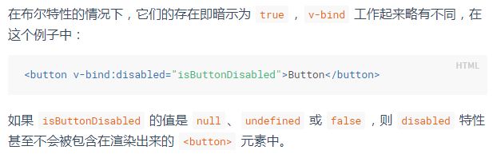
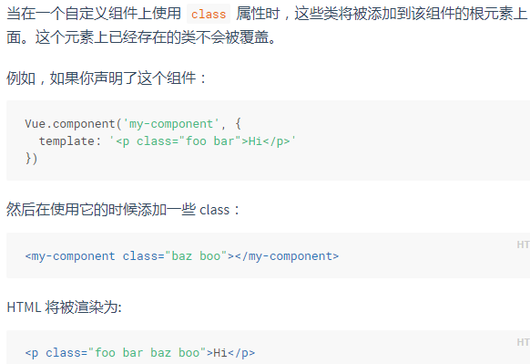
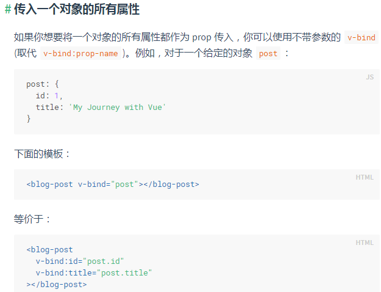
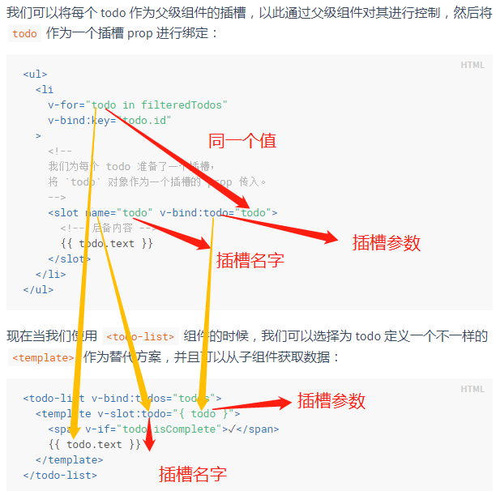

## VUE

官方文档: https://cn.vuejs.org/v2/guide/

### 注意

1. v-bind 在绑定属性时，需要注意：若绑定值为 null、undefined、false 则该属性不存在当前节点上。因此，在自定义组件时，使用该指令可避免传默认值问题。例如 input 的 id 属性绑定时不传则没有 id 属性。<br/>
   

2. 计算属性、方法、和侦听器的区别：<br/>
   computed 计算属性 getter / setter：计算属性基于它们的响应式依赖进行缓存，再次求值时会直接返回，而不是重新计算。<br/>
   methods 方法：每次重新渲染时会触发方法去计算。<br/>
   watch 侦听器：当数据需要随着其它数据变动而变动时，可以使用 watch。当数据变化时触发异步操作或者开销较大时可采用 watch 来处理。

3. 当在一个自定义组件上使用 class 属性时，这些类将被添加到该组件的根元素上面。这个元素上已经存在的类不会被覆盖。<br/>
   

4. 用 key 管理可复用的元素：<br/>
   详见 [vue 用 key 管理可复用的元素](https://cn.vuejs.org/v2/guide/conditional.html#%E7%94%A8-key-%E7%AE%A1%E7%90%86%E5%8F%AF%E5%A4%8D%E7%94%A8%E7%9A%84%E5%85%83%E7%B4%A0)

5. 数组更新检测：<br/>
   操作数组并更新的方式：<br/>
   变异方法：<br/>
   push()、pop()、shift()、unshift()、splice()、sort()、reverse()<br/>
   非变异方法：<br/>
   filter(), concat() 和 slice() ：这些不会改变原始数组，但总是返回一个新数组。可以用新数组替换旧数组。

6. 使用 v-for 指令渲染页面是，需要添加一个 :key，其中 key 绑定时最好使用 id，不要使用 index，防止出现 因数组在操作过程中发生顺序变化时页面无法得到重新渲染。

7. 事件修饰符：<br/>
   详见 [vue 事件修饰符](https://cn.vuejs.org/v2/guide/events.html#%E4%BA%8B%E4%BB%B6%E4%BF%AE%E9%A5%B0%E7%AC%A6)

8. 组件：<br/>
   （1）推荐：自定义组件名 (字母全小写且必须包含一个连字符)。<br/>
   （2）使用组件时，驼峰的写法等价于小写加 - 的写法。<br/>
   （3）自定义组件中的 prop 使用了驼峰的写法，在使用组件时，prop 推荐用小写加 - ，若采用了 vue-cli3 ，可以写为驼峰式：<br/>
   通过 webpack 打包，.vue 文件会被编译，其中的 template 会编译为 render 函数，所以使用驼峰的写法也没问题。<br/>

9. Prop 传值为一个对象的所有属性时：<br/>
   

10. 非 Prop 特性：<br/>
    即组件中没有定义这个 prop ，但是在使用时传入了这个 prop ，此时会被渲染在组件的根元素上。

11. 自定义 prop ：<br/>

    ```
    @Component({
        name: 'my-com',
        model: {
            prop: 'checked',
            event: 'change'
        }
    })
    ```

12. 插槽 prop 允许我们将插槽转换为可复用的模板，这些模板可以基于输入的 prop 渲染出不同的内容：<br/>
    
    详见[其他示例](https://cn.vuejs.org/v2/guide/components-slots.html#%E5%85%B6%E5%AE%83%E7%A4%BA%E4%BE%8B)

13. 函数式组件

14. 插件注册和插件开发

15. vue 中 img 标签图片加载失败加载另一张图片:

```
// avatar是图片路径
<div class="avatar-wrapper">
  
</div>

// defaultImg 等于 data 里面的数据
data() {
  return {
    defaultImg: 'this.src="' + require('../../static/icon_goods_default.png') + '"',
  };
},
```
