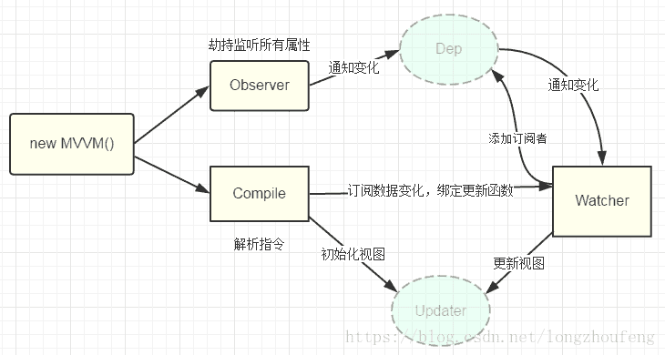

## 在 vue 中使用 v-model 实现自定义组件的双向数据绑定

### v-model 基础介绍
[Vue.js](https://cn.vuejs.org/v2/guide/) 中提供 `v-model` 指令用于在表单元素上创建双向数据绑定，表单元素如 input、textarea、select 等。它会根据表单控件类型自动选取对应的方法来实现元素的值更新。例如：普通 input 上使用 input 方法，input checkbox 上使用 change 方法等。

#### 基本实现：
Vue.js 中不同表单元素上 `v-model` 的实现差异：<br/>

1. 普通 input 元素：<br/>
（1）将其 value 特性绑定到名为 `value` 的 prop 上；<br/>
（2）通过 input 原生事件往外触发一个名为 `input` 的事件，并将当前 input 值从 input 事件中抛出，并赋予新值。<br/>
    ```
    <input v-model="str">
    // 等价于
    <input :value="str" @input="$event => str = $event.target.value">
    ```


2. input checkbox 元素：<br/>
（1）将其 checked 特性绑定到名为 `checked` 的 prop 上；<br/>
（2）通过 input checkbox 原生事件往外触发一个名为 `change` 的事件，并将当前 input checkbox 值从 change 事件中抛出，并赋予新值。<br/>

    ```
    <input type="checkbox" v-model="checked">
    // 等价于
    <input type="checkbox" :checked="checked" @change="$event => checked = $event.target.checked">
    ```


3. select 元素<br/>
（1）将其 value 特性绑定到名为 `value` 的 prop 上；<br/>
（2）通过 select 原生事件往外触发一个名为 `change` 的事件，并将当前 select 值从 change 事件中抛出，并赋予新值。<br/>
    ```
    <select v-model="selected">
        <option>...</option>
    </select>
    // 等价于
    <select :value="selected" @change="$event => selected = $event.target.value">
        <option>...</option>
    </select>
    ```


#### 基本原理：
Vue.js 采用数据劫持结合发布者-订阅者模式的方式来实现数据双向绑定。

1. 数据的双向绑定：<br/>
Vue.js 是 [`MVVM`](https://www.jianshu.com/p/ea9d556d6529) 类型的框架，其中 View 是视图层，即页面展示，Model 是模型层，即后台数据，ViewModel 是核心，用于连接 View 和 Model，负责监听 Model 或者 View 的修改。<br/>
（1）将 Model 转化为 View，即将后台数据转化为前端页面展示；<br/>
（2）将 View 转化为 Model，即将页面转化为后台数据。页面部分事件触发后会将页面的数据通过 ajax 请求等传给后台。<br/>
通过实现上述2点，就可以实现 View 和 Model 之间的数据绑定，即实现数据的双向绑定。

    


2. 数据劫持：<br/>
Vue.js 通过 [`Object.defineProperty()`](https://developer.mozilla.org/zh-CN/docs/Web/JavaScript/Reference/Global_Objects/Object/defineProperty) 给属性设置一个 `set` 函数 和 `get` 函数，当属性数据发生变化时就会触发 set，读取属性值时会触发 get 获取数据。

    


3. 发布者-订阅者模式：<br/>
（1）实现一个数据监听器 Observer，能够对数据对象的所有属性进行监听，如有变动可拿到最新值并通知订阅者；<br/>
（2）实现一个指令解析器 Compile，对每个元素节点的指令进行扫描和解析，根据指令模板替换数据，以及绑定相应的更新函数；<br/>
（3）实现一个 Watcher，作为连接 Observer 和 Compile 的桥梁，能够订阅并收到每个属性变动的通知，执行指令绑定的相应回调函数，从而更新视图。<br/>
详见 [剖析Vue实现双向数据绑定原理](https://blog.csdn.net/longzhoufeng/article/details/80987527)

    


### 在自定义组件上使用 v-model

自定义组件同样支持使用 `v-model` 来达到父子组件的双向数据绑定。

组件上使用 v-model 时，会默认使用名为 `value` 的 prop 和名为 `input` 的事件，使用者可以将 value 改为 `show` 等其他 prop，将 input 改为 `change` 等其他事件 来实现 v-model，基本实现与上述一致。

父组件：
```
<template>
    <!-- (1) 使用默认的 prop value 和 input 事件 -->
    <my-com v-model="showCom" @input="val => console.log(val)" />
    <!-- (2) 使用自定义的 prop show 和 change 事件 -->
    <my-com v-model="showCom" @change="val => console.log(val)" />
</template>

<script lang="ts">
    import { Vue, Component } from 'vue-property-decorator';

    @Component({
        name: 'home',
        components: {
            myCom
        }
    })
    export default class Home extends Vue {
        private showCom: boolean = true;
        ...
    }
</script>
```

子组件：
```
<template>
    <div class="my-com" v-show="showPage">
        <div class="my-com-close" @click="closePage"></div>
        <div class="my-com-content">...</div>
    </div>
</template>

<script lang="ts">
    import { Vue, Component, Prop, Watch } from 'vue-property-decorator';

    @Component({
        name: 'my-com'
    })
    export default class MyCom extends Vue {
        // (1) 使用默认的 prop value 和 input 事件
        @Prop({ type: Boolean }) private value!: boolean;
        private showPage: boolean = this.value; // 是否选中

        // (2) 使用自定义的 prop show 和 change 事件
        @Prop({ type: Boolean }) private show!: boolean;
        private showPage: boolean = this.show; // 是否选中

        

        // (1) 使用默认的 prop value 和 input 事件
        @Watch('value')
        public valueChange(val: any) {
            this.showPage = val;
        }

        // (2) 使用自定义的 prop show 和 change 事件
        @Watch('show')
        public showChange(val: any) {
            this.showPage = val;
        }

        public closePage() {
            this.showPage = !this.showPage;

            // (1) 使用默认的 prop value 和 input 事件
            this.$emit('input', this.showPage);

            // (2) 使用自定义的 prop show 和 change 事件
            this.$emit('change', this.showPage);
        }
    }
</script>
```

### 自定义 v-model 注意点
1. 子组件中，需要显式地将父组件传过来的 prop 中的 `value` 或者自定义 prop 值赋给当前子组件的值，作为默认值；

2. 父组件动态改变 prop，子组件可以通过添加 `Watch` 事件来监听父组件传过来的 value 或者自定义 prop 值的变化，并赋值给子组件，以达到父组件动态改变 prop 并触发子组件更新的效果。

3. 子组件中，需要在其某个事件触发时，往外 `$emit` 触发父组件的 input 或者自定义事件，并传参当前子组件的值，以达到父组件接收子组件的值的更新，从而达到双向数据绑定的过程。

4. 若有页面 A，组件 B、C。其中 A 为引用了 B 组件的页面，C 为 B 组件中引用的子组件，C 为使用了 Vue.js 中提供的表单组件，例如 input，来绑定 C 组件中的值，即：
    ```
    <A v-show="aVal">
        <B v-model="bVal">
            <C v-model="cVal" />
        </B>
    </A>
    ```
    此时需要注意，其中 C 中的 input 上的 v-model 是 vue 提供的表单的双向数据绑定。而 C 实现的与 B 的 v-model 双向数据绑定是属于自定义 v-model，两者不可混淆。

### 参考文档
1. [Vue.js 官方文档](https://cn.vuejs.org/v2/guide/)

2. [关于Vue的MVVM](https://www.jianshu.com/p/ea9d556d6529)

3. [MVC，MVP 和 MVVM 的图示](http://www.ruanyifeng.com/blog/2015/02/mvcmvp_mvvm.html)

4. [vue的双向绑定原理及实现](https://www.cnblogs.com/libin-1/p/6893712.html)

5. [剖析Vue实现双向数据绑定原理](https://blog.csdn.net/longzhoufeng/article/details/80987527)
