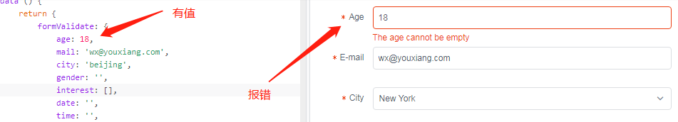
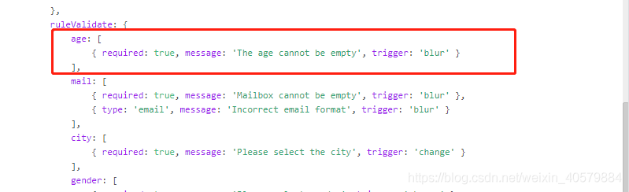
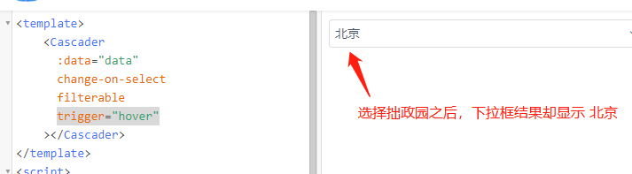
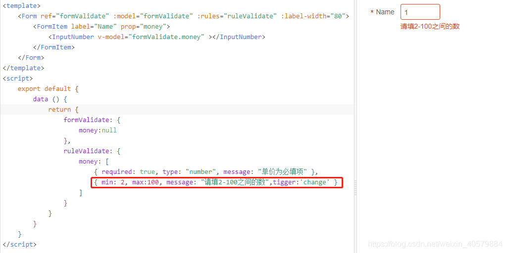

## vue2 + iview3.x 坑

1. DatePicker 日期选择器v-model绑定获取的时间为UTC时间。
DatePicker 组件，
v-model：绑定的是 Tue Dec 21 2021 00:00:00 GMT+0800 格式
on-change事件：返回两个值，**已经格式化后的日期**，比如 2016-01-01，和当前的**日期类型**，比如 date


2. 表单校验修改的时候，回显明明有值，form表单validate却报错。



**原因**：表单校验时，不填type,默认string类型，如果值是number类型，需要在校验中加入 type: 'number'。


3. select选择器加上搜索属性时，选择值之后样式居中了。


**解决方法**：<Option>标签和值之间不要换行，写在一行即可解决


4. Cascader级联选择器，选择即改变(change-on-select)，搜索(filterable)，移入展开(trigger="hover")，同时设置的时候，搜索选择结果出错。


**解决方法**：没有什么好的解决方法，根据需求取舍，这三个属性不能同时存在，我处理方式是把trigger="hover"修改为trigger="click"


5. inputNumber数字输入框，最小限制体验太差，如果设定min属性为2，则想输入12的时候，输入1就会变成2。
```vue
<InputNumber :min="2" v-model="value1"></InputNumber>
```
解决方法：
1) 添加 active-change = " false " ,失焦时更改数据，缺点：体验不好，用户输完的时候可能没关注输入框，失去焦点再改变数据用户可能没发现，引发误会。
```vue
<InputNumber :min="2" v-model="value1" :active-change="false"></InputNumber>
```
2)使用form表单的min和max方法校验,输入校验



6. form表单 想触发input的enter事件时，页面会刷新。
因为先触发了form表单的enter事件，导致页面刷新；
解决 form表单添加 `@submit.native.prevent`;
```vue
<Form :label-width="100" inline label-position='left' @submit.native.prevent>
```

@submit.native.prevent
.native 表示对一个组件绑定系统原生事件
.prevent 表示提交以后不刷新页面


### 参考链接
1. [iview 踩坑总结](https://www.i4k.xyz/article/weixin_40579884/89308844)