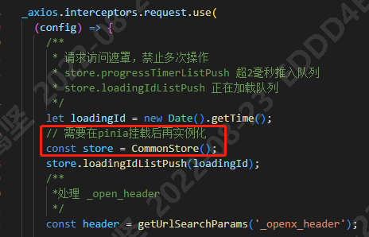

## pinia
>Vue 的存储库，它允许您跨组件/页面共享状态。
>vue2和vue3都可以使用。

### 优势
* dev-tools 支持
  * 跟踪动作、突变的时间线
  * Store 出现在使用它们的组件中
  * time travel 和 更容易的调试
* 热模块更换
  * 在不重新加载页面的情况下修改您的 Store
  * 在开发时保持任何现有状态
* 插件：使用插件扩展 Pinia 功能
* 为 JS 用户提供适当的 TypeScript 支持或 **autocompletion**
* 服务器端渲染支持

### pinia 在封装请求的文件中使用报错的问题
大概说一下背景，vue3 + vite + ts + ant design vue + pinia + axios 的项目中，有一个封装的公共的接口请求的文件 request.ts。request.ts 中使用了 pinia 去获取全局的数据。然后页面启动后报错：
```
Uncaught ReferenceError: Cannot access 'useStore' before initialization
```

究其原因，是在 request.ts 文件封装的公用方法外部直接实例化了公用 store。
```ts
import Vue from 'vue';
import axios from 'axios';
import base62 from 'base62-yf';
const store = CommonStore();
// ...
```
如果放在外面的话，是在 `pinia` 挂载之前使用，这个时候是会出错的，但是在方法里使用的话，这个时候是可以的！

所以在方法里面去调用 CommonStore() 就不会出错了。


### 参考链接
1. [pinia 官网](https://pinia.web3doc.top/introduction.html)

2. [pinia/vuex在封装请求的文件中使用报错的问题](https://zhuanlan.zhihu.com/p/447969990)