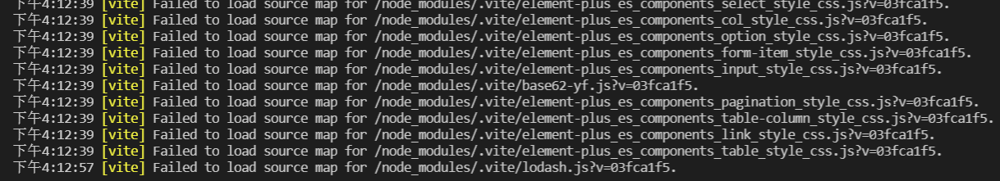

## vite 接入技巧与常见问题

### 技巧

### 常见问题

以下是使用 vite 过程中出现的问题：

#### Failed to load source map for /node_modules/.vite/chunk-ATV3NNMG.js?v=84e93af0

在使用自动导入 element-plus 的时候，会报如下错误。并且，在使用的组件多的时候，会在 updating...卡很久才重新刷新页面。


分析了源码后，大概了解到问题是与 vite 更新机制有关系！
如果要根本上解决这个问题，vite 需要改变它的更新机制，目前都是靠定时器进行处理，有重复刷新、编译等问题，很大可能是时序没控制好出现问题。
具体参见 https://github.com/vitejs/vite/issues/6241

临时解决方法：提前把所有依赖库都添加到 optimizeDeps（或者 external），这个报错问题就不会出现了。

```ts
optimizeDeps: {
  include: [
     'vue',
     'vuex',
    'vue-router',
    'lodash-es',
    ....
  ]
}
```

### 参考链接

1. [vite 接入技巧与常见问题](https://juejin.cn/post/7017446703296937998)

2. [Failed to load source map for /node_modules/.vite/chunk-ATV3NNMG.js?v=84e93af0](https://giters.com/antfu/unplugin-vue-components/issues/242)
