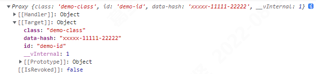

## vue3 知识点

### vue3 如何访问内部组件实例？

通过 `getCurrentInstance` 来访问内部组件实例。

### $attrs、useAttrs

#### Attributes 继承

“透传 attribute”指的是传递给一个组件，却**没有被该组件声明为 props 或 emits 的 attribute 或者 v-on 事件监听器**。最常见的例子就是 `class`、`style` 和 `id`。

当一个组件以单个元素为根作渲染时，透传的 `attribute` 会自动被添加到根元素上。
如果一个子组件的根元素已经有了 `class` 或 `style attribute`，它会和从父组件上继承的值合并。
同样的规则也适用于 v-on 事件监听器。

1. `setup` 函数下：
   子组件通过 `setup` 函数的第二个参数 `context` 里的 `attrs` 来获取。
   `attrs` 为非响应式，不能通过侦听器去监听它的变化。如果需要响应性，可以使用 `props`。或者你也可以使用 `onUpdated()` 使得在每次更新时结合最新的 `attrs` 执行副作用。

2. `setup` 语法糖模式下：
   没有 `context` 参数，使用 `useAttrs`。

或者直接在模板的表达式中用 `$attrs` 访问到。
`$attrs` 对象包含了除组件所声明的 `props` 和 `emits` 之外的所有其他 `attribute`，例如 class，style，v-on 监听器等等。

注意：

1. 透传 `attributes` 在 `JavaScript` 中保留了它们原始的大小写，所以像 `foo-bar` 这样的一个 `attribute` 需要通过 $attrs['foo-bar'] 来访问。
2. 像 `@click` 这样的一个 `v-on` 事件监听器将在此对象下被暴露为一个函数 `$attrs.onClick`。

```vue
<!-- App.vue -->
<template>
  <div>
    <Demo class="demo-class" id="demo-id" data-hash="xxxxx-11111-22222"></Demo>
  </div>
</template>

<script setup lang="ts">
import Demo from './components/Demo.vue';
import { reactive } from 'vue';
</script>
```

```vue
<!-- demo.vue -->
<template>
  <div>
    <h2>{{ attrs.class }}</h2>
    <h2>{{ attrs.id }}</h2>
    <h2>{{ attrs['data-hash'] }}</h2>
    <h2>{{ $attrs.class }}</h2>
    <h2>{{ $attrs.id }}</h2>
    <h2>{{ $attrs['data-hash'] }}</h2>
  </div>
</template>

<script setup lang="ts">
import { reactive, useAttrs } from 'vue';
let attrs = useAttrs();
console.log(attrs);
</script>
```

```vue
<!-- demo.vue -->
<template>
  <div>
    <h2>{{ attrs.class }}</h2>
    <h2>{{ attrs.id }}</h2>
    <h2>{{ attrs['data-hash'] }}</h2>
    <h2>{{ $attrs.class }}</h2>
    <h2>{{ $attrs.id }}</h2>
    <h2>{{ $attrs['data-hash'] }}</h2>
  </div>
</template>

<script lang="ts">
export default {
  setup(props, ctx) {
    // 透传 attribute 被暴露为 ctx.attrs
    console.log(ctx.attrs);
  },
};
</script>
```



#### 禁用 Attributes 继承

如果你不想要一个组件自动地继承 `attribute`，你可以在组件选项中设置 `inheritAttrs: false`。如果你使用了 `<script setup>`，你需要一个额外的 `<script>` 块来书写这个选项声明。

如果子组件外层有一个 `div` 包裹，但是希望父组件传过来的额外的属性和事件真实应用到子组件的里层的元素上，可以在组件选项中设置 `inheritAttrs: false`，且使用 `v-bind="$attrs"`来实现。

```vue
<template>
  <div class="btn-wrapper">
    <button class="btn" v-bind="$attrs">click me</button>
  </div>
</template>
<script lang="ts">
export default {
  inheritAttrs: false,
};
</script>
<script lang="ts" setup>
// ...
</script>
```

#### 多根节点的 Attributes 继承

和单根节点组件有所不同，有着多个根节点的组件没有自动 attribute 透传行为。如果 $attrs 没有被显式绑定，将会抛出一个运行时警告。

```vue
<template>
  <header>...</header>
  <main v-bind="$attrs">...</main>
  <footer>...</footer>
</template>
```

像上述一样，需要显示指定某一个节点应用这些额外的属性。

### vue3 ts 报错，使用 TypeScript 工具类型

#### PropType<T>

用于在用运行时 props 声明时给一个 prop 标注更复杂的类型定义。
参考：[指南 - 为组件 props 标注类型](https://cn.vuejs.org/guide/typescript/options-api.html#typing-component-props)

```vue
<script lang="ts">
import { defineComponent } from 'vue';
import type { PropType } from 'vue';

interface Book {
  title: string;
  author: string;
  year: number;
}

export default defineComponent({
  props: {
    book: {
      // 提供相对 `Object` 更确定的类型
      type: Object as PropType<Book>,
      required: true,
    },
    // 如果你的 TypeScript 版本低于 4.7，确保使用箭头函数
    // 如果你的 TypeScript 版本大于等于 4.7，则无影响
    default: () => ({
      title: 'Arrow Function Expression',
    }),
    // 也可以标记函数
    callback: Function as PropType<(id: number) => void>,
  },
  mounted() {
    this.book.title; // string
    this.book.year; // number

    // TS Error: argument of type 'string' is not
    // assignable to parameter of type 'number'
    this.callback?.('123');
  },
});
</script>
```

#### ComponentCustomProperties
>类型扩展必须被放置在一个模块 .ts 或 .d.ts 文件中。

用于增强组件实例类型以支持自定义全局属性。

参考：[扩展全局属性](https://cn.vuejs.org/guide/typescript/options-api.html#augmenting-global-properties)
```ts
import axios from 'axios';

declare module 'vue' {
  interface ComponentCustomProperties {
    $http: typeof axios
    $translate: (key: string) => string
  }
}
```

#### 

### 参考链接

1. [vue3 透传 Attributes](https://cn.vuejs.org/guide/components/attrs.html#fallthrough-attributes)

2. [TypeScript 工具类型](https://cn.vuejs.org/api/utility-types.html)
