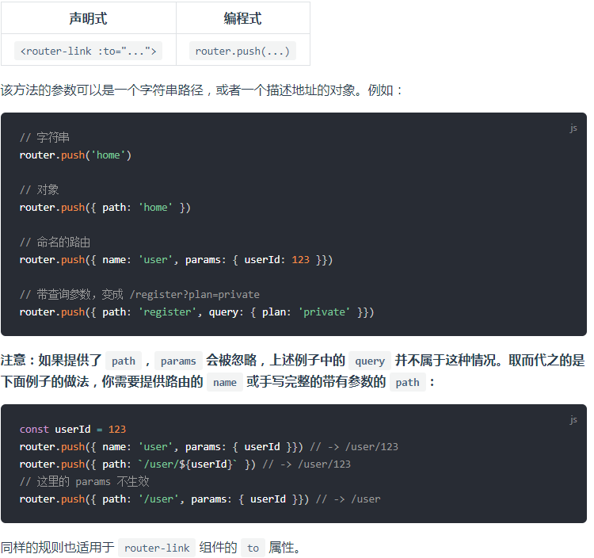

### 有关于 vue-cli 3.x

1. [vue.js 官方文档](https://cn.vuejs.org/v2/guide/)  

2. [vue-cli 3 官方文档](https://cli.vuejs.org/zh/guide/)  

3. [vue-router 官方文档](https://router.vuejs.org/zh/)  
(1) ```this.$router.push('/user/xxx')``` 与 ```this.$router.push({path: 'xxx', query: 'xxx'})``` 的区别：  
* 简单的 path 可以直接使用字符串处理，如果 query 参数里面需要传中文什么的，用query vue 会内部帮你转换好变量，就不会导致乱码！！！！
* 

4. [vuex](https://vuex.vuejs.org/zh/)

5. [manifest 使用方式](https://juejin.im/post/5ac8a89ef265da238440d60a)

6. [给自己的网站加上robots.txt](https://blog.csdn.net/fanghua_vip/article/details/79535639)

7. [vue-cli搭建项目中browserslist的作用讲解](https://blog.csdn.net/weixin_39936058/article/details/87523416)

8. [vue-cli 3.x 中 browserslist 详解](https://github.com/browserslist/browserslist)

9. [VUE CLI 3 默认端口修改](https://blog.csdn.net/github_38708644/article/details/86608493)