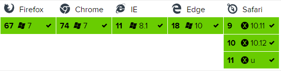

## axios
基于promise用于浏览器和node.js的http客户端。

### 特点
* 支持浏览器和node.js
* 支持promise
* 能拦截请求和响应
* 能转换请求和响应数据
* 能取消请求
* 自动转换JSON数据
* 浏览器端支持防止CSRF(跨站请求伪造)

### 浏览器支持情况
| firefox | chrome | ie | edge | safari | opera
| ------ | ------ | ------ | ------ | ------ | ------ |
| Latest ✔ | Latest ✔ | 8+ ✔ | Latest ✔ | Latest ✔ | Latest ✔ |


#### 兼容性问题
1. axios支持ie8+，但它是基于promise之上的，因此会存在兼容性问题。<br/>
解决办法：使用 babel-polyfill 将 es6转es5

2. 在低版本安卓手机发现封装的axios请求无效，主要原因是不支持promise。<br/>
解决办法：使用es6-promise
```javascript
import promise from 'es6-promise';
// 注意： es6-promise 一定要在 axios 之前注册
promise.polyfill();
```


### 安装
* npm 安装：npm install axios
* bower 安装：bower install axios
* cdn 引入：
```javascript
<script src="https://unpkg.com/axios/dist/axios.min.js"></script>
```

### 举例
具体参照 ./index.js 和 axios.ts

### 参考文档
1. [Axios中文文档](https://blog.lee-cloud.xyz/post/1/Axios-zhong-wen-wen-dang)

2. [axios中文文档](https://www.jianshu.com/p/7a9fbcbb1114)

3. [axios的兼容性问题](https://www.jianshu.com/p/aac2240f3540)