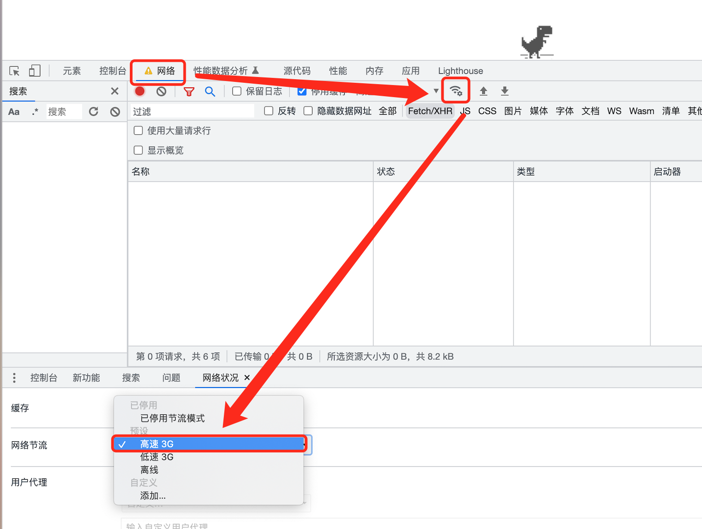
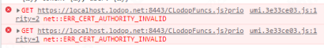
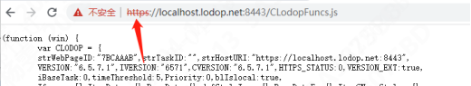
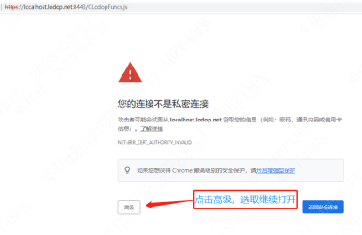
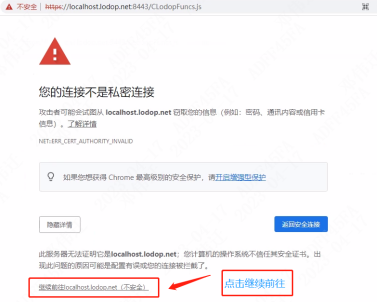
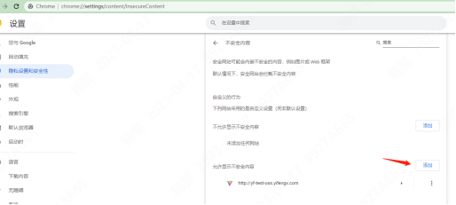

## Chrome 浏览器报错

以下是 Chrome 浏览器报错的汇总。

### Chrome 浏览报错：crbug/1173575, non-JS module files deprecated.

在自己电脑上访问某个网址是正常的，换了别的电脑访问，就访问不了了，控制台报错：crbug/1173575, non-JS module files deprecated.

#### 解决方案

点开控制台，网络-网络设置-选择高速 3G

### Chrome, NET::ERR_CERT_AUTHORITY_INVALID

有时候，浏览器访问某个网址或者加载某个域名下的脚本时，突然会加载不出来，控制台报错如下：

#### 可能的原因

1. https 网站被劫持了，然后 Chrome 又默认使用 HSTS(严格的 http 传输方式)，才导致无法访问。
2. 该网站使用了自签证书或者已经被吊销的根证书导致，即证书有问题，请在合法的 CA 申请 SSL 证书。

#### 解决方案

1. 清理一下缓存：chrome 右上角三个点 --> 设置 --> 隐私设置和安全性 --> 清除浏览数据即可。
2. 按照如下步骤来操作：
   
   
   然后 F5 刷新便可以打印了
3. 请查看下证书路径是否正常，是否缺少根证书，是否证书过期无效。下载对应的有效证书，双击后导入。导入成功后重启浏览器，试下看是否不会有该提示。
4. 浏览器地址栏输入 chrome://settings/content/insecureContent；
   
   点击添加，填入https://localhost.lodop.net:8443，重启浏览器再试下是否可以打印

#### 参考链接

1. [解决 Chrome, NET::ERR_CERT_AUTHORITY_INVALID](https://blog.csdn.net/qq_44231797/article/details/109555580)
