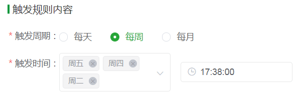
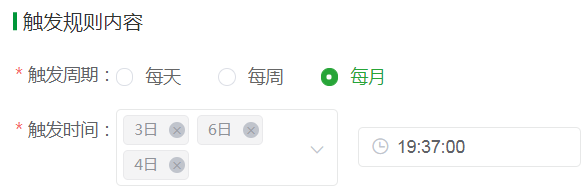

## Cron 表达式之前端篇

### 背景
在一次需求开发过程中，需要将 form 表单中的几个字段传给后台进行保存，下次进入时会回传给 form 表单展示，可以进行编辑等操作。而后台拿到这些字段后需要**执行对应的定时任务**。




如上图所示，触发周期选择“每周”，需要选择周几和触发时间；触发周期选择“每月”，需要选择几日和触发时间；触发周期选择“每天”，需要选择触发时间。

按照正常接口定义时，就需要定义三个参数：触发周期、触发日期/星期、触发时间。同时数据库表字段也需要增加 3 个。

那我们可以对它进行简化以减少数据库字段吗？答案是 yes。神奇的 Cron 表达式即将闪亮登场。

O(∩_∩)O哈哈~其实一点都不神奇，请听我娓娓道来。

**Tip**：以下内容仅限于 Cron 表达式的介绍以及前端使用，后端篇需自行查阅相关文档~~

### Cron 表达式作用
Cron 表达式一般用于周期性执行、日常维护、在某时刻需要完成的单次任务等场景。当然，使用它来优化数据库字段定义也是很不错的一个解决方案。


### Cron 表达式定义
>Cron 表达式，是一个**具有时间含义的字符串**。字符串以 6 个空格隔开，分为 7 个域，每个域代表一个时间含义。


单个域有多个取值时使用英文逗号 `,` 隔开进行取值。每个域可以是确定的取值，也可以是具有逻辑意义的特殊字符。

```
[秒] [分] [时] [日] [月] [周] [年]
```
通常 `[年]` 可以省略，实际使用前 6 个域。在文章后面的例子中部分是省略了 `[年]` 的。


#### 域取值
| 域 | 是否必填 | 取值范围 | 通配符 |
| --- | --- | --- | --- |
| 秒 | 是 | [0, 59] | * , - / |
| 分 | 是 | [0, 59] | * , - / |
| 时 | 是 | [0, 23] | * , - / |
| 日 | 是 | [1, 31] | * , - / ? L W |
| 月 | 是 | [1, 12] 或 [JAN, DEC] | * , - / |
| 周 | 是 | [1, 7] 或 [SUN-SAT]。若您使用 [1, 7] 表达方式，1 代表星期日，7 代表星期六 | * , - / ? L # |
| 年 | 否 | 1970-2099 | , - * / |

Cron 表达式中每个域都支持一定数量的通配符，每个通配符都有其特殊含义。

以上表格内容基于 **Java(Quartz)**。

**Linux 下的 Cron 表达式规则不同之处**：
1. 没有 [秒] 和 [年]
2. [周] 域取值范围：[0-7]，0 和 7 为星期日，1 为 星期一

**Java(Spring) 下的 Cron 表达式规则不同之处**：
1. 没有 [年]
2. [周] 域取值范围：[0-7]，0 和 7 为星期日，1 为 星期一

**若无特殊说明，以下规则描述都以 Java(Quartz) 为基准，其他软件可以对照上述区别自行调整。**


#### 秒
允许值范围：`0~59`。必填，若值不合法，调度器将抛出 `SchedulerException` 异常。  
`*`：代表每秒钟都触发；  
`,`：代表在指定的秒数触发，比如 "0,20,36" 代表在 0秒、20秒、36秒触发；  
`-`：代表在指定的秒范围内触发，比如 "20-30" 代表从 20 秒开始触发到 30 秒结束触发，每隔 1 秒触发 1 次（左闭右闭）；  
`/`：代表触发步进(step)。`/` 前面的值代表初始值(`*`等价于`0`)，后面的值代表偏移量，比如
  * "0/20" 或者 "*/20" 代表从 0 秒开始，每隔 20 秒触发 1 次，即 0、20、40 秒各触发一次；
  * "5/20" 代表从 5 秒开始，每隔 20 秒触发 1 次，即 5、25、45 秒各触发一次；
  * "10-45/20" 代表从 10 秒开始，在 10-45 秒内，步进为 20，命中的时间点触发，即 10、30 秒各触发 1 次；


#### 分
允许值范围：`0~59`。必填，若值不合法，调度器将抛出 `SchedulerException` 异常。  
`*`：代表每分钟都触发；  
`,`：代表在指定的分钟触发，比如 "0,20,36" 代表在 0分钟、20分钟、36分钟触发；  
`-`：代表在指定的分范围内触发，比如 "20-30" 代表从 20 分钟开始触发到 30 分钟结束触发，每隔 1 分钟触发 1 次（左闭右闭）；  
`/`：代表触发步进(step)。`/` 前面的值代表初始值(`*`等价于`0`)，后面的值代表偏移量，比如
  * "0/25" 或者 "*/25" 代表从 0 分钟开始，每隔 25 分钟触发 1 次，即 0、25、50 分钟各触发一次；
  * "5/25" 代表从 5 分钟开始，每隔 25 分钟触发 1 次，即 5、30、55 分钟各触发一次；
  * "10-45/20" 代表从 10 分钟开始，在 10-45 分钟内，步进为 20，命中的时间点触发，即 10、30 分钟各触发 1 次；


#### 时
允许值范围：`0~23`。必填，若值不合法，调度器将抛出 `SchedulerException` 异常。
`*`：代表每小时都触发；  
`,`：代表在指定的小时触发，比如 "0,7,21" 代表在 0点、7点、21点触发；  
`-`：代表在指定的时间段内触发，比如 "15-22" 代表从 15 点开始触发到 22 点结束触发，每隔 1 小时触发 1 次（左闭右闭）；  
`/`：代表触发步进(step)。`/` 前面的值代表初始值(`*`等价于`0`)，后面的值代表偏移量，比如
  * "0/5" 或者 "*/5" 代表从 0 点开始，每隔 5 小时触发 1 次，即 0、5、10、15、20 点各触发一次；
  * "3/7" 代表从 3 点开始，每隔 7 小时触发 1 次，即 3、10、17 点各触发一次；
  * "10-23/3" 代表从 10 点开始，在 10-23 小时内，步进为 3，命中的时间点触发，即 10、13、16、19、22 点各触发 1 次；


#### 日
允许值范围：`1~31`，必填，若值不合法，调度器将抛出 `SchedulerException` 异常。
`*`：代表每天都触发；  
`,`：代表在指定的天数触发，比如 "1,3,4" 代表在 1 号、3 号、4 号触发；  
`-`：代表在指定的天范围内触发，比如 "2-4" 代表从 2 号开始触发到 4 号结束触发，每隔 1 天触发 1 次（左闭右闭）；   
`/`：代表触发步进(step)。`/` 前面的值代表初始值(`*`等价于`1`)，后面的值代表偏移量，比如  
  * "1/7" 或者 "*/7" 代表从 1 号开始，每隔 7 天触发 1 次，即 1 号、8 号、15号、22号、29号各触发一次；
  * "10-19/2" 代表从 10 号开始，在`[10-19]`内，步进为 2，命中的天触发，即 10 号、12 号、14 号、16 号、18 号各触发 1 次；  

`?`：与`{星期}`互斥，即意味着若明确指定`{日期}`触发，则表示`{星期}`无意义，以免引起冲突和混乱
`L`：意味着一个月的最后一天触发。`L-4`代表一个月的最后第4天触发，比如说这个月有 31 天，则代表 27 日。
`W`：代表最近的工作日，离指定日期的最近的工作日。`W` 寻找最近有效工作日时**不跨月**。`LW` 表示为指定月份的最后一个工作日。比如：  
  * `15W` 表示每个月 15 号最近的工作日，所以如果 15 号是周六，则会在 14 号触发；如果 15 号是周日，则会在 16 号触发；
  * `1W` 表示每个月 1 号最近的工作日，所以如果 1 号是周六，则会在 3 号触发；


#### 月
允许值范围：`1~12(JAN-DEC)`。必填，若值不合法，调度器将抛出 `SchedulerException` 异常。
`*`：代表每个月都触发；  
`,`：代表在指定的月份触发，比如 "1,7,11" 代表在 1月份、7月份、11月份触发；  
`-`：代表在指定的月份范围内触发，比如 "3-9" 代表从 3 月份开始触发到 9 月份结束触发，每隔 1 个月触发 1 次（左闭右闭）；    
`/`：代表触发步进(step)。`/` 前面的值代表初始值(`*`等价于`1`)，后面的值代表偏移量，比如  
  * "1/5" 或者 "*/5" 代表从 1 月份开始，每隔 5 个月触发 1 次，即 1、6、11 月份各触发一次；
  * "6/6" 代表从 6 月份开始，每隔 6 个月触发 1 次，即 6、12 月份各触发一次；
  * "1-6/12" 代表每年 1 月份触发；


#### 周
允许值范围：`1~7(SUN-SAT)`，1 代表星期天（一星期的第一天）7 代表星期六（一星期的最后一天）。必填，若值不合法，调度器将抛出 `SchedulerException` 异常。
`*`：代表每星期都触发；  
`,`：代表在指定的星期触发，比如 "1,3,4" 代表在星期天、星期二、星期三触发；  
`-`：代表在指定的星期范围内触发，比如 "2-4" 代表从星期一开始触发到星期三结束触发，每隔 1 天触发 1 次（左闭右闭）；   
`/`：代表触发步进(step)。`/` 前面的值代表初始值(`*`等价于`1`)，后面的值代表偏移量，比如
  * "1/3" 或者 "*/3" 代表从星期天开始，每隔 3 天触发 1 次，即星期天、星期三、星期六各触发一次；  
  * "1-5/2" 代表从星期天开始，在`[1-5]`内，步进为 2，命中的星期触发，即 星期天、星期二、星期四各触发 1 次；  

`?`：与`{日期}`互斥，即意味着若明确指定`{星期}`触发，则表示`{日期}`无意义，以免引起冲突和混乱
`L`：意味着星期的最后一天触发，即星期六触发，L=7 或者 L=SAT。"3L"意味着一个月的最后一个星期二触发
`#`：代表具体的周数，`#`前面代表星期，后面代表本月第几周，比如
  * "2#2" 代表本月第 2 周的星期一
  * "5#4" 代表本月第 4 周的星期四
  * "5L" 代表一个月的最后一个星期四，和 `#`有异曲同工之妙


#### 年
允许值范围：`1970~2099`。不必填，若值不合法，调度器将抛出 `SchedulerException` 异常。
`*`：代表每年都触发；  
`,`：代表在指定的年份触发，比如 "2021,2023,2034" 代表在 2021 年、2023 年、2034 年触发；  
`-`：代表在指定的年份范围内触发，比如 "2022-2030" 代表从 2022 年开始触发到 2030 年结束触发，每隔 1 年触发 1 次（左闭右闭）；   
`/`：代表触发步进(step)。`/` 前面的值代表初始值(`*`等价于`1970`)，后面的值代表偏移量，比如
  * "2022/4" 代表从 2022 年开始，每隔 4 年触发 1 次；
  * "2022-2045/10" 代表从 2022 年开始，在 `[2022,2045]`内，步进为 10，命中的年份触发，即 2022、2032、2042 年各触发 1 次；


#### 注意
1. 除了`{日期}`和`{星期}`可以使用 `?` 来实现互斥，表达无意义的信息之外，其他占位符都要具有具体的时间含义，且依赖关系为：`年->月->日(周)->时->分->秒`

2. 表达式的每个数值域都是一个有`最大值`和`最小值`的`集合`，如：秒域和分钟域的集合是 0-59，日期域是 1-31，月份域是 1-12。字符 `/` 可以帮助你在每个字符域中取相应的数值。如：“7/6” 在月份域的时候只有当 7 月的时候才会触发，并不是表示每个 6 月。

3. `L` 是 `last` 的省略写法，可以表示 `日` 和 `周` 域，但在两个字段中的意思不同。例如 `日` 域中表示一个月的最后一天，`周` 域表示一周的最后一天即 `7` 或者 `SAT`。如果在 `周` 域中前面加上数字，它表示一个月的最后一周周几，例如 `6L` 就表示一个月的最后一个星期五。

4. `W` 字符指定的最近工作日是**不能够跨月份**的。`W` 只能配合一个单独的数值使用，**不能够是一个数字段**，如：1-15W 是错误的。


#### 取值示例
| 示例 | 说明 |
| --- | --- |
| 0 15 10 ? * * | 每天上午10:15执行任务 |
| 0 15 10 * * ? | 每天上午10:15执行任务 |
| 0 0 12 * * ? | 每天中午12:00执行任务 |
| 0 0 10,14,16 * * ? | 每天上午10:00点、下午14:00、下午16:00执行任务 |
| 0 0/30 9-11 * * ? | 每天上午09:00到上午11:00时间段内每隔半小时执行任务 |
| 0 * 14 * * ? | 每天下午14:00到下午14:59时间段内每隔1分钟执行任务 |
| 0 0-5 14 * * ? | 每天下午14:00到下午14:05时间段内每隔1分钟执行任务 |
| 0 0/15 14 * * ? | 每天下午14:00到下午14:59时间段内每隔15分钟执行任务 |
| 0 0/25 14,18 * * ? | 每天下午14:00到下午14:59、下午18:00到下午18:59时间段内每隔25分钟执行任务 |
| 0 0 12 ? * WED | 每个星期三中午12:00执行任务 |
| 0 15 10 15 * ? | 每月15日上午10:15执行任务 |
| 0 15 10 L * ? | 每月最后一日上午10:15执行任务 |
| 0 15 10 ? * 6L | 每月最后一个星期五上午10:15执行任务 |
| 0 15 10 ? * 6#3 | 每月第三个星期五上午10:15执行任务 |
| 0 10,44 14 ? 3 WED | 每年3月的每个星期三下午14:10和14:44执行任务 |
| 0 15 10 ? * 6L 2022-2025 | 2022年至2025年的每月最后一个星期五的上午10:15执行任务 |
| 0 59 23 L 3/3 ? | 每季度最后一天23天59分执行任务 |


### 在线 Cron 表达式生成器
链接地址：https://qqe2.com/cron
<iframe  
  height=1200 
  width=90% 
  src="https://qqe2.com/cron"  
  frameborder=0  
  allowfullscreen
>
</iframe>


### 提问
1. `* 12 13 ? 3-11/3 2/3` 代表什么？
答：每年3月、6月、9月的每个星期一、星期四的 13:12:00 到 13:12:59 每秒触发一次

2. `12 10-40/9 10 5-28/6 6/12 ?` 代表什么？
答：每年6月5号、11号、17号、23号的上午10点10分、19分、28分、37分12秒触发

3. 每年4月、7月、10月的最后一个星期三的22点10分 每秒触发一次，对应的 Cron 表达式？
答：`* 10 22 ? 4-12/3 4L`


### Cron 表达式解析与生成
好了，上面已经把 Cron 表达式讲得很透彻，相信大家对 Cron 表达式没有那么陌生了吧~
那我们如何在项目中利用 Cron 表达式呢？怎么实现 Cron 表达式的解析和生成呢？

以下 Cron 解析与生成的代码都依赖于文章开头的 from 表单交互。
```ts
// 触发规则-触发周期
export enum ModelReachTypeEnum {
  DAY = "DAY", // 每天
  WEEK = "WEEK", // 每周
  MONTH = "MONTH" // 每月
}

// 触发规则内容-触发周期、触发时间
export interface IReachRuleDate {
  recycleType: ModelReachTypeEnum | string; // 触发周期
  execTimeNative: string; // 触发时间
  execListNative: string[]; // 触发日期
}
```

#### Cron 表达式生成
```ts
/**
 * @description 日期对象转为cron表达式-年份不传
 * @param {IReachRuleDate} date
 */
export const changeDateToCron = (date: IReachRuleDate): string => {
  let second = "0";
  let minute = "*";
  let hour = "*";
  if (date.execTimeNative) {
    hour = `${Number(date.execTimeNative.split(":")[0])}`;
    minute = `${Number(date.execTimeNative.split(":")[1])}`;
  }

  let cronStr = "";
  if (date.recycleType === ModelReachTypeEnum.DAY) {
    cronStr = `${second} ${minute} ${hour} * * ?`;
  } else if (date.recycleType === ModelReachTypeEnum.WEEK) {
    cronStr = `${second} ${minute} ${hour} ? * ${date.execListNative
      .sort()
      .join(",")}`;
  } else if (date.recycleType === ModelReachTypeEnum.MONTH) {
    cronStr = `${second} ${minute} ${hour} ${date.execListNative
      .sort((a, b) => {
        return Number(a) - Number(b);
      })
      .join(",")} * ?`;
  }
  return cronStr;
};
```

#### Cron 表达式解析
```ts
/**
 * @description 补0
 * @param {string} str
 */
export const fixZero = (str: string) => (Number(str) < 10 ? "0" + str : str);

/**
 * @description 获取特定字符串的个数
 * @param {string[]} list
 * @param {string} specStr
 * @returns
 */
const getSpecStrCount = (list: string[], specStr: string) => {
  let count = 0; // 特定字符串的个数

  list.forEach((item: string) => {
    if (item === specStr) {
      count++;
    }
  });
  return count;
};

/**
 * @description cron表达式转为日期对象-年份不传
 * @param {string} cronStr
 */
export const changeCronToDate = (cronStr: string): IReachRuleDate => {
  const date: IReachRuleDate = {
    recycleType: "",
    execTimeNative: "",
    execListNative: []
  };

  if (cronStr) {
    const cronList = cronStr.split(" ");
    date.execTimeNative = `${fixZero(cronList[2])}:${fixZero(cronList[1])}`;
    const starCount = getSpecStrCount(cronList, "*");

    // 年份不传
    if (starCount === 2) {
      date.recycleType = ModelReachTypeEnum.DAY;
    } else if (cronList[3] == "?" && cronList[5] !== "?") {
      date.recycleType = ModelReachTypeEnum.WEEK;
      date.execListNative = cronList[5].split(",");
    } else if (cronList[3] !== "?" && cronList[5] === "?") {
      date.recycleType = ModelReachTypeEnum.MONTH;
      date.execListNative = cronList[3].split(",");
    }
  }

  return date;
};
```


### 基于 VUE 的 Cron 表达式组件
github 上有两个相对来说比较好的依赖 vue2 + element-ui 的 Cron 组件：
1. [vue-cron 基于Vue的Cron表达式组件](https://github.com/1615450788/vue-cron)
2. [vue-crontab](https://github.com/small-stone/vCrontab)

下载 vue-crontab 源码后，调整了部分代码实现逻辑，代码可参见 ./file/vCrontab-master

但为什么要说是相对来说比较好呢？

通过查看上述两个组件的交互和实现来看，组件生成的 Cron 表达式中有一部分与 Cron 表达式对应的语法规则不一致。

个人想法：组件如果需要兼容不同平台上的 Cron 表达式使用，需要对不同平台做判断。另外像 [周] 域中的生成规则 "3#3" 需要修正。

还有一个 **分布式多租户的支持流程编排的任务调度平台(用之作为cron表达式生成器)**，内部继承 Cron 表达式生成器，具体参见[vue-cron-generator](https://juejin.cn/post/6844904051952484360)


### 疑问点
1. 如何将旧页面改为使用 Cron 表达式？
（1）与后台协商，将需要调整的字段合并，使用 Cron 表达式来代替。
（2）页面上去掉多余字段，提供简单 Cron 表达式配置，提供高级设置，高级设置中使用输入框，支持用户自定义输入，由后台去判断 Cron 表达式是正确性。

2. 使用 Cron 表达式的页面，执行定时任务，调度跑之后。如果我想查询每天某些时间点有哪些被执行？将来有哪些被执行？该如何处理？
答：需要后台循环 Cron 表达式生成的执行任务时间，去做统计。

3. 为什么大部分在线 Cron 表达式编辑器，[周] 域生成的 Cron 表达式都有问题？但是执行时间是正常的？


### 参考链接
1. [Cron表达式的详细用法](https://www.jianshu.com/p/e9ce1a7e1ed1)

2. [Cron表达式](https://help.aliyun.com/document_detail/64769.html)

3. [JavaScript 日期格式与cron表达式的互相转换](https://blog.csdn.net/wh13267207590/article/details/79667529)

4. [vue-cron 基于Vue的Cron表达式组件](https://juejin.cn/post/7025787807478054926)

5. [vue-crontab](https://github.com/small-stone/vCrontab)

6. [在线工具](https://tool.lu/crontab/)

7. [js获取CRON表达式](https://www.cnblogs.com/excellencesy/p/12616163.html)