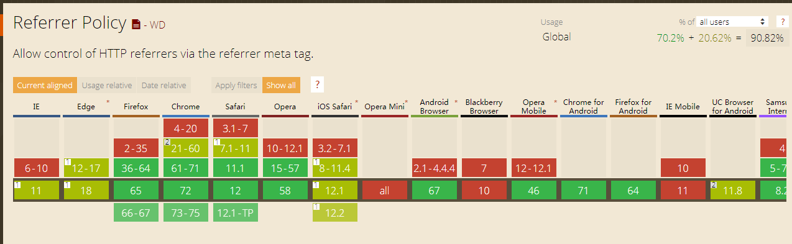

# document.referrer 返回上一页

对于返回上一页的功能，PC端我们可以直接使用浏览器的 ```history.go(-1)``` 或者 ```history.back()```，如果没有上一页，浏览器按钮会置灰不可点击。而移动端，我们需要在返回按钮上加一个 ```history.go(-1)``` 来返回上一层。如果没有上一页（当前页面通过微信分享而来或者手动输入链接而来），那此时点击返回按钮没有任何反应，用户体验不好.

## document.referrer
1. 来源：  
（1）referrer 属性可返回载入当前文档的 URL【摘自W3CSHCOOL】, 如果当前文档不是通过超链接访问的，那么当前文档的URL为NULL，这个属性允许客户端的 javascript 访问 HTTP 头部；  
（2）referrer 属性，我们可以从 http 头部获取。

2. 兼容性：  
（1）兼容性比较高，Android 5.0开始支持，iOS都支持，PC端浏览器从IE7就开始支持了。  
（2）IE会主动清除 referrer 属性，而其他浏览器不会，因此需要做下处理:
```javascript
var url = 'http://www.jb51.net';
if (
    /MSIE (\d+\.\d+);/.test(navigator.userAgent)
    || /MSIE(\d+\.\d+);/.test(navigator.userAgent)
) {
    var referLink = document.createElement('a');
    referLink.href = url;   
    document.body.appendChild(referLink);
    referLink.click();
} else {
    location.href = url;
}
```


3. 使用场景
移动端如果没有上一页则返回到首页：
```javascript
if (document.referrer === '') {
    // 没有来源页面信息的时候，改成首页URL地址
    $('.jsBack').attr('href', '/');
}
```

4. 无法获取 referrer 信息的情况
```
1. 直接在浏览器中输入地址
2. 使用location.reload()刷新（location.href或者location.replace()刷新有信息）
3. 在微信对话框中，点击进入微信自身浏览器
4. 扫码进入微信或QQ的浏览器
5. 新版本Chrome测试，新窗口页面依然有document.referrer
6. 从https的网站直接进入一个http协议的网站（Chrome下亲测）
7. a标签设置 rel="noreferrer"（兼容IE7+）
8. meta标签来控制不让浏览器发送referer
9. 点击 flash 内部链接
10. Chrome4.0以下，IE 5.5+以下返回空的字符串
11. 使用 修改 Location 进行页面导航的方法，会导致在IE下丢失 referrer，这可能是IE的一个BUG
12. 跨域
13. <meta content="never" name="referrer">
```
