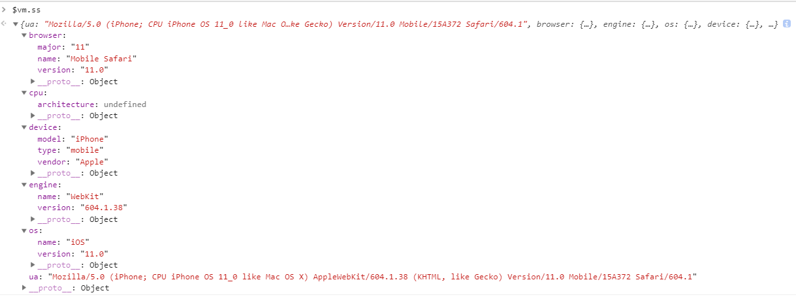

## 如何判断浏览器运行环境

使用 `device` 和 `ua-parser-js` 可以获取设备的类型、名称、浏览器类型等等

```javascript
import * as device from 'device';
import * as UsParse from 'ua-parser-js';

function userDevice(ua) {
    const usParse = UsParse(ua);

    // usParse.os.name
}
```




### 参考链接

1. [详细判断浏览器运行环境](https://juejin.im/post/5d0220a8f265da1bcc193c6c)

2. [JS 获得浏览器类型和版本](https://segmentfault.com/a/1190000007640795)