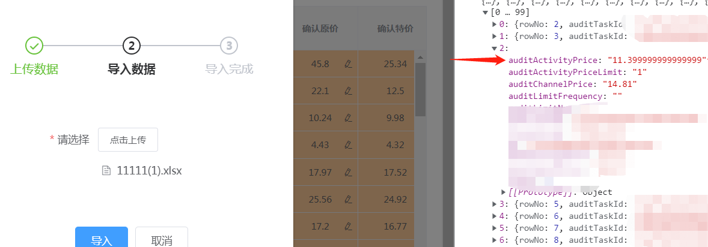
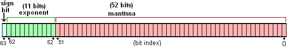
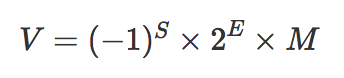
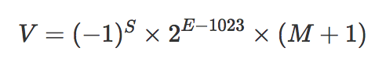
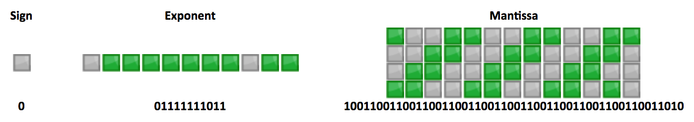
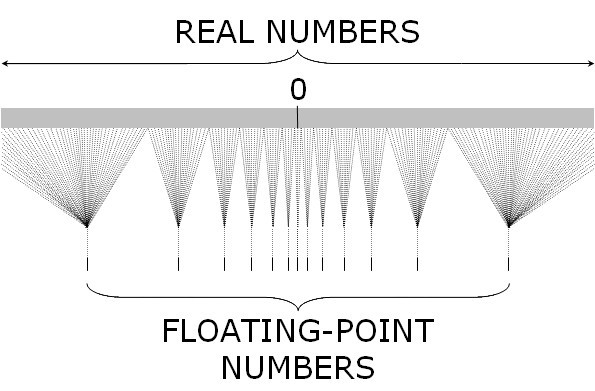

## 浅谈 js 浮点数精度问题

之前在做项目的时候，涉及到商品价格计算、excel 表格读取价格字段等，经常会出现精度问题。因此，就仔细研究了一下精度问题及对应的解决方案，以下是对应的整理和总结。

### 常见的精度问题

一般出现精度问题的场景有两个：浮点数运算后出现的精度问题、excel 表格读取浮点数出现的精度问题。

#### 浮点数运算后出现的精度问题

两个浮点数进行加减乘除运算时，可能会出现精度问题，例如在 chrome 浏览器控制台打印：

```js
// 加法
0.1 + 0.2 = 0.30000000000000004
0.7 + 0.2 = 0.8999999999999999
0.1 + 0.7 = 0.7999999999999999
0.2 + 0.4 = 0.6000000000000001
18.8 + 0.1 = 18.900000000000002
...

// 减法
0.9 - 0.3 = 0.6000000000000001
17.9 - 0.1 = 17.799999999999997
18.88 - 0.01 = 18.869999999999997
100.67 - 10.71 = 89.96000000000001
...

// 乘法
18.9 * 100 = 1889.9999999999998
0.3 * 3 = 0.8999999999999999
0.7 * 0.7 = 0.48999999999999994
100.222 * 10 = 1002.2199999999999
...

// 除法
0.3 / 0.1 = 2.9999999999999996
99.888 / 10 = 9.988800000000001
0.69 / 10 = 0.06899999999999999
...
```

#### excel 表格读取浮点数出现的精度问题

很多时候，业务给到的表格的数值字段都是通过数值计算出来的，可能计算出来之后，表格中展示的是没有精度问题的值，但是实际上使用 xlsx 依赖包读取 excel 表格的时候，获取到的就是有精度问题的值。如下图所示：


### 出现精度问题的原因

看到上面列举的例子发现，好像随时都可能出现精度问题。精度问题使得页面展示及交互、前端到后台的数据处理等方面都会受到影响。真是令人头疼 o(╥﹏╥)o

那为什么会出现精度问题呢？为什么 0.1 + 0.2 !== 0.3 呢？？这就涉及到大学里学的复（ku）杂（zao）的计算机组成原理了~~

#### 浮点数的存储

和其他语言如 Java 和 Python 不同，js 中所有的数字包括整数和小数都只有一种类型 —— `Number`。它的实现遵循 [IEEE 754](https://www.jianshu.com/p/7c636d8f18d5) 标准，使用 64 位固定长度来表示，也就是标准的 double 双精度浮点数（相关的还有 float 32 位单精度）。

> 注：大多数语言中的小数默认都是遵循 IEEE 754 的 float 浮点数，包括 Java、Ruby、Python，本文中的浮点数问题同样存在。

这样的存储结构优点是可以**归一化处理整数和小数，节省存储空间**。

64 位比特又可分为三个部分：

- 符号位 S：第 1 位是正负数符号位（sign），0 代表正数，1 代表负数
- 指数位 E：中间的 11 位存储指数（exponent），用来表示次方数
- 尾数位 M：最后的 52 位是尾数（mantissa），超出的部分自动进一舍零
  

实际数字就可以用以下公式来计算：


其中，**符号位决定了一个数的正负，指数部分决定了数值的大小，小数部分决定了数值的精度**。

注意以上的公式遵循科学计数法的规范，在十进制中 `0<M<10`，到二进制就是 `0<M<2`。也就是说整数部分只能是 1，所以可以被舍去，只保留后面的小数部分。如 `4.5` 转成二进制就是 `100.1`，科学计数法表示是 `1.001*2^2`，舍去 1 后 `M = 001`。E 是一个无符号整数，因为长度是 11 位，取值范围是 0~2047。但是科学计数法中的指数是可以为负数的，所以约定减去一个中间数 1023，`[0, 1022]` 表示为负，`[1024, 2047]` 表示为正。如 4.5 的指数 `E = 1025`，尾数 M = 001。

最终的公式变成：


所以 4.5 最终表示为（M=001、E=1025）：

(图片由此生成 http://www.binaryconvert.com/convert_double.html)

下面再以 `0.1` 为例解释浮点误差的原因，`0.1` 转成二进制表示为 `0.0001100110011001100`(1100 循环)，`1.100110011001100x2^-4`，所以 `E=-4+1023=1019`；M 舍去首位的 1，得到 `100110011...`。最终就是：


转化成十进制后为 `0.100000000000000005551115123126`，因此就出现了浮点误差。

#### Number.MAX_VALUE & Number.MIN_VALUE

从 IEEE 754 存储结构可知，E 长度为 11 位二进制，指数部分能表示的最大值为 2047(2^11 - 1)。取中间值 1023，即指数范围为 [-1023, 1024]。

因此这种存储结构能表示的数值范围为 2^-1023 到 2^1024。 超出这个范围的数值无法表示。2^-1023 和 2^1024 转换为科学计数法如下所示：

```
1.7976931348623157e+308 ==> Number.MAX_VALUE

5e-324 ==> Number.MIN_VALUE
```

因此，js 中能表示的最大值和最小值分别为 1.7976931348623157e+308 和 5e-324。超出则会产生 “溢出”。

#### Number.MAX_SAFE_INTEGER & Number.MIN_SAFE_INTEGER

IEEE754 规定，有效数字第一位默认总是 1 。因此，在表示精度的位数前面，还存在一个 “隐藏位” ，固定为 1 ，但它不保存在 64 位浮点数之中。也就是说，有效数字总是 1.xx...xx 的形式，其中 xx..xx 的部分保存在 64 位浮点数之中，最长为 52 位 。所以，JavaScript 提供的有效数字最长为 53 个二进制位。

因此 js 能表示并进行精确算数运算的整数范围：[-2^53-1, 2^53-1]。

```
Math.pow(2, 53)-1; // 9007199254740991 ==> Number.MAX_SAFE_INTEGER(最大安全整数)
-Math.pow(2, 53)-1; // -9007199254740991 ==> Number.MIN_SAFE_INTEGER(最小安全整数)
```

对于超过这个范围的整数，JavaScript 依旧可以进行运算，但却不保证运算结果的精度。

#### js 在计算 0.1 + 0.2 时到底发生了什么呢？

十进制的 0.1 和 0.2 会被转换成二进制

```
0.1 -> 0.00011001100110011001100110011001100110011001100110011010
0.2 -> 0.0011001100110011001100110011001100110011001100110011010
```

IEEE 754 标准的 64 位双精度浮点数的小数部分最多支持 53 位二进制位，所以两者相加之后得到二进制为：

```
0.0100110011001100110011001100110011001100110011001100111
```

因浮点数小数位的限制而截断的二进制数字，再转换为十进制，就成了 0.30000000000000004。所以在进行算术运算时会产生误差。

#### 为什么 `x=0.1` 能得到 `0.1`？

IEEE 754 标准的 64 位双精度浮点数的小数部分最多支持 53 位二进制位，最多可以表示的数是 `2^53=9007199254740992`，对应科学计数尾数是 `9.007199254740992`，这也是 JS 最多能表示的精度。它的长度是 16，所以可以近似使用 `toPrecision(16)` 来做精度运算，超过的精度会自动做凑整处理。于是就有：

```
0.10000000000000000555.toPrecision(16)
// 返回 0.1000000000000000，去掉末尾的零后正好为 0.1

// 但你看到的 `0.1` 实际上并不是 `0.1`。不信你可用更高的精度试试：
0.1.toPrecision(30) = 0.100000000000000005551115123126
```

#### 大数危机

可能你已经感觉到了，如果整数大于 `9007199254740992` 会出现什么情况呢？
由上述可知，E 的范围是 [-1023, 1024]，所以最大可以表示的整数是 `2^1024`，这就是能表示的最大整数。但你并不能这样计算这个数字，因为从 `2^1024` 开始就变成了 `Infinity`

```
Math.pow(2, 1023)
8.98846567431158e+307

// 超过 2 的 1024 次方的数值，无法表示
Math.pow(2, 1024) // Infinity

// 超过 53 个二进制位的数值，无法保持精度
Math.pow(2, 53) === Math.pow(2, 53) + 1 // true
```

那么对于 `(2^53, 2^63)` 之间的数会出现什么情况呢？

- `(2^53, 2^54)` 之间的数会两个选一个，只能精确表示偶数
- `(2^54, 2^55)` 之间的数会四个选一个，只能精确表示 4 个倍数
- ... 依次跳过更多 2 的倍数

下面这张图能很好的表示 js 中浮点数和实数（Real Number）之间的对应关系。我们常用的 `(-2^53, 2^53)` 只是最中间非常小的一部分，越往两边越稀疏越不精确。


在淘宝早期的订单系统中把订单号当作数字处理，后来随意订单号暴增，已经超过了
`9007199254740992`，最终的解法是把订单号改成字符串处理。

要想解决大数的问题你可以引用第三方库 [bignumber.js](https://github.com/MikeMcl/bignumber.js/)，原理是把所有数字当作字符串，重新实现了计算逻辑，缺点是性能比原生的差很多，所以原生支持很有必要。

[ES2020](https://github.com/tc39/proposal-bigint) 引入了一种新的数据类型 BigInt（大整数），来解决这个问题，这是 ECMAScript 的第八种数据类型。BigInt 只用来表示整数，没有位数的限制，任何位数的整数都可以精确表示。详情请参见 [es6 阮一峰 - BigInt 数据类型](https://es6.ruanyifeng.com/#docs/number#BigInt-%E6%95%B0%E6%8D%AE%E7%B1%BB%E5%9E%8B)

### 解决方案

好了，上面已经把浮点数的精度问题的出现原因讲得很明白~那现在遇到了浮点数的精度问题，怎么处理呢？首先，理论上用有限的空间来存储无限的小数是不可能保证精确的，但我们可以处理一下得到我们期望的结果。

可能大多数人而且目前大部分人已经采取的一种方案就是使用 `toFixed(2)` 来解决。

#### toFixed 处理方案

> toFixed() 方法可把 Number 四舍五入为指定小数位数的数字。

**注意**：`toFixed()` 是小数点后指定位数取整，从小数点开始数起。

> “四舍五入/四舍六入五成双” 含义：对于位数很多的近似数，当有效位数确定后，其后面多余的数字应该舍去，只保留有效数字最末一位，这种修约（舍入）规则是“四舍六入五成双”，也即“4 舍 6 入 5 凑偶”这里“四”是指 ≤4 时舍去，"六"是指 ≥6 时进上，"五"指的是根据 5 后面的数字来定，当 5 后有数时，舍 5 入 1；当 5 后无有效数字时，需要分两种情况来讲：①5 前为奇数，舍 5 入 1；②5 前为偶数，舍 5 不进。（0 是偶数）

但是在实际过程中，四舍五入后的值并不是完全符合我们的预期。以下是在 chrome 下的测试结果：

```
1.33.toFixed(1) // 1.4 正确
1.36.toFixed(1) // 1.4 正确
1.35.toFixed(1) // 1.4 正确
1.335.toFixed(2) // 1.33  错误
1.3335.toFixed(3) // 1.333 错误
1.33335.toFixed(4) // 1.3334 正确
1.333335.toFixed(5)  // 1.33333 错误
1.3333335.toFixed(6) // 1.333333 错误
```

使用 IETester 在 IE 下面测试的结果却是正确的。其他浏览器中我没测试，大家可以测试看看，可能也会出现不一致的问题。

由上述例子发现，浮点数末尾 ≤4 或者 ≥ 6 的情况下的舍入没有争议，但当末尾正好等于 5 的情况，就百家争鸣了。

那怎么解决 `toFixed(2)` 出现的这种鸡肋的问题呢？重写 Number.prototype.toFixed() 方法：

```js
Number.prototype.toFixed = function (d) {
  // 转化为字符串
  var s = this + '';
  // 处理参数为空的情况
  if (!d) d = 0;
  if (s.indexOf('.') == -1) s += '.';
  s += new Array(d + 1).join('0');
  if (new RegExp('^(-|\\+)?(\\d+(\\.\\d{0,' + (d + 1) + '})?)\\d*$').test(s)) {
    var s = '0' + RegExp.$2,
      pm = RegExp.$1,
      a = RegExp.$3.length,
      b = true;
    if (a == d + 2) {
      a = s.match(/\d/g);
      if (parseInt(a[a.length - 1]) > 4) {
        for (var i = a.length - 2; i >= 0; i--) {
          a[i] = parseInt(a[i]) + 1;
          if (a[i] == 10) {
            a[i] = 0;
            b = i != 1;
          } else break;
        }
      }
      s = a.join('').replace(new RegExp('(\\d+)(\\d{' + d + '})\\d$'), '$1.$2');
    }
    if (b) s = s.substr(1);
    return (pm + s).replace(/\.$/, '');
  }
  return this + '';
};
```

```js
// toFixed 兼容方法
Number.prototype.toFixed = function (len) {
  if (len > 20 || len < 0) {
    throw new RangeError('toFixed() digits argument must be between 0 and 20');
  }
  // .123转为0.123
  var number = Number(this);
  if (isNaN(number) || number >= Math.pow(10, 21)) {
    return number.toString();
  }
  // 处理参数为空的情况
  if (typeof len == 'undefined' || len == 0) {
    return Math.round(number).toString();
  }
  var result = number.toString(),
    numberArr = result.split('.');

  // 整数的情况
  if (numberArr.length < 2) {
    return padNum(result);
  }
  var intNum = numberArr[0], // 整数部分
    deciNum = numberArr[1], // 小数部分
    lastNum = deciNum.substr(len, 1); // 最后一个数字

  // 需要截取的长度等于当前长度
  if (deciNum.length == len) {
    return result;
  }
  // 需要截取的长度大于当前长度 1.3.toFixed(2)
  if (deciNum.length < len) {
    return padNum(result);
  }
  // 需要截取的长度小于当前长度，需要判断最后一位数字
  result = intNum + '.' + deciNum.substr(0, len);
  if (parseInt(lastNum, 10) >= 5) {
    // 最后一位数字大于5，要进位
    var times = Math.pow(10, len); // 需要放大的倍数
    var changedInt = Number(result.replace('.', '')); // 截取后转为整数
    changedInt++; // 整数进位
    changedInt /= times; // 整数转为小数，注：有可能还是整数
    result = padNum(changedInt + '');
  }
  return result;
  // 对数字末尾加 0
  function padNum(num) {
    var dotPos = num.indexOf('.');
    if (dotPos === -1) {
      // 整数的情况
      num += '.';
      for (var i = 0; i < len; i++) {
        num += '0';
      }
      return num;
    } else {
      // 小数的情况
      var need = len - (num.length - dotPos - 1);
      for (var j = 0; j < need; j++) {
        num += '0';
      }
      return num;
    }
  }
};
```

除了 `toFixed(2)` 方案，我们还可以使用另外两种方案来解决精度问题：

#### 数据展示类处理方案

使用 `toPrecision` 来解决精度问题。

> `toPrecision()` 方法以指定的精度返回该数值对象的字符串表示。以定点表示法或指数表示法表示的一个数值对象的字符串表示，四舍五入到 precision 参数指定的显示数字位数。

**注意**：`toPrecision` 是处理精度，精度是从左至右第一个不为 0 的数开始数起。

```ts
/**
 * @description 把错误的数据转正：strip(0.09999999999999998)=0.1
 * @param {number | string} num
 * @param {number} [precision=12]
 * @returns
 */
export const strip = (num: number | string, precision = 12) => {
  return +parseFloat(Number(num).toPrecision(precision));
};
```

为什么选择 `12` 做为默认精度？这是一个经验的选择，一般选 `12` 就能解决掉大部分 `0001` 和`0009` 的问题，而且大部分情况下也够用了，如果你需要更精确可以调高。

#### 数据运算类处理方案

如果需要进行数值运算，就无法使用 `toPrecision` 了。正确的做法是把小数转成整数后再运算。

推荐一个很好用的工具：[`number-precision`](https://github.com/nefe/number-precision)：完美支持浮点数的加减乘除、四舍五入等运算，且非常小只有 1K。你可以直接引入该工具，也可以复制一份里面的代码放在你的项目下来使用~~

以下是 `number-precision` 源码：

```ts
type numType = number | string;
/**
 * @desc 解决浮动运算问题，避免小数点后产生多位数和计算精度损失。
 * 问题示例：2.3 + 2.4 = 4.699999999999999，1.0 - 0.9 = 0.09999999999999998
 */

/**
 * 把错误的数据转正
 * strip(0.09999999999999998)=0.1
 */
function strip(num: numType, precision = 15): number {
  return +parseFloat(Number(num).toPrecision(precision));
}

/**
 * Return digits length of a number
 * @param {*number} num Input number
 */
function digitLength(num: numType): number {
  // Get digit length of e
  const eSplit = num.toString().split(/[eE]/);
  const len = (eSplit[0].split('.')[1] || '').length - +(eSplit[1] || 0);
  return len > 0 ? len : 0;
}

/**
 * 把小数转成整数，支持科学计数法。如果是小数则放大成整数
 * @param {*number} num 输入数
 */
function float2Fixed(num: numType): number {
  if (num.toString().indexOf('e') === -1) {
    return Number(num.toString().replace('.', ''));
  }
  const dLen = digitLength(num);
  return dLen > 0 ? strip(Number(num) * Math.pow(10, dLen)) : Number(num);
}

/**
 * 检测数字是否越界，如果越界给出提示
 * @param {*number} num 输入数
 */
function checkBoundary(num: number) {
  if (_boundaryCheckingState) {
    if (num > Number.MAX_SAFE_INTEGER || num < Number.MIN_SAFE_INTEGER) {
      console.warn(`${num} is beyond boundary when transfer to integer, the results may not be accurate`);
    }
  }
}

/**
 * 迭代操作
 */
function iteratorOperation(arr: numType[], operation: (...args: numType[]) => number): number {
  const [num1, num2, ...others] = arr;
  let res = operation(num1, num2);

  others.forEach((num) => {
    res = operation(res, num);
  });

  return res;
}

/**
 * 精确乘法
 */
function times(...nums: numType[]): number {
  if (nums.length > 2) {
    return iteratorOperation(nums, times);
  }

  const [num1, num2] = nums;
  const num1Changed = float2Fixed(num1);
  const num2Changed = float2Fixed(num2);
  const baseNum = digitLength(num1) + digitLength(num2);
  const leftValue = num1Changed * num2Changed;

  checkBoundary(leftValue);

  return leftValue / Math.pow(10, baseNum);
}

/**
 * 精确加法
 */
function plus(...nums: numType[]): number {
  if (nums.length > 2) {
    return iteratorOperation(nums, plus);
  }

  const [num1, num2] = nums;
  // 取最大的小数位
  const baseNum = Math.pow(10, Math.max(digitLength(num1), digitLength(num2)));
  // 把小数都转为整数然后再计算
  return (times(num1, baseNum) + times(num2, baseNum)) / baseNum;
}

/**
 * 精确减法
 */
function minus(...nums: numType[]): number {
  if (nums.length > 2) {
    return iteratorOperation(nums, minus);
  }

  const [num1, num2] = nums;
  const baseNum = Math.pow(10, Math.max(digitLength(num1), digitLength(num2)));
  return (times(num1, baseNum) - times(num2, baseNum)) / baseNum;
}

/**
 * 精确除法
 */
function divide(...nums: numType[]): number {
  if (nums.length > 2) {
    return iteratorOperation(nums, divide);
  }

  const [num1, num2] = nums;
  const num1Changed = float2Fixed(num1);
  const num2Changed = float2Fixed(num2);
  checkBoundary(num1Changed);
  checkBoundary(num2Changed);
  // fix: 类似 10 ** -4 为 0.00009999999999999999，strip 修正
  return times(num1Changed / num2Changed, strip(Math.pow(10, digitLength(num2) - digitLength(num1))));
}

/**
 * 四舍五入
 */
function round(num: numType, ratio: number): number {
  const base = Math.pow(10, ratio);
  let result = divide(Math.round(Math.abs(times(num, base))), base);
  if (num < 0 && result !== 0) {
    result = times(result, -1);
  }
  return result;
}

let _boundaryCheckingState = true;
/**
 * 是否进行边界检查，默认开启
 * @param flag 标记开关，true 为开启，false 为关闭，默认为 true
 */
function enableBoundaryChecking(flag = true) {
  _boundaryCheckingState = flag;
}
export { strip, plus, minus, times, divide, round, digitLength, float2Fixed, enableBoundaryChecking };
export default {
  strip,
  plus,
  minus,
  times,
  divide,
  round,
  digitLength,
  float2Fixed,
  enableBoundaryChecking,
};
```

### 参考链接

1. [JS 浮点数陷阱及解法](https://zhuanlan.zhihu.com/p/30703042)

2. [JS 中浮点数精度问题](https://juejin.cn/post/6844903572979597319)

3. [toPrecision](https://developer.mozilla.org/zh-CN/docs/Web/JavaScript/Reference/Global_Objects/Number/toPrecision)

4. [number-precision](https://github.com/nefe/number-precision)

5. [关于 JavaScript 的 精度丢失 与 近似舍入](https://www.cnblogs.com/xjnotxj/p/12639408.html)

6. [JavaScript 中精度问题以及解决方案](https://www.runoob.com/w3cnote/js-precision-problem-and-solution.html)

7. [bigInt-数据类型](https://es6.ruanyifeng.com/#docs/number#BigInt-%E6%95%B0%E6%8D%AE%E7%B1%BB%E5%9E%8B)
