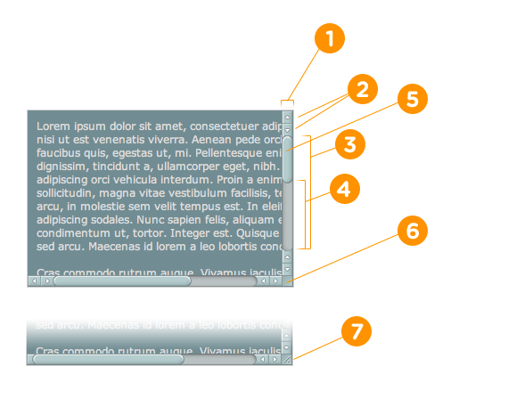

## 自定义页面滚动条

在开发过程中，有时候需要对浏览器的滚动条进行自定义，那如何通过 css 来修改浏览器的默认滚动条样式或者隐藏滚动条呢？

我们针对三种主流浏览器 `Firefox`，`Chromium`，`IE` 来讨论。由于 IE 浏览器现在已经不再维护，大部分以前在 IE 上访问的网站都会切换到别的浏览器上进行访问，故 IE 可以不考虑。

> 此功能某些浏览器尚在开发中，请参考浏览器兼容性表格以得到在不同浏览器中适合使用的前缀。由于该功能对应的标准文档可能被重新修订，所以在未来版本的浏览器中该功能的语法和行为可能随之改变。

### Firefox

#### `scrollbar-width`：设置滚动条的宽度

| 取值 | 说明                                                                             | 是否默认 |
| ---- | -------------------------------------------------------------------------------- | -------- |
| auto | 系统默认的滚动条宽度                                                             | 是       |
| thin | 系统提供的瘦滚动条宽度，或者比默认滚动条宽度更窄的宽度（经过不精准测量大概 8px） | 否       |
| none | 不显示滚动条，但是该元素依然可以滚动                                             | 否       |

取值为 thin 时，只对窗口的滚动条有效果，对标签的滚动条无效。不能取值为数值或像素值。

```scss
.scroller {
  scrollbar-width: thin;
}
```

#### `scrollbar-color`：设置滚动条背景和滑块的颜色

| 取值                | 说明               | 是否默认 |
| ------------------- | ------------------ | -------- |
| auto                | 系统默认的平台渲染 | 是       |
| dark                | 黑色滚动条         | 否       |
| light               | 轻量滚动条         | 否       |
| `<color>` `<color>` | 背景色 + 滑块颜色  | 否       |

```scss
.scroller {
  scrollbar-color: rebeccapurple green;
}
```

举例：

```scss
html {
  scrollbar-width: thin;
  scrollbar-color: red green;
}
```

### Chromium

Chromium 内核浏览器，除 chrome 外，还包括 edge、opera、safari、以及换壳的各种国产浏览器。

[](https://css-tricks.com/custom-scrollbars-in-webkit/)

1、::-webkit-scrollbar
滚动条整体部分，其中的属性有 width，height，background，border，border-radius（就和一个块级元素一样）等。它不仅能控制窗口的滚动条，也能控制标签的滚动条。

其中，width 定义的是纵向滚动条的宽度，height 定义的是横向滚动条的高度。

```scss
::webkit-scrollbar {
  background: #f00;
  width: 10px;
  height: 10px;
  border: 1px solid #000;
  border-radius: 10px;
}
```

2、::-webkit-scrollbar-button

滚动条两端的按钮。可以用 display:none 让其不显示，也可以添加背景图片，颜色改变显示效果。

3、::-webkit-scrollbar-track

外层轨道。可以用 display:none 让其不显示，也可以添加背景图片，颜色改变显示效果。

4、::-webkit-scrollbar-track-piece

内层轨道。外层轨道设置了，这个内层轨道也会跟着变。

5、::-webkit-scrollbar-thumb

滚动条里的滑块。

6、::-webkit-scrollbar-corner

边角。个人习惯设置跟整体滚动条同一个背景色，不用刻意让它显示。

7、::-webkit-resizer

右下角拖动块。个人习惯设置跟整体滚动条同一个背景色，不用刻意让它显示。

一般的写法：

```scss
/* 滚动条和滑块 */
::-webkit-scrollbar,
::-webkit-scrollbar-thumb {
  width: 8px;
  height: 8px;
  border-radius: 10px;
}
/* 滑块背景色 */
::-webkit-scrollbar-thumb {
  background: #fbefb5;
}
/* 其余相关样式设置跟滑块一个背景色 */
::-webkit-scrollbar,
::-webkit-scrollbar-corner,
::-webkit-resizer,
::-webkit-scrollbar-track,
::-webkit-scrollbar-track-piece {
  background: #991d28;
}
/* 隐藏滚动条按钮 */
::-webkit-scrollbar-button {
  display: none;
}
```

### IE

需要区分窗口滚动条和标签滚动条：

```scss
html,
.scrollbar {
  /*三角箭头的颜色*/
  scrollbar-arrow-color: #fbefb5;
  /*滚动条滑块按钮的颜色*/
  scrollbar-face-color: #fbefb5;
  /*滚动条整体颜色*/
  scrollbar-highlight-color: #991d28;
  /*滚动条阴影*/
  scrollbar-shadow-color: #991d28;
  /*滚动条轨道颜色*/
  scrollbar-track-color: #991d28;
  /*滚动条3d亮色阴影边框的外观颜色——左边和上边的阴影色*/
  scrollbar-3dlight-color: #991d28;
  /*滚动条3d暗色阴影边框的外观颜色——右边和下边的阴影色*/
  scrollbar-darkshadow-color: #991d28;
  /*滚动条基准颜色*/
  scrollbar-base-color: #991d28;
}
```

注意：

1. 无法更改 IE 滚动条的宽度

2. 没有办法在非 webkit 内核的 Microsoft Edge 中执行此操作，这些在 MS Edge 中被删除了。

3. webkit 内核的 Edge 自定义滚动条设置方法参考 chromium 的做法。

### 总结

如果想隐藏浏览器的滚动条，可以如下写：

```scss
@mixin mixin-scroll-hide {
  scroll-behavior: smooth;

  // chromium / safari
  &::-webkit-scrollbar {
    display: none;
  }

  /* 隐藏滚动条按钮 */
  &::-webkit-scrollbar-button {
    display: none;
  }
  // firefox
  scrollbar-width: none;
}
```

### 参考链接

1. [CSS3 干货 14：自定义页面滚动条](https://blog.csdn.net/weixin_42703239/article/details/105311582)

2. [CSS_Scrollbars](https://developer.mozilla.org/zh-CN/docs/Web/CSS/CSS_Scrollbars)
