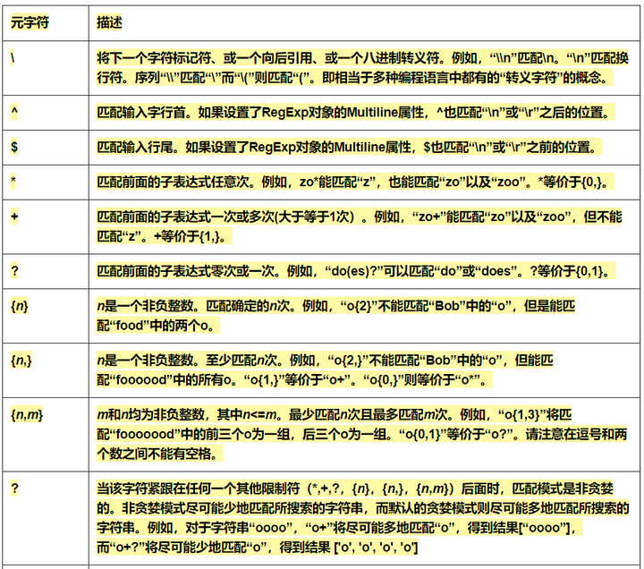
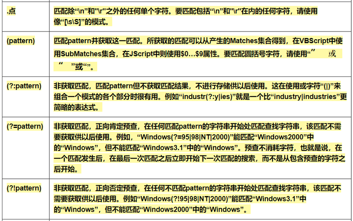
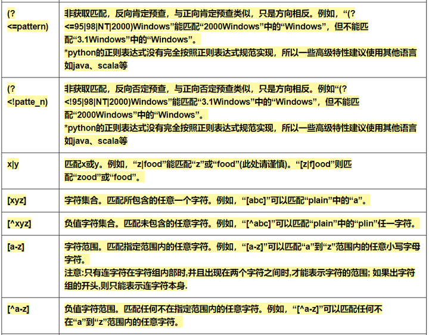
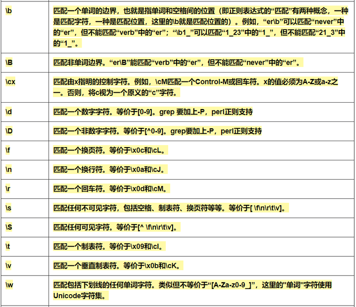
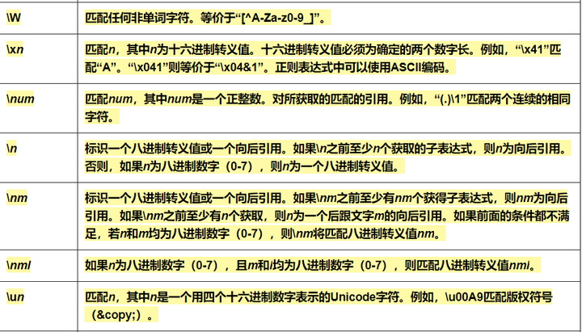
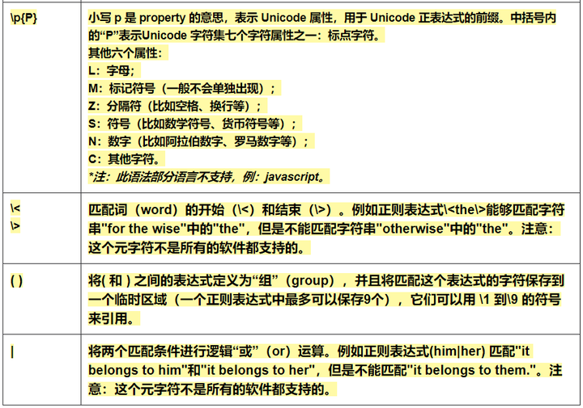

## js 正则表达式

### 数字

数字：^[0-9]_$
n位的数字：^\d{n}$
至少 n 位的数字：^\d{n,}$
m-n位的数字：^\d{m,n}$
零和非零开头的数字：^(0|[1-9][0-9]_)$
非零开头的最多带两位小数的数字：^([1-9][0-9]*)+(.[0-9]{1,2})?$
带 1-2 位小数的正数或负数：^(\-)?\d+(\.\d{1,2})?$
正数、负数、和小数：^(\-|\+)?\d+(\.\d+)?$
有两位小数的正实数：^[0-9]+(.[0-9]{2})?$
有1~3位小数的正实数：^[0-9]+(.[0-9]{1,3})?$
非零的正整数：^[1-9]\d*$ 或 ^([1-9][0-9]*){1,3}$ 或 ^\+?[1-9][0-9]_$
非零的负整数：^\-[1-9][]0-9"_$ 或 ^-[1-9]\d*$
非负整数：^\d+$ 或 ^[1-9]\d*|0$
非正整数：^-[1-9]\d*|0$ 或 ^((-\d+)|(0+))$
非负浮点数：^\d+(\.\d+)?$ 或 ^[1-9]\d*\.\d*|0\.\d*[1-9]\d*|0?\.0+|0$
非正浮点数：^((-\d+(\.\d+)?)|(0+(\.0+)?))$ 或 ^(-([1-9]\d*\.\d*|0\.\d*[1-9]\d*))|0?\.0+|0$
正浮点数：^[1-9]\d*\.\d*|0\.\d*[1-9]\d*$ 或 ^(([0-9]+\.[0-9]_[1-9][0-9]_)|([0-9]_[1-9][0-9]_\.[0-9]+)|([0-9]_[1-9][0-9]_))$
负浮点数：^-([1-9]\d*\.\d*|0\.\d*[1-9]\d*)$ 或 ^(-(([0-9]+\.[0-9]_[1-9][0-9]_)|([0-9]_[1-9][0-9]_\.[0-9]+)|([0-9]_[1-9][0-9]_)))$
浮点数：^(-?\d+)(\.\d+)?$ 或 ^-?([1-9]\d*\.\d*|0\.\d*[1-9]\d*|0?\.0+|0)$

验证数字：^[0-9]_$
验证n位的数字：^\d{n}$
验证至少 n 位数字：^\d{n,}$
验证m-n位的数字：^\d{m,n}$
验证零和非零开头的数字：^(0|[1-9][0-9]_)$
验证有两位小数的正实数：^[0-9]+(.[0-9]{2})?$
验证有 1-3 位小数的正实数：^[0-9]+(.[0-9]{1,3})?$
验证非零的正整数：^\+?[1-9][0-9]*$
验证非零的负整数：^\-[1-9][0-9]_$
验证非负整数（正整数 + 0） ^\d+$
验证非正整数（负整数 + 0） ^((-\d+)|(0+))$
验证长度为3的字符：^.{3}$
验证由 26 个英文字母组成的字符串：^[A-Za-z]+$
验证由26个大写英文字母组成的字符串：^[A-Z]+$
验证由 26 个小写英文字母组成的字符串：^[a-z]+$
验证由数字和26个英文字母组成的字符串：^[A-Za-z0-9]+$
验证由数字、26 个英文字母或者下划线组成的字符串：^\w+$
验证用户密码:^[a-zA-Z]\w{5,17}$ 正确格式为：以字母开头，长度在 6-18 之间，只能包含字符、数字和下划线。
验证是否含有 ^%&',;=?$\" 等字符：[^%&',;=?$\x22]+
验证汉字：^[\u4e00-\u9fa5],{0,}$
验证 Email 地址：/^([a-zA-Z0-9]+[_|\_|\.]?)_[a-zA-Z0-9]+@([a-zA-Z0-9]+[_|\_|\.]?)_[a-zA-Z0-9]+\.[a-zA-Z]{2,3}$/
验证 InternetURL：^http://([\w-]+\.)+[\w-]+(/[\w-./?%&=]_)?$ ；^[a-zA-z]+://(w+(-w+)_)(.(w+(-w+)_))_(?S_)?$
验证电话号码：^(\(\d{3,4}\)|\d{3,4}-)?\d{7,8}$：--正确格式为：XXXX-XXXXXXX，XXXX-XXXXXXXX，XXX-XXXXXXX，XXX-XXXXXXXX，XXXXXXX，XXXXXXXX。
验证身份证号（15 位或 18 位数字）：^\d{15}|\d{}18$
验证一年的12个月：^(0?[1-9]|1[0-2])$ 正确格式为：“01”-“09”和“1”“12”
验证一个月的 31 天：^((0?[1-9])|((1|2)[0-9])|30|31)$ 正确格式为：01、09 和 1、31。
整数：^-?\d+$
非负浮点数（正浮点数 + 0）：^\d+(\.\d+)?$
正浮点数 ^(([0-9]+\.[0-9]_[1-9][0-9]_)|([0-9]_[1-9][0-9]_\.[0-9]+)|([0-9]_[1-9][0-9]_))$
非正浮点数（负浮点数 + 0） ^((-\d+(\.\d+)?)|(0+(\.0+)?))$
负浮点数 ^(-(([0-9]+\.[0-9]_[1-9][0-9]_)|([0-9]_[1-9][0-9]_\.[0-9]+)|([0-9]_[1-9][0-9]_)))$
浮点数 ^(-?\d+)(\.\d+)?$
0.x-9.x：/^\d(\.\d)?$/
29-3：/^(\d+(\.\d+)?)-(\d+(\.\d+)?)$/

### 校验字符的表达式

汉字：^[\u4e00-\u9fa5]{0,}$
英文和数字：^[A-Za-z0-9]+$ 或 ^[A-Za-z0-9]{4,40}$
长度为3-20的所有字符：^.{3,20}$
由 26 个英文字母组成的字符串：^[A-Za-z]+$
由26个大写英文字母组成的字符串：^[A-Z]+$
由 26 个小写英文字母组成的字符串：^[a-z]+$
由数字和26个英文字母组成的字符串：^[A-Za-z0-9]+$
由数字、26 个英文字母或者下划线组成的字符串：^\w+$ 或 ^\w{3,20}
中文、英文、数字包括下划线：^[\u4E00-\u9FA5A-Za-z0-9_]+$
中文、英文、数字但不包括下划线等符号：^[\u4E00-\u9FA5A-Za-z0-9]+$ 或 ^[\u4E00-\u9FA5A-Za-z0-9]{2,20}$
可以输入含有^%&',;=?$\"等字符：[^%&',;=?$\x22]+
禁止输入含有~的字符：[^~\x22]+

### 其它：

1. 汉字：/[\u4E00-\u9FA5]/

2. 全角符号：/[\uFF00-\uFFFF]/

3. 半角符号：/[\u0000-\u00FF]/

### js 判断输入的文字是全角还是半角？

str="中文;；ａ"  
alert(str.match(/[\u0000-\u00ff]/g)) //半角  
alert(str.match(/[\u4e00-\u9fa5]/g)) //中文  
alert(str.match(/[\uff00-\uffff]/g)) //全角

### 特殊需求表达式

Email 地址：^\w+([-+.]\w+)_@\w+([-.]\w+)_\.\w+([-.]\w+)_$
域名：[a-zA-Z0-9][-a-zA-Z0-9]{0,62}(/.[a-zA-Z0-9][-a-zA-Z0-9]{0,62})+/.?
InternetURL：[a-zA-z]+://[^\s]_ 或 ^http://([\w-]+\.)+[\w-]+(/[\w-./?%&=]_)?$
手机号码：^(13[0-9]|14[5|7]|15[0|1|2|3|5|6|7|8|9]|18[0|1|2|3|5|6|7|8|9])\d{8}$
电话号码("XXX-XXXXXXX"、"XXXX-XXXXXXXX"、"XXX-XXXXXXX"、"XXX-XXXXXXXX"、"XXXXXXX"和"XXXXXXXX)：^(\(\d{3,4}-)|\d{3.4}-)?\d{7,8}$
国内电话号码(0511-4405222、021-87888822)：\d{3}-\d{8}|\d{4}-\d{7}
身份证号(15位、18位数字)：^\d{15}|\d{18}$
短身份证号码(数字、字母 x 结尾)：^([0-9]){7,18}(x|X)?$ 或 ^\d{8,18}|[0-9x]{8,18}|[0-9X]{8,18}?$
帐号是否合法(字母开头，允许 5-16 字节，允许字母数字下划线)：^[a-zA-Z]a-zA-Z0-9_]{4,15}$
密码(以字母开头，长度在 6~18 之间，只能包含字母、数字和下划线)：^[a-zA-Z]\w{5,17}$
强密码(必须包含大小写字母和数字的组合，不能使用特殊字符，长度在 8-10 之间)：^(?=._\d)(?=._[a-z])(?=.\_[A-Z]).{8,10}$
日期格式：^\d{4}-\d{1,2}-\d{1,2}
一年的12个月(01～09和1～12)：^(0?[1-9]|1[0-2])$
一个月的 31 天(01 ～ 09 和 1 ～ 31)：^((0?[1-9])|((1|2)[0-9])|30|31)$

### 钱的输入格式：

1.有四种钱的表示形式我们可以接受:"10000.00" 和 "10,000.00", 和没有 "分" 的 "10000" 和 "10,000"：^[1-9][0-9]\*$

2.这表示任意一个不以 0 开头的数字,但是,这也意味着一个字符"0"不通过,所以我们采用下面的形式：^(0|[1-9][0-9]\*)$

3.一个 0 或者一个不以 0 开头的数字.我们还可以允许开头有一个负号：^(0|-?[1-9][0-9]\*)$

4.这表示一个 0 或者一个可能为负的开头不为 0 的数字.让用户以 0 开头好了.把负号的也去掉,因为钱总不能是负的吧.下面我们要加的是说明可能的小数部分：^[0-9]+(.[0-9]+)?$

5.必须说明的是,小数点后面至少应该有 1 位数,所以"10."是不通过的,但是 "10" 和 "10.2" 是通过的：^[0-9]+(.[0-9]{2})?$

6.这样我们规定小数点后面必须有两位,如果你认为太苛刻了,可以这样：^[0-9]+(.[0-9]{1,2})?$

7.这样就允许用户只写一位小数.下面我们该考虑数字中的逗号了,我们可以这样：^[0-9]{1,3}(,[0-9]{3})\*(.[0-9]{1,2})?$

8.1 到 3 个数字,后面跟着任意个 逗号+3 个数字,逗号成为可选,而不是必须：^([0-9]+|[0-9]{1,3}(,[0-9]{3})\*)(.[0-9]{1,2})?$

### 网络相关

xml 文件：^([a-zA-Z]+-?)+[a-zA-Z0-9]+\\.[x|X][m|M][l|L]$
中文字符的正则表达式：[\u4e00-\u9fa5]
双字节字符：[^\x00-\xff] (包括汉字在内，可以用来计算字符串的长度(一个双字节字符长度计2，ASCII字符计1))
空白行的正则表达式：\n\s*\r (可以用来删除空白行)
HTML标记的正则表达式：<(\S*?)[^>]*>.*?|<.*? /> (网上流传的版本太糟糕，上面这个也仅仅能部分，对于复杂的嵌套标记依旧无能为力)
首尾空白字符的正则表达式：^\s*|\s*$或(^\s*)|(\s*$) (可以用来删除行首行尾的空白字符(包括空格、制表符、换页符等等)，非常有用的表达式)
腾讯QQ号：[1-9][0-9]{4,} (腾讯QQ号从10000开始)
中国邮政编码：[1-9]\d{5}(?!\d) (中国邮政编码为6位数字)
IP地址：\d+\.\d+\.\d+\.\d+ (提取IP地址时有用)
IP地址：((?:(?:25[0-5]|2[0-4]\\d|[01]?\\d?\\d)\\.){3}(?:25[0-5]|2[0-4]\\d|[01]?\\d?\\d))
IP-v4地址：\\b(?:(?:25[0-5]|2[0-4][0-9]|[01]?[0-9][0-9]?)\\.){3}(?:25[0-5]|2[0-4][0-9]|[01]?[0-9][0-9]?)\\b (提取IP地址时有用)
校验IP-v6地址:(([0-9a-fA-F]{1,4}:){7,7}[0-9a-fA-F]{1,4}|([0-9a-fA-F]{1,4}:){1,7}:|([0-9a-fA-F]{1,4}:){1,6}:[0-9a-fA-F]{1,4}|([0-9a-fA-F]{1,4}:){1,5}(:[0-9a-fA-F]{1,4}){1,2}|([0-9a-fA-F]{1,4}:){1,4}(:[0-9a-fA-F]{1,4}){1,3}|([0-9a-fA-F]{1,4}:){1,3}(:[0-9a-fA-F]{1,4}){1,4}|([0-9a-fA-F]{1,4}:){1,2}(:[0-9a-fA-F]{1,4}){1,5}|[0-9a-fA-F]{1,4}:((:[0-9a-fA-F]{1,4}){1,6})|:((:[0-9a-fA-F]{1,4}){1,7}|:)|fe80:(:[0-9a-fA-F]{0,4}){0,4}%[0-9a-zA-Z]{1,}|::(ffff(:0{1,4}){0,1}:){0,1}((25[0-5]|(2[0-4]|1{0,1}[0-9]){0,1}[0-9])\\.){3,3}(25[0-5]|(2[0-4]|1{0,1}[0-9]){0,1}[0-9])|([0-9a-fA-F]{1,4}:){1,4}:((25[0-5]|(2[0-4]|1{0,1}[0-9]){0,1}[0-9])\\.){3,3}(25[0-5]|(2[0-4]|1{0,1}[0-9]){0,1}[0-9]))
子网掩码：((?:(?:25[0-5]|2[0-4]\\d|[01]?\\d?\\d)\\.){3}(?:25[0-5]|2[0-4]\\d|[01]?\\d?\\d))
校验日期:^(?:(?!0000)[0-9]{4}-(?:(?:0[1-9]|1[0-2])-(?:0[1-9]|1[0-9]|2[0-8])|(?:0[13-9]|1[0-2])-(?:29|30)|(?:0[13578]|1[02])-31)|(?:[0-9]{2}(?:0[48]|[2468][048]|[13579][26])|(?:0[48]|[2468][048]|[13579][26])00)-02-29)$(“yyyy-mm-dd“ 格式的日期校验，已考虑平闰年。)
抽取注释：
查找 CSS 属性:^\\s*[a-zA-Z\\-]+\\s*[:]{1}\\s[a-zA-Z0-9\\s.#]+[;]{1}
提取页面超链接:(]_)(href="https?:\\/\\/)((?!(?:(?:www\\.)?'.implode('|(?:www\\.)?', $follow_list).'))[^" rel="external nofollow" ]+)"((?!._\\brel=)[^>]_)(?:[^>]_)>
提取网页图片:\\< _[img][^\\\\>]_[src] _= _[\\"\\']{0,1}([^\\"\\'\\ >]_)
提取网页颜色代码:^#([A-Fa-f0-9]{6}|[A-Fa-f0-9]{3})$
文件扩展名效验:^([a-zA-Z]\\:|\\\\)\\\\([^\\\\]+\\\\)_[^\\/:*?"<>|]+\\.txt(l)?$
判断IE版本：^.*MSIE [5-8](?:\\.[0-9]+)?(?!.*Trident\\/[5-9]\\.0).*$

### 英文半角

/[\x21-\x2F\x3A-\x40\x5B-\x60\x7B-\x7E]/g

解释：
– `[]` 匹配方括号中的任意一个字符
– `\x21-\x2F` 匹配 ASCII 码中的数字 21 到 2F 之间的字符，即 `!”#$%&'()*+,-./`
– `\x3A-\x40` 匹配 ASCII 码中的数字 3A 到 40 之间的字符，即 `:;<=>?@`
– `\x5B-\x60` 匹配 ASCII 码中的数字 5B 到 60 之间的字符，即 `[\]^_`
– `\x7B-\x7E` 匹配 ASCII 码中的数字 7B 到 7E 之间的字符，即 `{|}~`

最后的 `/g` 表示全局匹配，即匹配所有的特殊字符。

### 邮箱

/^([a-zA-Z0-9]+[_|\_|\.]?)_[a-zA-Z0-9]+@([a-zA-Z0-9]+[_|\_|\.]?)\_[a-zA-Z0-9]+\.[a-zA-Z]{2,3}$/;

### 参考链接

1. [常用正则表达式-数字篇](https://www.cnblogs.com/so-letitgo/p/10552415.html)

2. [全网最全 JS 正则表达式 校验数字](https://www.cnblogs.com/bert227/p/10260424.html)

3. [校验英文半角字符的正则表达式](https://www.shence123.com/s/61283.html)

4. [常用正则表达式最强整理](https://zhuanlan.zhihu.com/p/658166320)
