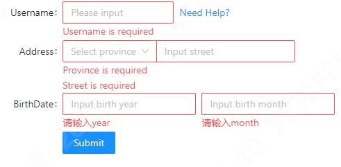

## react + antd

### antd 样式按需引入

1. 安装 `babel-plugin-import`

```bash
yarn add babel-plugin-import -S
```

2. 在配置中配置 babel
   ```ts
   extraBabelPlugins: [
    [
      'import', // 要做按需引入，所以是import
       {
         libraryName: 'antd', // 表示要做antd的按需引入
         libraryDirectory: 'es', // antd用es的模块化规范
         style: true, //设置为true即是less
       }
     ],
   ],
   ```
   或
   ```ts
   // antd 按需引入样式
    babel: {
        plugins: [
            [
                "import", // 要做按需引入，所以是import
                {
                    "libraryName": "antd", // 表示要做antd的按需引入
                    "libraryDirectory": "es",// antd用es的模块化规范
                    "style": true //设置为true即是less
                }
            ]
        ]
    },
   ```

### antd Upload 组件使用，出现闪动问题

参考链接：https://blog.csdn.net/qq_37766810/article/details/122090712

复现场景：

1. table 里面的某个字段 voucher 使用 Upload 组件展示，传参为 fileList: [{ uid: '1', url: 'xxx', name: 'xxx' }]。
2. 更改图片时，Upload 组件的 fileList 里面的 uid 与 步骤 1 的 fileList 里面的 uid 不一致，导致每次一更改图片后，会出现闪动情况

解决方案：

1. table 里面的某个字段 voucher 使用 Upload 组件展示，传参为 fileList: [{ uid: record.voucherUid || '1', url: 'xxx', name: 'xxx' }]。
2. 更改图片是，Upload 组件的 fileList 里面的 uid 赋值给 table 数据源里面的 voucherUid。就能保证更改图片后 uid 是一致的，就可以避免闪动情况。

### setFieldValue don't call dependencies form field change

参考：https://github.com/ant-design/ant-design/issues/36985

复现例子：https://codesandbox.io/s/antd-form-forked-fd3xwu?file=/src/App.js

根据目前 antd 的 issues，官方还没有提供解决办法，可以暂时先用 `shouldUpdate` 修复，或者自己监听 onChange 后手动触发

### antd(antdV) table scroll 设置 x 为 max-content 和 y 设置某个值后，表头宽度自适应失效

scroll 设置为 `{{ x: 'max-conetnt', y: 300 }}` 后，x 设置失效。antd 和 antd-vue 都是如此。

研究其代码发现，设置 x 为 max-content 时有一个样式，设置 y 时有一个样式，结果组合的时候，把 x 设置的独特样式给干掉了。所以 x 失效了。看了官网的 issue，大家提出来了，但是还没有解决。

以下是临时的解决办法

```tsx
<Table
  rowKey='id'
  rowSelection={rowSelection}
  size='small'
  bordered
  columns={columns}
  {...tableProps}
  scroll={{ x: 'max-content' }}
  className={styles.table}></Table>
```

```less
.table {
  :global {
    .ant-table-content {
      overflow: auto !important;
      max-height: calc(100vh - 330px);
    }
    .ant-table-thead {
      position: -webkit-sticky;
      position: sticky;
      z-index: 3; // fixed 字段 z-index 为 2
      top: 1px;
      box-shadow: 0px -1px 0px 0px #f0f0f0;

      top: 0; // bordered 设置为 false 时就直接 top 为 0 即可
    }
  }
}
```

### Form.Item 内有多个元素的方式如何布局加展示

`<Form.Item name="field" />` 只会对它的直接子元素绑定表单功能，例如直接包裹了 `Input/Select`。如果控件前后还有一些文案或样式装点，或者一个表单项内有多个控件，你可以使用内嵌的 `Form.Item` 完成。你可以给 `Form.Item` 自定义 `style` 进行内联布局，或者添加 `noStyle` 作为纯粹的无样式绑定组件。

参考：https://4x.ant.design/components/form-cn/#components-form-demo-validate-other



```tsx
import { Button, Form, Input, Select, Space, Tooltip, Typography } from 'antd';
import React from 'react';

const { Option } = Select;

const App: React.FC = () => {
  const onFinish = (values: any) => {
    console.log('Received values of form: ', values);
  };

  return (
    <Form name='complex-form' onFinish={onFinish} labelCol={{ span: 8 }} wrapperCol={{ span: 16 }}>
      <Form.Item label='Username'>
        <Space>
          <Form.Item name='username' noStyle rules={[{ required: true, message: 'Username is required' }]}>
            <Input style={{ width: 160 }} placeholder='Please input' />
          </Form.Item>
          <Tooltip title='Useful information'>
            <Typography.Link href='#API'>Need Help?</Typography.Link>
          </Tooltip>
        </Space>
      </Form.Item>
      <Form.Item label='Address'>
        <Input.Group compact>
          <Form.Item
            name={['address', 'province']}
            noStyle
            rules={[{ required: true, message: 'Province is required' }]}>
            <Select placeholder='Select province'>
              <Option value='Zhejiang'>Zhejiang</Option>
              <Option value='Jiangsu'>Jiangsu</Option>
            </Select>
          </Form.Item>
          <Form.Item name={['address', 'street']} noStyle rules={[{ required: true, message: 'Street is required' }]}>
            <Input style={{ width: '50%' }} placeholder='Input street' />
          </Form.Item>
        </Input.Group>
      </Form.Item>
      <Form.Item label='BirthDate' style={{ marginBottom: 0 }}>
        <Form.Item
          name='year'
          rules={[{ required: true }]}
          style={{ display: 'inline-block', width: 'calc(50% - 8px)' }}>
          <Input placeholder='Input birth year' />
        </Form.Item>
        <Form.Item
          name='month'
          rules={[{ required: true }]}
          style={{ display: 'inline-block', width: 'calc(50% - 8px)', margin: '0 8px' }}>
          <Input placeholder='Input birth month' />
        </Form.Item>
      </Form.Item>
      <Form.Item label=' ' colon={false}>
        <Button type='primary' htmlType='submit'>
          Submit
        </Button>
      </Form.Item>
    </Form>
  );
};

export default App;
```
