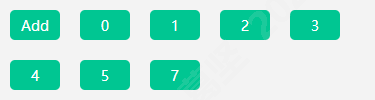
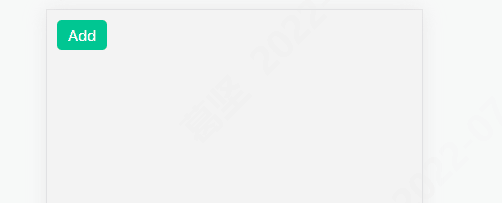

## React hook 闭包问题

本文分享一个短小而又深刻的 React Hook 场景题，这个例子涉及到：

1. hook 闭包问题
2. state 更新机制

希望看完以后大家会对 `React` 函数组件有更深入的了解。

### 场景复现

首先看一下 Demo

```tsx
import { useState } from 'react';
import styles from './index.scss';

export default () => {
  const [list, setList] = useState([]);

  const add = () => {
    // ...
  };

  return (
    <div className={styles.app}>
      <button className={styles.add} onClick={add}>
        Add
      </button>
      {list.map((val) => val)}
    </div>
  );
};
```

`list` 是使用 `useState` 管理的状态，`button` 绑定了点击事件 `add`。点击按钮，会触发 `add` 方法，向 `list` 里面增加一些内容。

现在页面看起来像这样：


我们继续，在外部定义一个变量 `i`，修改 `add` 方法，如下：

```tsx
import { ReactNode, useState } from 'react';
import styles from './index.scss';

// 定义外部变量 i
let i = 0;
export default () => {
  const [list, setList] = useState<ReactNode[]>([]);

  const add = () => {
    // 增加新的 button，绑定 add 方法
    setList(
      list.concat(
        <button className={styles.add} key={i} onClick={add}>
          {i++}
        </button>
      )
    );
  };

  return (
    <div className={styles.app}>
      <button className={styles.add} onClick={add}>
        Add
      </button>
      {list.map((val) => val)}
    </div>
  );
};
```

当我们点击 【Add按钮】 7 次，页面展示如下：


### 问题

现在我们**点击这些【数字按钮】，页面会怎么展示呢？**

- 比如点击 0，页面会如何展示，list 最终结果是什么？
- 点击 6，又会如何展示？

大家可以思考一下，这两种情况下页面的展示情况。带着自己心中的答案，继续往下读，看看自己答对了没有？

### 解答

可能很多小伙伴会认为，点击【数字按钮】，会有新的 button 被添加到 list 中去。然鹅，这个答案是**错误**的。

正确答案是什么呢？点击【数字按钮】后：

- 列表的长度将会变成 <text style="color: #28ca71">点击的数字 + 1</text>；
- 并且列表最后一个数字会变成 <text style="color: #28ca71">点击之前最大的数字 + 1</text>。

可能这样说大家不太明白，举一个**栗子**。

假设点击 【Add按钮】 7 次后当前列表变为：


1. 如果此时点击 <text style="color: #28ca71">0</text>：

   - 列表的长度会变成 <text style="color: #28ca71">0</text> + 1 = 1
   - 列表最后一个数字会变成 <text style="color: #28ca71">6</text> + 1 = 7
     

2. 如果此时点击 <text style="color: #28ca71">3</text>：

   - 列表的长度会变成 <text style="color: #28ca71">3</text> + 1 = 4
   - 列表最后一个数字会变成 <text style="color: #28ca71">6</text> + 1 = 7
     

3. 如果此时点击 <text style="color: #28ca71">5</text>：

   - 列表的长度会变成 <text style="color: #28ca71">5</text> + 1 = 6
   - 列表最后一个数字会变成 <text style="color: #28ca71">6</text> + 1 = 7
     

4. 如果此时点击 <text style="color: #28ca71">6</text>：
   - 列表的长度会变成 <text style="color: #28ca71">6</text> + 1 = 7
   - 列表最后一个数字会变成 <text style="color: #28ca71">6</text> + 1 = 7
     

为什么呢？
<image src="./images/why.jpeg" width="200">

### 原理剖析

造成这种反直觉现象的原因有两个：

1. **hook 闭包问题**
2. **state 更新机制**

再次让我们看看点击按钮触发的事件 `add`：

```tsx
const add = () => {
  // 增加新的 button，绑定 add 方法
  setList(
    list.concat(
      <button className={styles.add} key={i} onClick={add}>
        {i++}
      </button>
    )
  );
};
```
当执行 `add` 函数时，由于访问了外层函数内部的变量 `list`，所以会根据外层函数上下文形成闭包，闭包内包括：
+ add 函数
+ list 变量
+ setList 方法

<image src="./images/explain.png" width="500">

`list` 和 `setList` 是调用 `useState()` 返回的。

这里通常有一个**误解**：**多次调用 `useState`，返回的 `list` 都是同一个对象。**

实际上，`useState` 返回的 `list` 都是基于 `base state` 计算出来的：
```tsx
current state = base state + update1 + update2 + …
```
每次会将上一次的 `prev state` 与 `update` 进行合并得到新的 `current state`。

因此，**每次调用 useState 返回的 list 都不是同一个对象**，它们的内存地址不同。

这会导致每个【数字按钮】的 `add` 函数处于不同的闭包中，每个闭包当中的 `list` 都不同。
<image src="./images/explain-1.png" width="600">
而变量 `i` 是声明在外层的模块级变量，在每个闭包中 `i` 都是相同的。
```tsx
// 定义外部变量 i
let i = 0;
```

所以：

在点击 <text style="color: #28ca71">0</text> 时：
- `i` 是模块级变量，值为 6；
- `list` 是闭包中的变量，值为 []；
实际上 `add` 函数执行的是：
```tsx
setList(
    [].concat(
      <button className={styles.add} key={7} onClick={add}>
        {7}
      </button>
    )
  );
```
所以 `list` 最终变成了 [7]。

在点击 <text style="color: #28ca71">3</text> 时：
- `i` 是模块级变量，值为 6；
- `list` 是闭包中的变量，值为 [0, 1]；
实际上 `add` 函数执行的是：
```tsx
setList(
    [0, 1].concat(
      <button className={styles.add} key={7} onClick={add}>
        {7}
      </button>
    )
  );
```
所以 `list` 最终变成了 [0, 1, 7]。

>为了方便理解，这里的 [0, 1, 7] 省略了外层的 `<button>` 标签。

依此类推，点击 <text style="color: #28ca71">5</text>、<text style="color: #28ca71">6</text>时，`list`分别变为了[0, 1, 2, 3, 4, 7]和[0, 1, 2, 3, 4, 5, 7]

### 如何解决
那既然我们已经知道了是因为闭包问题导致的点击现象与预期不一致，那该如何解决呢？怎么让按钮点击后可以正常添加按钮呢？

so easy，只要将 `list` 从闭包中清理出去就可以了，**将 `setList` 参数改为函数形式**。

修改 `add` 方法：
```tsx
const add = () => {
    // 增加新的 button，绑定 add 方法
    setList((list) =>
      list.concat(
        <button className={styles.add} key={i} onClick={add}>
          {i++}
        </button>,
      ),
    );
  };
```
这样，我们点击【Add按钮】或者是【数字按钮】，都会发现，`list` 后面会正常拼接按钮。


### 解决原理
我们来看下 `useState` 的定义。todo

### 总结
由于 state 的更新机制是：
```tsx
current state = base state + update1 + update2 + …
```
**每次调用 useState 返回的 list 都不是同一个对象。**
并且由于**闭包**的存在，每个【数字按钮】`add` 函数中的 `list` 都不同，导致了点击现象与实际不符。

因此我们可以通过将 `setState` 改为**函数形式**，将变量从闭包中清理出去。

### 参考链接

1. [一道有挑战性的 React Hook 场景题，考考你的功底](https://mp.weixin.qq.com/s/jLAWoT64-C0UoImsISN6nw)
