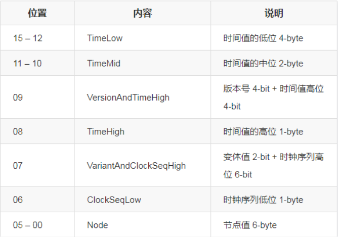
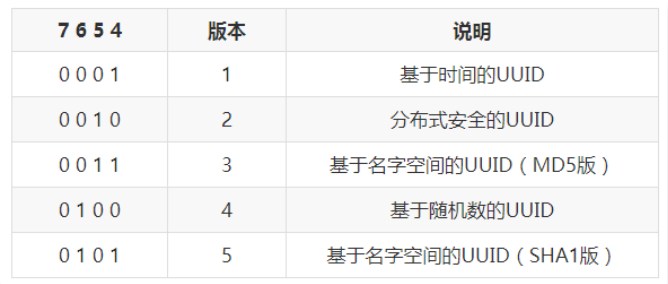
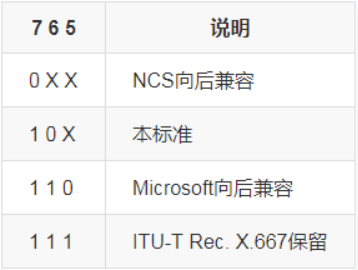

## 唯一ID

---

在业务开发中，大量场景需要唯一ID来进行标识：用户需要唯一身份标识；商品需要唯一标识；消息需要唯一标识；事件需要唯一标识…等等，都需要全局唯一ID，尤其是分布式场景下。

唯一ID有哪些特性或者说要求呢？按照我的分析有以下特性：
* 唯一性：生成的ID全局唯一，在特定范围内冲突概率极小
* 有序性：生成的ID按某种规则有序，便于数据库插入及排序
* 可用性：可保证高并发下的可用性
* 自主性：分布式环境下不依赖中心认证即可自行生成ID
* 安全性：不暴露系统和业务的信息

一般来说，常用的唯一ID生成方法有这些：

1. **UUID**
   - 基于时间戳&时钟序列生成
   - 基于名字空间/名字的散列值 (MD5/SHA1) 生成
   - 基于随机数生成
2. **数据库自增ID**
   - 多台机器不同初始值、同步长自增
   - 批量缓存自增ID
3. **雪花算法**
   - 时钟回拨解决方案

而在前端领域，一般应用到的就是 **UUID**。在此，我将对 **UUID** 做讲解和分析。


### UUID
UUID全称为：Universally Unique IDentifier（通用唯一识别码），有的地方也称作GUID（Globally Unique IDentifier），实际上GUID指微软对于UUID标准的实现。

UUID算法的目的是为了生成某种形式的全局唯一ID来标识系统中的任一元素，尤其在分布式环境下，该ID需要不依赖中心认证即可自动生成全局唯一ID。

**优势**：
* 无需网络，单机自行生成
* 速度快，QPS高（支持100ns级并发）
* 各语言均有相应实现库供直接使用

**缺点**：
* String存储，占空间，DB查询及索引效率低
* 无序，可读性差
* 根据实现方式不同可能泄露信息

#### UUID的格式
UUID的标准形式为32个十六进制数组成的字符串，且分隔为五个部分，如：**467e8542-2275-4163-95d6-7adc205580a9**
各部分的数字个数为：8-4-4-4-12，总共字符串长度为36位。

#### UUID版本
根据需要不同，标准提供了不同的UUID版本以供使用，分别对应于不同的UUID生成规则：
* 版本1 - 基于时间的UUID：主要依赖当前的时间戳及机器mac地址，因此可以保证全球唯一性
* 版本2 - 分布式安全的UUID：将版本1的时间戳前四位换为POSIX的UID或GID，很少使用
* 版本3 - 基于名字空间的UUID（MD5版）：基于指定的名字空间/名字生成MD5散列值得到，标准不推荐
* 版本4 - 基于随机数的UUID：基于随机数或伪随机数生成，
* 版本5 - 基于名字空间的UUID（SHA1版）：将版本3的散列算法改为SHA1

#### UUID各版本优缺点
1. **版本1 - 基于时间的UUID**：
   * 优点：能基本保证全球唯一性
   * 缺点：使用了Mac地址，因此会暴露Mac地址和生成时间

2. **版本2 - 分布式安全的UUID**：
   * 优点：能保证全球唯一性
   * 缺点：很少使用，常用库基本没有实现

3. **版本3 - 基于名字空间的UUID（MD5版）**：
   * 优点：不同名字空间或名字下的UUID是唯一的；相同名字空间及名字下得到的UUID保持重复。
   * 缺点：MD5碰撞问题，只用于向后兼容，后续不再使用

4. **版本4 - 基于随机数的UUID**：
   * 优点：实现简单
   * 缺点：重复几率可计算

5. **版本5 - 基于名字空间的UUID（SHA1版）**：
   * 优点：不同名字空间或名字下的UUID是唯一的；相同名字空间及名字下得到的UUID保持重复。
   * 缺点：SHA1计算相对耗时

总得来说：
* 版本 1/2 适用于需要高度唯一性且无需重复的场景；
* 版本 3/5 适用于一定范围内唯一且需要或可能会重复生成UUID的环境下；
* 版本 4 适用于对唯一性要求不太严格且追求简单的场景。

#### UUID结构及生成规则
以 版本1 - 基于时间的UUID 为例先梳理UUID的结构：

UUID为32位的十六机制数，因此实际上是16-byte (128-bit)，各位分别为：


**时间值**：在基于时间的UUID中，时间值是一个60位的整型值，对应UTC的100ns时间间隔计数，因此其支持支持一台机器每秒生成10M次。在UUID中，将这60位放置到了15~08这8-byte中（除了09位有4-bit的版本号内容）。

**版本号**：版本号即上文所说的五个版本，在五个版本的UUID中，都总是在该位置标识版本，占据 4-bit，分别以下列数字表示：

因此版本号这一位的取值只会是1,2,3,4,5。

**变体值**：表明所依赖的标准（X表示可以是任意值）：


时钟序列：在基于时间的UUID中，时钟序列占据了07~06位的14-bit。不同于时间值，时钟序列实际上是表示一种逻辑序列，用于标识事件发生的顺序。在此，如果前一时钟序列已知，则可以通过自增来实现时钟序列值的改变；否则，通过（伪）随机数来设置。主要用于避免因时间值向未来设置或节点值改变可能导致的UUID重复问题。

节点值：在基于时间的UUID中，节点值占据了05~00的48-bit，由机器的MAC地址构成。如果机器有多个MAC地址，则随机选其中一个；如果机器没有MAC地址，则采用（伪）随机数。

了解了基于时间的UUID结构及生成规则后，再看看其他版本的UUID生成规则：

**版本2 - 分布式安全的UUID**：
将基于时间的UUID中时间戳前四位换为POSIX的UID或GID，其余保持一致。

**版本3/5 - 基于名字空间的UUID (MD5/SHA1)**：
- 将命名空间 (如DNS、URL、OID等) 及名字转换为字节序列；
- 通过MD5/SHA1散列算法将上述字节序列转换为16字节哈希值 (MD5散列不再推荐，SHA1散列的20位只使用其15~00位)；
- 将哈希值的 3~0 字节置于UUID的15~12位；
- 将哈希值的 5~4 字节置于UUID的11~10位；
- 将哈希值的 7~6 字节置于UUID的09~08位，并用相应版本号覆盖第9位的高4位 (同版本1位置)；
- 将哈希值的 8 字节置于UUID的07位，并用相应变体值覆盖其高2位 (同版本1位置)；
- 将哈希值的 9 字节置于UUID的06位 (原时钟序列位置)；
- 将哈希值的 15~10 字节置于UUID的05~00位 (原节点值位置)。

**版本4 - 基于随机数的UUID**：
生成16byte随机值填充UUID。重复机率与随机数产生器的质量有关。若要避免重复率提高，必须要使用基于密码学上的假随机数产生器来生成值才行；
将变体值及版本号填到相应位置。

#### 多版本伪码
```ts
// 版本 1 - 基于时间的UUID：
gen_uuid() {
  struct uuid uu;

  // 获取时间戳
  get_time(&clock_mid, &uu.time_low);
  uu.time_mid = (uint16_t) clock_mid; // 时间中间位
  uu.time_hi_and_version = ((clock_mid >> 16) & 0x0FFF) | 0x1000; // 时间高位 & 版本号

  // 获取时钟序列。在libuuid中，尝试取时钟序列+1，取不到则随机；在python中直接使用随机
  get_clock(&uu.clock_seq);// 时钟序列+1 或 随机数
  uu.clock_seq |= 0x8000;// 时钟序列位 & 变体值

  // 节点值
  char node_id[6];
  get_node_id(node_id);// 根据mac地址等获取节点id
  uu.node = node_id;
  return uu;
}

// 版本4 - 基于随机数的UUID：
gen_uuid() {
  struct uuid uu;
  uuid_t buf;

  random_get_bytes(buf, sizeof(buf));// 获取随机出来的uuid，如libuuid根据进程id、当日时间戳等进行srand随机

  uu.clock_seq = (uu.clock_seq & 0x3FFF) | 0x8000;// 变体值覆盖
  uu.time_hi_and_version = (uu.time_hi_and_version & 0x0FFF) | 0x4000;// 版本号覆盖
  return uu;
}

// 版本5 - 基于名字空间的UUID（SHA1版）：
gen_uuid(name) {
  struct uuid uu;
  uuid_t buf;

  sha_get_bytes(name, buf, sizeof(buf));// 获取name的sha1散列出来的uuid

  uu.clock_seq = (uu.clock_seq & 0x3FFF) | 0x8000;// 变体值覆盖
  uu.time_hi_and_version = (uu.time_hi_and_version & 0x0FFF) | 0x5000;// 版本号覆盖
  return uu;
}
```

### UUID 使用
以下是UUID的使用方式：

#### 1. npm 包 uuid（生成唯一标识符）
简单，快速生成RFC4122 UUIDS。  
链接：https://www.npmjs.com/package/uuid  
安装：`npm install uuid` or `yarn add uuid`  
使用方法：  
```
var uuid = require('uuid');
uuid.v1();
uuid.v4();

import * as uuid from 'uuid';
uuid.v1();
uuid.v4();

const uuidv4 = require('uuid/v4');
uuidv4();
```

#### 2. shortid
`npm install shortid` or `yarn add shortid`
```ts
import shortid from 'shortid';

const uuid = shortid.generate();
```


#### 3. nanoid
`npm install nanoid` or `yarn add nanoid`
```ts
import { nanoid } from 'nanoid';

nanoid();
```

#### 4. 其他普通生成随机数的方式
见 ./demo.ts


### 参考链接
1. [唯一ID生成算法剖析，看看这篇就够了](https://cloud.tencent.com/developer/article/1530850)
2. [uuid-js](https://github.com/tangqipeng/uuid-js/blob/master/uuid.js)
3. [JavaScript生成GUID的算法](http://www.cnblogs.com/snandy/p/3261754.html)