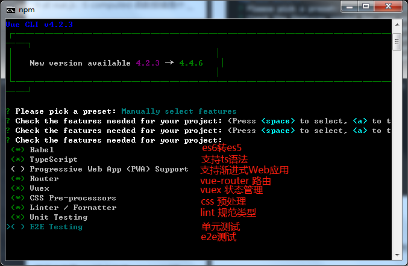

## vue3 全家桶初体验

vue全家桶：vue + vue-router + vuex

vue：是一套用于构建用户界面的渐进式框架，其核心库只关心视图层，易上手，易与第三方库或者既有项目进行整合。

vue-router：是 vue.js 官方的路由管理器。
主要功能有：
* 嵌套的路由/视图表
* 模块化的、基于组件的路由配置
* 路由参数、查询、通配符
* 基于 Vue.js 过渡系统的视图过渡效果
* 细粒度的导航控制
* 带有自动激活的 CSS class 的链接
* HTML5 历史模式或 hash 模式，在 IE9 中自动降级
* 自定义的滚动条行为

vuex：是一个专用于 vue.js 应用程序开发的状态管理模式，集中式存储管理应用的所有组件的状态，适合于开发中大型的单页应用。


vue-cli 4.x 版本创建vue2项目：
```
npm install -g @vue/cli
# OR
yarn global add @vue/cli

vue create vue2-all
在选择手动设置的时候，可以选择是否需要集成 Router 和 vuex，勾选即可。
```


目录结构：


vue3特性：
1. vue3.0是一个全新的框架，框架代码实现全部采用typescript编写。
2. 使用Proxy支持数据响应式处理。
3. 向下兼容，支持Vue2.x风格的写法。这种Vue2.x风格的写法就叫做Composition API(组合式API)。
一般我们在创建组件的时候，都会传入data、computed、methods、created、mounted等生命周期函数，用这些来声明一个组件。这种可选项集合就是Composition API(组合式API)。


vue 3 项目创建：


vite 创建时：
yarn add vue-router@4.0.0-alpha.12 --save
yarn add sass sass-loader --dev


## 参考链接
1. [vue-next](https://github.com/vuejs/vue-next)

2. [vite](https://github.com/vitejs/vite)

3. [Vuex 4](https://github.com/vuejs/vuex/tree/4.0)

4. [vue-router-next](https://github.com/vuejs/vue-router-next)

5. [vue-cli-plugin-vue-next](https://github.com/vuejs/vue-cli-plugin-vue-next)

6. [vue-next学习](https://gitee.com/kennana/vue_next_learning/tree/master)

https://zhuanlan.zhihu.com/p/133383201

https://blog.csdn.net/weixin_39876634/article/details/106875596