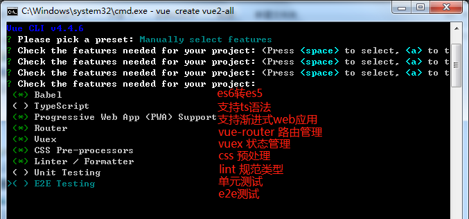

## vue3 全家桶初体验

vue全家桶：vue + vue-router + vuex

vue：是一套用于构建用户界面的渐进式框架，其核心库只关心视图层，易上手，易与第三方库或者既有项目进行整合。

vue-router：是 vue.js 官方的路由管理器。
主要功能有：
* 嵌套的路由/视图表
* 模块化的、基于组件的路由配置
* 路由参数、查询、通配符
* 基于 Vue.js 过渡系统的视图过渡效果
* 细粒度的导航控制
* 带有自动激活的 CSS class 的链接
* HTML5 历史模式或 hash 模式，在 IE9 中自动降级
* 自定义的滚动条行为

vuex：是一个专用于 vue.js 应用程序开发的状态管理模式，集中式存储管理应用的所有组件的状态，适合于开发中大型的单页应用。


vue-cli 4.x 版本创建vue2项目：
```
npm install -g @vue/cli
# OR
yarn global add @vue/cli

vue create vue2-all
在选择手动设置的时候，可以选择是否需要集成 Router 和 vuex，勾选即可。
```


目录结构：

https://zhuanlan.zhihu.com/p/133383201

https://blog.csdn.net/weixin_39876634/article/details/106875596

vue 3 项目创建：

