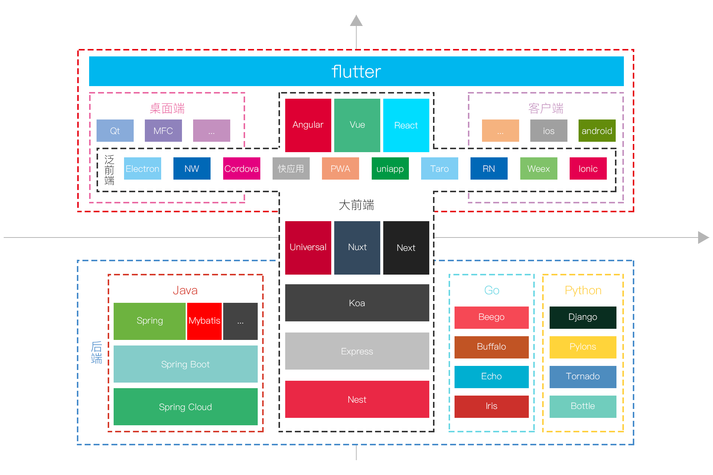

## 前端发展趋势

2021年web前端行业发展趋势：
1. __新规范的更新和稳定__。像目前HTML、CSS、JS等的标准都在逐步完善，前端的新标准也都在不断的提出和试验阶段。随着时间的推移，最终规范将会落地，标准将会执行。

2. __前端框架稳定有序迭代__。目前前端三大巨头框架分别是react、vue和angular。而对应框架上的开发版本迭代不会停止，但是会有序进行。只要我们前端基础扎实，上手任何框架都没有问题。

3. __前端工具的发展__。单靠前端框架，无法整体提高前端技术的效率和性能。在框架之余，前端调试、打包、自动构建、自动部署、自动发布等工具也发挥着很大的用处，因此前端工具会继续发展。

### typescript成为前端工程师的标配

### 前端工程化

### 跨端开发框架

### 低代码平台

### 5G应用

### Serverless

### 微前端

### 大前端

### 泛前端

### 参考链接
1. [2020年大前端发展趋势](https://juejin.cn/post/6844904004141465613)

1. [从2020看2021前端发展趋势](https://juejin.cn/post/6912435101452206088)

2. [2021下半年前端新变化预测](https://zhuanlan.zhihu.com/p/381933494?utm_source=wechat_session&utm_medium=social&utm_oi=988513125209022464)

3. [2021年前端会有什么新变化？](https://juejin.cn/post/6920487374543831053)