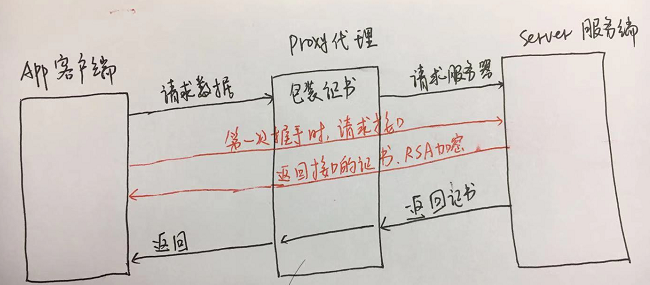

# 前端安全及防范

现如今，互联网越来越发达，随之而来的网络安全问题也越来越多。对于我们前端行业来说也是一个需要重视的问题。因此我们来了解一下几种常见的前端安全问题以及对应的防范策略：

* XSS攻击
* CSRF攻击
* 网络劫持攻击
* 控制台注入代码
* 钓鱼

## XSS攻击

XSS(Cross Site Scripting)，即跨站脚本攻击。用户通过XSS将恶意代码插入WEB页面，普通用户访问该页面时，就会执行嵌入的恶意代码，遭受恶意攻击。如果恶意代码中包含获取用户敏感信息的脚本，则容易导致用户信息泄露和受到恶意轰炸等。

XSS攻击危害：
* 盗取各类用户帐号，如机器登录帐号、用户网银帐号、各类管理员帐号等；
* 控制企业数据，包括读取、篡改、添加、删除企业敏感数据的能力；
* 盗窃企业重要的具有商业价值的资料；
* 非法转账；
* 强制发送电子邮件；
* 网站挂马；
* 控制受害者机器向其它网站发起攻击。

### XSS分类

XSS一般分为两种类型：`持久型`和`非持久型`。有些地方也叫做`存储型`和`反射型`。

持久(存储)型：`攻击的代码被服务端写入数据库中，读取时被解析执行`，这种攻击危害性比较大。如果该网站访问量很大，大量用户在访问时就会受到攻击，被投诉等。

<p align="left">
    
</p>

如上图所示，对于这种评论输入框或者用户反馈输入框，就需要防范XSS攻击，过滤恶意脚本，防止提交后存储到数据库中。

非持久(反射)型：相对于持久(存储)型来说，危害性就比较小了。一般是`通过修改URL参数的方式加入攻击代码，诱导用户访问链接从而进行攻击`。

```javascript
// 比如说用户访问一个页面，页面链接携带参数name，在页面代码中，需要获取name参数并展示在页面上。
// 如果此时name为<script>alert(1)</script>，而代码中没有在对name做任何处理的话，就会执行alert(1)这段代码

// 获取 url 参数
function getUrlParams() {
    var url = location.search; // 获取 url 中 "?" 符后的字串
    var theRequest = new Object();
    if (url.indexOf('?') !== -1) {
        var str = decodeURIComponent(url.substr(1));
        var strs = str.split('&');
        for (var i = 0; i < strs.length; i++) {
            theRequest[strs[i].split('=')[0]] = strs[i].split('=')[1];
        }
    }
    return theRequest;
}

const urlParams = getUrlParams();
const name = urlParams['name'] || ''; // url 参数 name

if (name) {
    $('body').append(`<div>${name}</div>`);
}
```

<br/>

上述例子使用了jquery的append方法进行操作。jquery的append使用的方式是innerHTML，会将unicode码转换为字符实体，在变为fragment的时候，会找到其中的script标签，再使用eval执行一遍，因此就弹窗了。

### XSS防御

可以通过以下方式防御XSS攻击。<br/>

1. 转义字符

即对用户输入永远不信任。普遍是对输入输出内容进行转义，如 <、>、"、'、&等。

```javascript
function escapeStr(str) {
    let formatStr = str || '';

    if (!formatStr) {
        return '';
    }

    formatStr = formatStr.replace(/&/g, '&amp;');
    formatStr = formatStr.replace(/</g, '&lt;');
    formatStr = formatStr.replace(/>/g, '&gt;');
    formatStr = formatStr.replace(/\"/g, '&quot;');
    formatStr = formatStr.replace(/\'/g, '&#39;');
    formatStr = formatStr.replace(/ /g, '&nbsp;');
    formatStr = formatStr.replace(/\n/g, '<br/>');
    return formatStr;
}
```

2. 使用 xss 对富文本进行过滤

对于页面展示富文本来说，就不能像上面的转义字符一样处理了。此时，可以采用白名单过滤的办法。

```javascript
const xss = require('xss');
let html = xss('<h1 id="title">XSS Demo</h1><script>alert("XSS");</script>');
console.log(html);
// <h1>XSS Demo</h1>&lt;script&gt;alert("XSS");&lt;/script&gt;
```

上述例子中，使用 xss 模块，将可能会受到XSS攻击的代码进行过滤，将h1标签完整输出，将script标签进行转义，这样就可以避免XSS攻击。

xss 模块具体使用方法可参见其文档：[根据白名单过滤 HTML(防止 XSS 攻击)](https://github.com/leizongmin/js-xss/blob/master/README.zh.md)

3. CSP

内容安全策略(CSP)是一个额外的安全层，用于检测并削弱某些特定类型的攻击，包括跨站脚本 (XSS)和数据注入攻击等。无论是数据盗取、网站内容污染还是散发恶意软件，这些攻击都是主要的手段。

CSP本质上就是建立白名单，开发者明确告诉浏览器哪些外部资源可以加载和执行。我们只需要配置规则，如何拦截是由浏览器自己实现的。我们可以通过这种方式来尽量减少XSS攻击。

通常可以通过两种方式来开启CSP：
* 设置HTTP Header中的 [Content-Security-Policy](https://developer.mozilla.org/zh-CN/docs/Web/HTTP/CSP)
```javascript
// 只允许加载本站资源
Content-Security-Policy: default-src ‘self’

// 只允许加载 HTTPS 协议图片
Content-Security-Policy: img-src https://*

// 允许加载任何来源框架
Content-Security-Policy: child-src 'none'
```
* 设置meta标签的方式：
```html
<meta http-equiv="Content-Security-Policy">
```


## CSRF攻击

CSRF(Cross-site request forgery)，中文名为跨站请求伪造，也被称为“One Click Attack”或者Session Riding，通常缩写为CSRF或者XSRF，是一种对网站的恶意利用。

其原理就是攻击者构造出一个后端请求地址，诱导用户点击或者通过某些途径自动发起请求。如果用户是在登录状态下的话，后端就以为是用户在操作，从而执行相应的逻辑，导致用户数据泄露等。

```html

```
假如A网站提供了一个使用GET方式请求的接口，用于修改用户的评论。那攻击者可以通过在自己制造的网站或者钓鱼网站中加入一个图片，如上所示。用户登录A网站后，转到钓鱼网站上点击该图片，该用户的评论就可以被攻击者任意修改。

这是GET请求方式的一个弊端，然而POST请求也不一定完全安全。

如果用户登录了A网站，此时去访问攻击者的B钓鱼网站，B网站页面中包含一堆form表单信息，信息中包含A网站修改用户昵称需要的表单信息。此时如果用户点击B网站页面某处，就可能被攻击者任意修改该用户的昵称。

### CSRF防御
可以通过以下方式防御CSRF攻击。<br/>
1. 使用GET请求时不修改用户数据。

2. 阻止第三方网站请求接口：可以验证Referer来判断请求是否是第三方发起。

3. 接口请求时，附带验证信息，比如验证码或者随机token：每次发起请求时，都带上当前页面生成的token，服务器验证此参数token和服务器存储的token信息是否一致。

4. 设置cookie信息：httpOnly为true(不允许被js访问)、sign为true(对cookie进行签名)、encrypt为true(对cookie进行加密)。

5. 不让第三方网站访问用户的cookie信息：对cookie设置`SameSite`属性，值可为`Strict`或`Lax`。
具体设置方式可参见[Cookie 的 SameSite 属性](http://www.ruanyifeng.com/blog/2019/09/cookie-samesite.html)


## 网络劫持攻击

一般来说，用户访问一些大型的网站，会先经过一层层代理，最终到达对应的服务器。如果在某一个环节，数据被代理劫持者所截获，他们就可以获取到该用户使用该站点的账户信息等敏感信息。

例如，我们经常会在各种饭店、火锅店里面去连接他们提供的wifi。如果这些wifi是黑客所建立的wifi，那黑客就可以接管我们收发的所有数据。

因此，一般的网站都会使用https进行加密，这样就算数据被代理劫持者所截获，拿到的数据也是加密的，很难解密出真实数据。

另外，考虑到一点，https不一定安全，黑客还是有可能在用户与服务器之间建立一层代理捕获数据。<br/>

如图所示，黑客在APP客户端与服务器之间建立一个代理。返回自己的证书给到APP客户端。此时APP客户端以为代理就是真正的服务端，而服务端以为代理就是真正的客户端。这样黑客就可以获取到用户数据。

<br/>

针对这种安全问题，如何处理呢？可以看下红笔标注。`APP客户端在与服务端第一次握手时，先向服务端发一个特殊的请求，获取接口真实的证书。再请求数据，拿到代理返回的证书，将两个证书做比较，如果一致，则继续下一环节。不一致则表明此时已经被代理给拦截了，就可以做出相应的提示`。


## 控制台注入代码

大家可能平时都喜欢用手机或者APP去访问一些购物网站，比如淘宝、天猫、京东等。可能没注意到，访问天猫官网，打开控制台，可以发现一串警告信息，如下图所示。

<br/>

这是为什么呢？因为有些黑客会诱骗用户去控制台里面粘贴东西，比如说在群里发消息，称“只要打开天猫，按下F12并粘贴某某内容，就可以获得红包奖励”。而部分用户不知道，只贪红包，就可能会这么做。此时可能这段内容就会将用户的cookie信息等暴露给黑客了。

因此天猫在控制台打印出这段警告信息，为的就是提示用户不要随意粘贴代码。

再看一下这个图：

<br/>

我访问某个网站，打开控制台，确认当前页面引入了jquery脚本。于是我输入
```javascript
$('body').append(`<div><script>alert(1)</script></div>`);
```
这段脚本，脚本立即执行，弹窗1。这只是很简单的一个例子，有些黑客肯定不是让该页面弹窗了。

遇到这种情况，网站开发人员也没办法处理，只能说，`可以借鉴一下天猫这种方案，去提示下用户`了。


## 钓鱼

钓鱼是一种比较古老的攻击方式，由于它攻击是在页面上执行的，因此也算是一种前端安全问题。

钓鱼主要是怎么实现的呢？

举个例子<br/>
1. 恶意用户在QQ群或者微信群发布一则商品优惠券信息，大概内容是在淘宝上购买某商品，只要点击内容中的链接进入淘宝领取优惠券，就可以优惠50元。
2. 不知内情的用户，以为很优惠，就点击该链接，跳至浏览器，打开类似淘宝的页面进行登录再领取优惠券。而此时打开的页面并不是淘宝的官方网站，而是恶意用户伪造的网站。
3. 用户登录后，恶意用户就获取到了用户真正的淘宝登录信息等。

再举个例子<br/>
1. 恶意用户登录某公司官网，修改该网站上某一处a链接的href，改为他自己的href。
2. 用户不知情，就直接访问该链接，跳去了恶意用户伪造的登录页。
3. 用户登录后，恶意用户就获取到了用户真正的该网站的账号密码信息，可以胡作非为了。

这种钓鱼攻击是比较难以防御的，我们没办法将所有页面链接都通过脚本打开。而且也没办法控制用户点击哪些链接。真正可以做的是：提高自己的网络安全意识，不随便点击奇怪的链接。

[前端黑魔法之远程控制地址栏](https://www.leavesongs.com/PENETRATION/use-target-to-spoof-fishing.html)


## 总结

1. 针对XSS：对部分字符进行转义，对富文本进行xss过滤，添加内容安全策略CSP。

2. 针对CSRF攻击：不使用GET方式修改数据，对cookie进行签名和加密，对cookie设置SameSite为`Strict`或`Lax`防止跨域请求发送，接口请求时附带验证码或者token并进行token校验等。

3. 针对网络劫持攻击：使用https加密，额外添加证书校验等。

4. 针对控制台注入代码攻击：在控制台输出警告信息，提示用户避免泄露信息。

5. 针对钓鱼网站攻击：提高安全防范意识，不随意点击奇怪的网站，尽量访问https协议的网站等。


## 参考链接

1. [浅谈前端安全以及如何防范](https://baijiahao.baidu.com/s?id=1591810438484253300&wfr=spider&for=pc)

2. [前端面试题-安全防范](https://www.jianshu.com/p/2aa1ea6cdf22)

3. [Web 漏洞分析与防御之 XSS（一）](https://juejin.im/post/59dc2c5151882578e310e7ba)

4. [Web 漏洞分析与防御之 CSRF（二）](https://juejin.im/post/59dec112f265da431c6f4aad)

5. [前端的安全问题与防御策略](https://juejin.im/post/5cd373bee51d456e671c7e70)

6. [Web安全系列（四）：XSS 的防御](https://juejin.im/post/5bac9e21f265da0afe62ec1b)