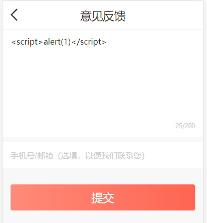

## 前端安全及防范之XSS

以下是关于前端安全问题-XSS以及对应的防范策略。

### 什么是XSS

XSS(Cross Site Scripting)，即跨站脚本攻击。用户通过XSS将恶意代码插入WEB页面，普通用户访问该页面时，就会执行嵌入的恶意代码，遭受恶意攻击。如果恶意代码中包含获取用户敏感信息的脚本，则容易导致用户信息泄露和受到恶意轰炸等。

### XSS攻击危害

1. 盗取各类用户帐号，如机器登录帐号、用户网银帐号、各类管理员帐号等；

2. 控制企业数据，包括读取、篡改、添加、删除企业敏感数据的能力；

3. 盗窃企业重要的具有商业价值的资料；

4. 非法转账；

5. 强制发送电子邮件；

6. 网站挂马；

7. 控制受害者机器向其它网站发起攻击。

### XSS 分类

XSS一般分为两种类型：`持久型`和`非持久型`。有些地方也叫做`存储型`和`反射型`。

持久(存储)型：`攻击的代码被服务端写入数据库中，读取时被解析执行`，这种攻击危害性比较大。如果该网站访问量很大，大量用户在访问时就会受到攻击，被投诉等。

<br/>
如上图所示，对于这种评论输入框或者用户反馈输入框，就需要防范XSS攻击，过滤恶意脚本，防止提交后存储到数据库中。

非持久(反射)型：相对于持久(存储)型来说，危害性就比较小了。一般是`通过修改URL参数的方式加入攻击代码，诱导用户访问链接从而进行攻击`。
```javascript
// 某一页面需要从url中获取某些参数，如果参数内容包含恶意脚本，在获取时就有可能导致恶意代码被执行

// 某页面url： http://www.domain.com?name=<script>alert(1)</script>

// 页面内获取name参数并展示，此时就可能会执行 alert(1)
<div>{{name}}</div>
```

另外，如果用户直接访问该链接：https://www.yyfax.com/?name=%3Cscript%3Ealert(1)%3C/script%3E，也会报错


### 总结

1. xxx

### 参考链接

1. [浅谈前端安全以及如何防范](https://baijiahao.baidu.com/s?id=1591810438484253300&wfr=spider&for=pc)

2. [前端面试题-安全防范](https://www.jianshu.com/p/2aa1ea6cdf22)

3. [Web 漏洞分析与防御之 XSS（一）](https://juejin.im/post/59dc2c5151882578e310e7ba)

4. [Web安全系列（四）：XSS 的防御](https://juejin.im/post/5bac9e21f265da0afe62ec1b)


2. [前端的安全问题与防御策略](https://juejin.im/post/5cd373bee51d456e671c7e70)