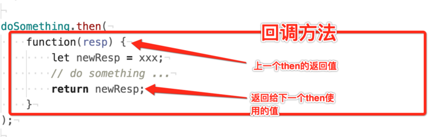

## js 基础相关面试题

该文档包含了各种 js 基础相关的面试题，每个题目后面有参考链接。

### 什么是闭包？

> 一个函数和对其周围状态（lexical environment，词法环境）的引用捆绑在一起（或者说函数被引用包围），这样的组合就是闭包（closure）。也就是说，闭包让你可以在一个内层函数中访问到其外层函数的作用域。

**闭包**：就是**有权访问另一个函数作用域中的变量的函数**。它包含两个部分：**函数**，**声明该函数的词法环境**。词法环境包含了这个闭包创建时其作用域内的任何局部变量。  
换言之，闭包，是一个可以自己拥有独立环境和变量的表达式（通常是函数）。

举例：

```js
function makeAdder(x) {
  return function (y) {
    return x + y;
  };
}

var add5 = makeAdder(5);
var add10 = makeAdder(10);

console.log(add5(2)); // 7
console.log(add10(2)); // 12

// 释放对闭包的引用
add5 = null;
add10 = null;
```

上述例子中，makeAdder 为一个函数工厂——他创建了将指定值和它的参数相加求和的函数。add5 和 add10 都属于闭包，它们共享相同的函数定义，但是保存了不同的此法环境，一个是 x 为 5，一个是 x 为 10。

闭包常用**创建形式**：在一个函数内部创建另外一个函数。  
闭包**注意事项**：被引用的变量会和这个函数一同存在，即使外部函数被销毁。  
闭包中的**this 对象**：

```js
var name = 'window';
var obj = {
  name: 'object',
  getName: function () {
    console.log('第一次打印this', this.name);
    return function () {
      console.log('第二次打印this', this.name);
      return this.name;
    };
  },
};
obj.getName()();
// 第一次打印this object
// 第二次打印this window
// 此时，匿名函数的this指向window
```

```js
var name = 'window';
var obj = {
  name: 'object',
  getName: function () {
    // 将this指向用that保存起来
    var that = this;
    console.log('第一次打印this', that.name);
    return function () {
      console.log('第二次打印this', that.name);
      return that.name;
    };
  },
};
obj.getName()();
// 第一次打印this object
// 第二次打印this object
// 此时，匿名函数的this指向object
```

```js
var name = 'window';
var obj = {
  name: 'object',
  getName: function () {
    return this.name;
  },
};
obj.getName(); // object
(obj.getName = obj.getName)(); // window
// (obj.getName = obj.getName)赋值语句返回的是等号右边的值，在全局作用域中返回，此时this指向全局
```

**作用**：

1. 可以在函数外部访问到函数内部的变量。
2. 允许将函数与其操作的数据关联起来。
3. 被引用的变量会和这个函数一同存在，即使外部函数被销毁。
4. 使用闭包模拟私有方法，限制对代码的访问，避免非核心方法弄乱代码公共接口部分。

   如下面例子，三个闭包共享一个词法环境。Counter 为立即执行函数，内部的 privateCounter 变量和 changeBy 函数为私有项，函数外部无法访问，只能通过三个闭包来访问。

   ```js
   var Counter = (function () {
     var privateCounter = 0;
     function changeBy(val) {
       privateCounter += val;
     }
     return {
       increment: function () {
         changeBy(1);
       },
       decrement: function () {
         changeBy(-1);
       },
       value: function () {
         return privateCounter;
       },
     };
   })();

   console.log(Counter.value()); /* logs 0 */
   Counter.increment();
   Counter.increment();
   console.log(Counter.value()); /* logs 2 */
   Counter.decrement();
   console.log(Counter.value()); /* logs 1 */
   ```

5. 在一个闭包内对变量进行修改，不会影响另一个闭包中的变量。  
   还是上述例子，改一下，即可以实现不同的闭包只会修改自己词法环境内的变量，不影响其他。

   ```js
   var makeCounter = function () {
     var privateCounter = 0;
     function changeBy(val) {
       privateCounter += val;
     }
     return {
       increment: function () {
         changeBy(1);
       },
       decrement: function () {
         changeBy(-1);
       },
       value: function () {
         return privateCounter;
       },
     };
   };

   var Counter1 = makeCounter(); // 创建一个计数器
   var Counter2 = makeCounter(); // 创建另一个计数器
   console.log(Counter1.value()); /* logs 0 */
   Counter1.increment();
   Counter1.increment();
   console.log(Counter1.value()); /* logs 2 */
   Counter1.decrement();
   console.log(Counter1.value()); /* logs 1 */
   console.log(Counter2.value()); /* logs 0 */
   ```

**应用**：

1. 设计模式中的单例模式
2. for 循环中的保留 i 的操作
3. 防抖和节流
4. 函数柯里化

**缺点**：

1. 闭包只能取得包含函数中任何变量的最后一个值。

   ```js
   function arrFunc() {
     var arr = [];
     for (var i = 0; i < 10; i++) {
       arr[i] = function () {
         return [i];
       };
     }
     return arr;
   }
   arrFunc()[0](); // [10]
   arrFunc()[9](); // [10]
   // 当arrFunc执行完毕，其作用域被销毁，但是i仍然保存在内存中，最终i的值为10，因此取到的值都是10
   ```

   ```js
   function arrFunc() {
     var arr = [];
     for (var i = 0; i < 10; i++) {
       arr[i] = (function (num) {
         return function () {
           return num;
         };
       })(i);
     }
     return arr;
   }
   arrFunc()[0](); // [0]
   arrFunc()[9](); // [9]
   // 在匿名函数外部再套一个匿名函数，定义一个新的变量来保存i的值，此时最终的i值每次也都不一样
   ```

2. 循环中使用闭包，可能会导致不同的闭包都共享同一个环境，可以使用`let`而不是`var`去声明变量。

   ```js
   function arrFunc() {
     const arr = [];
     for (let i = 0; i < 10; i++) {
       arr[i] = function () {
         return [i];
       };
     }
     return arr;
   }
   arrFunc()[0](); // [0]
   arrFunc()[9](); // [9]
   // 使用let去声明变量后，最终i的值每次都不一样
   ```

3. 闭包在处理速度和内存消耗方面对脚本性能有负影响。  
   例如，在创建新的对象或者类时，方法通常应该关联于对象的原型，而不是定义到对象的构造器中。原因是这将导致每次构造器被调用时，方法都会被重新赋值一次（也就是说，对于每个对象的创建，方法都会被重新赋值）。

   ```js
   function MyObject(name, message) {
     this.name = name.toString();
     this.message = message.toString();
     this.getName = function () {
       return this.name;
     };

     this.getMessage = function () {
       return this.message;
     };
   }
   // 每次new MyObject()，内部的getName和getMessage都会被重新赋值
   ```

   ```js
   function MyObject(name, message) {
     this.name = name.toString();
     this.message = message.toString();
   }
   MyObject.prototype.getName = function () {
     return this.name;
   };
   MyObject.prototype.getMessage = function () {
     return this.message;
   };
   // 每次new MyObject()，getName和getMessage属于原型上的方法，不需要每次都重新定义以及赋值一次。
   ```

4. 可能会导致内存泄漏。  
   当闭包的作用域链中保存着一个 HTML 元素，那只要闭包不销毁，该元素就无法被销毁，因此需要在对这个元素操作完成后主动销毁。

   ```js
   function test() {
     var element = document.getElementById('test');
     var id = element.id;
     element.onclick = function () {
       console.log('test节点id：', id);
     };
     element = null;
   }

   (function () {
     var a = 0;
     setInterval(function () {
       console.log(a++);
     }, 1000);
   })();
   // 定时器内部的a也不会被销毁，因此要避免这种代码的写法产生
   ```

#### 参考链接

1. [闭包 MDN](https://developer.mozilla.org/zh-CN/docs/Web/JavaScript/Closures)

1. [什么是闭包？](https://blog.csdn.net/Matildan/article/details/108349502?ivk_sa=1024320u)

### js 中有哪些数据类型？各数据类型是如何存储的？

js 中数据类型一共八大类，分为基本数据类型和引用数据类型。

基本数据类型：

- Number
- String
- Boolean
- Undefined
- Null
- Symbol(es6 新增)
- bigInt(es2020 新增，大整数)

引用数据类型（统称为 Object 类型，细分如下）：

- Object
- Array
- Date
- Function
- RegExp

基本数据类型的数据直接存储在**栈**中，引用数据类型的数据存储在**堆**中。引用类型在栈中会保存其引用地址。  
栈内存是自动分配内存的，而堆内存是动态分配内存的，不会自动释放。因此每次使用完对象后可以把它设置为`null`。

### 判断数据类型的几种方法

- typeof
  缺点：typeof null === 'object'，无法区分是 null 还是 object

- instanceof
  缺点：只能判断对象是否存在于目标对象的原型链上

- constructor

- Object.prototype.toString.call()：最好的基本类型检测方式  
  可以区分 null 、string 、boolean 、number 、undefined 、array 、function 、object 、date 数据类型。  
  缺点：不能细分为谁谁的实例

```js
// -------------------typeof----------------------
typeof undefined; // 'undefined'
typeof '10'; // 'String'
typeof 10; // 'Number'
typeof false; // 'Boolean'
typeof Symbol(); // 'Symbol'
typeof Function; // ‘function'
typeof null; // ‘Object’
typeof []; // 'Object'
typeof {}; // 'Object'

// -----------------instanceof------------------------
function Foo() {}
var f1 = new Foo();
var d = new Number(1);
console.log(f1 instanceof Foo); // true
console.log(d instanceof Number); //true
console.log(123 instanceof Number); //false  --> 不能判断字面量的基本数据类型

// -------------------constructor----------------------
var d = new Number(1);
var e = 1;
function fn() {
  console.log('ming');
}
var date = new Date();
var arr = [1, 2, 3];
var reg = /[hbc]at/gi;

console.log(e.constructor); //ƒ Number() { [native code] }
console.log(e.constructor.name); //Number
console.log(fn.constructor.name); // Function
console.log(date.constructor.name); // Date
console.log(arr.constructor.name); // Array
console.log(reg.constructor.name); // RegExp

//----------Object.prototype.toString.call()-------------
console.log(Object.prototype.toString.call(undefined)); // "[object Undefined]"
console.log(Object.prototype.toString.call(null)); // "[object Null]"
console.log(Object.prototype.toString.call(123)); // "[object Number]"
console.log(Object.prototype.toString.call('abc')); // "[object String]"
console.log(Object.prototype.toString.call(true)); // "[object Boolean]"

function fn() {
  console.log('ming');
}
var date = new Date();
var arr = [1, 2, 3];
var reg = /[hbc]at/gi;
console.log(Object.prototype.toString.call(fn)); // "[object Function]"
console.log(Object.prototype.toString.call(date)); // "[object Date]"
console.log(Object.prototype.toString.call(arr)); // "[object Array]"
console.log(Object.prototype.toString.call(reg)); // "[object RegExp]"
```

### instanceof 原理

原理：查找目标对象的原型链

```js
function myInstance(left, right) {
  // left，instanceof 左边
  // right，instanceof 右边
  var rp = right.prototype;
  var lp = left.__proto__;
  while (true) {
    if (lp == null) {
      return false;
    }
    if (lp == rp) {
      return true;
    }
    lp = lp.__proto__;
  }
}
console.log(myInstance({}, Object));
```

### typeof null === 'Object'，why？

在 js 中，不同的对象都是使用二进制存储的，如果二进制前三位都是 0 的话，系统会判断为是`Object`类型，而`null`的二进制全是 0，自然也就判断为 Object。  
这个 bug 是初版本的 js 中留下的，扩展一下其他五种标识位：

- 000 对象
- 1 整型
- 010 双精度类型
- 100 字符串
- 110 布尔类型

### 在 js 中为什么 0.2+0.1>0.3？

在 js 中，浮点数使用 64 位固定长度来表示，1 位表示符号位，11 位表示指数位，剩余 52 位表示尾数位。  
由于只能存储 52 位尾数位，所以会出现精度缺失。  
0.1 存到内存中再取出来转换成十进制就不是原来的 0.1 了。

```js
// 0.1 和 0.2 都转化成二进制后再进行运算
0.00011001100110011001100110011001100110011001100110011010 +
0.0011001100110011001100110011001100110011001100110011010 =
0.0100110011001100110011001100110011001100110011001100111

// 转成十进制正好是 0.30000000000000004
```

### 在 js 中为什么 0.2+0.3=0.5？

在 js 中，浮点数使用 64 位固定长度来表示，1 位表示符号位，11 位表示指数位，剩余 52 位表示尾数位。  
0.2 和 0.3 转换为二进制，其尾数位正好是 52 位，相加后恰好前 52 位尾数位是 0，截取后正好是 0.5。

### 那既然 0.1 不是 0.1 了，为什么在 console.log(0.1)的时候还是 0.1 呢?

console.log：先二进制转为十进制，十进制再转为字符串。转换过程中取了近似值，因此打印的还是 0.1。

### ==与===的区别

===，严格意义上的相等，会比较两边的数据类型和值大小

- 数据类型不同返回 false
- 数据类型相同，但值大小不同，返回 false

==，非严格意义上的相等

- 两边类型相同，比较大小
- 两边类型不同，根据下方表格，再进一步进行比较：
  Null == Undefined --> true  
   String == Number --> 先将 String 转为 Number，再比较大小  
   Boolean == Number --> 先将 Boolean 转为 Number，再进行比较  
   Object == String，Number，Symbol -> Object 转化为原始类型

### js 中 call、apply、bind 的区别

（1）call、apply、bind，都是用来重定义 this 指向对象的。

```js
var name = '小王';
var age = 17;
var obj = {
  name: '小张',
  myFunc: function () {
    console.log(this.name + '年龄' + this.age);
  },
};
var db = { name: 'xx', age: 20 };
obj.myFunc.call(db); // xx年龄20
obj.myFunc.apply(db); // xx年龄20
obj.myFunc.bind(db)(); // xx年龄20
```

（2）传参不一致。
call、apply、bind，第一个参数都是 this 的指向对象；  
call、bind 传参一致，使用,分隔符；  
apply 传参，使用数组；  
bind 返回的是一个新的函数，需要再调用后执行。

```js
func.call(obj, '成都', '上海');
func.apply(obj, ['成都', '上海']);
func.bind(obj, '成都', '上海')();
```

（3）手写 call、apply、bind

- call 和 apply 实现思路主要是：

  - 判断是否是函数调用，若非函数调用抛异常；
  - 通过新对象（`context`）来调用函数：
    - 给`context`创建一个`fn`设置为需要调用的函数
    - 结束调用完之后删除`fn`

- bind 实现思路：
  - 判断是否是函数调用，若非函数调用抛异常
  - 返回函数
    - 判断函数的调用方式，是否是被 new 出来的
      - new 出来的话返回空对象，但是实例的**proto**指向\_this 的 prototype
  - 完成函数柯里化
    - `Array.prototype.slice.call()`：截取参数

```js
Function.prototype.myCall = function (context) {
  // 先判断调用myCall是不是一个函数
  // 这里的this就是调用myCall的
  if (typeof this !== 'function') {
    throw new TypeError('Not a Function');
  }

  // 不传参数，默认是window对象
  context = context || window;
  // 保存this——调用myCall的函数
  context.fn = this;
  // 保存参数
  let args = Array.from(arguments).slice(1);
  // 调用函数
  let result = context.fn(...args);
  // 删除this
  delete context.fn;
  return result;
};
Function.prototype.myApply = function (context) {
  // 先判断调用myApply是不是一个函数
  // 这里的this就是调用myApply的
  if (typeof this !== 'function') {
    throw new TypeError('Not a Function');
  }

  // 不传参数，默认是window对象
  context = context || window;
  // 保存this——调用myCall的函数
  context.fn = this;

  // 定义result
  let result;

  // 判断是否传参--数组类型
  if (arguments[1]) {
    result = context.fn(...arguments[1]);
  } else {
    result = context.fn();
  }
  // 删除this
  delete context.fn;
  return result;
};
Function.prototype.myBind = function (context) {
  // 先判断调用myBind是不是一个函数
  // 这里的this就是调用myBind的
  if (typeof this !== 'function') {
    throw new TypeError('Not a Function');
  }
  // 保存this
  const _this = this;
  // 保存参数
  const args = Array.prototype.slice.call(arguments, 1);
  // 返回一个函数
  return function F() {
    // 判断是不是new出来的
    if (this instanceof F) {
      console.log(1);
      // todo ???
      // 如果是new出来的
      // 返回一个空对象，且使创建出来的实例的__proto__指向_this的prototype，且完成函数柯里化
      return new _this(...args, ...arguments);
    } else {
      // 如果不是new出来的改变this指向，且完成函数柯里化
      console.log(2);
      return _this.apply(context, [...args, ...arguments]);
    }
  };
};
function Person(name, age) {
  this.name = name;
  this.age = age;
  this.sayHi = function () {
    alert(`${this.name}你好啊`);
  };
}

var db = { name: 's', age: 11 };
var person = new Person('nn', 10);
person.sayHi.myBind(db, 'nih')(); // 打印2

var test = function () {
  console.log(this.name);
};
test.myBind(db, 'wdw')(); // 打印2
Object.toString.myBind(test, 'ede')(); // 打印2
var test1 = new Function();
Object.toString.myBind(test1, 'ede')(); // 打印2
```

### 字面量创建对象和 new 创建对象有什么区别，new 内部都实现了什么，手写一个 new

字面量创建对象：

- 简单、方便阅读
- 不需要作用域解析、速度更快

new 创建对象：

- 创建一个新对象
- 使新对象的`__proto__`指向原函数的`prototype`
- 改变 this 指向（指向新的 obj）并执行该函数，执行结果保存起来作为 result
- 判断执行函数的结果是不是 null 或 Undefined，如果是则返回之前的新对象，如果不是则返回 result

手写 new

```js
function myNew(fn, ...args) {
  // 创建一个空对象
  let obj = {};
  // 使空对象的隐式原型指向原函数的显式原型
  obj.__proto__ = fn.prototype;
  // this指向obj
  let result = fn.apply(obj, args);
  // 返回
  return result instanceof Object ? result : obj;
}
```

### 字面量和 new 出来的对象和 Object.create(null)创建出来的对象有什么区别

字面量创建和 new 创建对象：创建出来的对象会继承 Object 的方法和属性，其**proto**会指向 Object.prototype。

Object.create(null)创建对象：创建出来的对象的原型为 null，属于原型链的顶端，没有继承 Object 的方法和属性。

### js 变量分类

js 中变量分为**全局变量**和**局部变量**。

**js 变量生存期**：
生命周期从他们被声明时间开始，局部变量会在函数执行以后被删除，全局变量会在页面关闭后删除。

**显示声明**：使用 var 声明变量；
**隐式声明**：不用 var 声明变量；

在函数中，

- 使用 var 声明的变量为局部变量，
- 不用 var 声明的变量为全局变量

在函数外，

- 使用 var 声明的变量为全局变量，
- 不用 var 声明的变量为全局变量

```js
var a = 123; // 全局变量
b = 456; // 不使用var声明，全局变量
console.log(a); // 123
console.log(b); // 456
console.log(window.a); // 123
console.log(window.b); // 456

function my() {
  var aa = 123; // 使用var声明，局部变量
  bb = 456; // 不使用var声明，全局变量
  console.log(aa); // 123
  console.log(bb); // 456
  console.log(window.aa); // undefined
  console.log(window.bb); // 456
}
my();
console.log(bb); // 456
```

### 什么是作用域，什么是作用域链？什么是链式作用域？

#### 作用域

规定变量和函数的可使用范围叫做作用域。  
作用：隔离变量，不同作用域下同名变量不会冲突。  
分类：  
（1）全局作用域(window、global)  
变量在函数或代码块{}以外定义的即为全局作用域。

另，函数内部未用 var 声明的变量，也具有全局作用域(这种情况下变量是作为 window 或 global 的属性而存在的)。

```js
var name = 'bob';
// 此处可调用name变量
function myName() {
  // 此处可调用name变量
  // 未用var声明的变量
  Rname = 'lucy';
}
myName();
console.log(Rname); // lucy
```

（2）函数（局部）作用域(function)  
在函数内部定义的变量即为函数（局部）作用域。函数作用域内，对外是封闭的，即函数外部无法直接访问函数内部的变量。

```js
function myNum() {
  var a = 3;
}
myNum();
console.log(a);
```

可以通过 return 或闭包的方式间接访问函数内部的变量。

```js
//通过return方式访问内部变量
function myNum() {
  var a = 3;
  return a;
}
console.log(myNum());

//通过闭包方式访问内部变量
function myNumTwo() {
  var a = 3;
  return function () {
    return a;
  };
}
console.log(myNumTwo()());
```

（3）块级作用域({})  
es6 中提出，在{}内部定义的变量就是块级作用域。

```js
//直接用{}
{
  let a = 5;
}
// 循环、判断等语句中
if (true) {
  let b = 10;
}
```

（4）静态作用域  
函数外部定义的变量为全局作用域，函数内部用 var 定义的变量为局部作用域都称为静态作用域，也叫词法作用域。  
**变量的作用域是在定义时决定而不是执行时决定的**。

（5）动态作用域  
在执行阶段才确定变量的作用域。动态作用域需要手动借助 bind、with、eval 等开启，即默认情况下是动态作用域。

```js
window.a = 3;
function test() {
  console.log(this.a);
}
test.bind({ a: 2 })(); // 2：通过bind动态指向2
test(); // 3
```

```js
function foo() {
  console.log(a);
}
function bar() {
  var a = 3;
  foo();
}
var a = 2;
bar(); // 2：window.foo()-->打印window.a
```

#### 作用域链

变量取值时，一般会在创建该变量的作用域中取值，若没取到值，则会向上级作用域去查找，直到查到全局作用域。这么一个查找过程形成的链条，就叫做作用域链。

#### 链式作用域

子函数可以访问父函数的所有变量；  
函数运行在被定义的作用域而不是被执行的作用域中。  
定义变量请在函数顶部，有利于代码可读性。

### 什么是执行栈，什么是执行上下文？

#### 执行上下文

（1）全局执行上下文  
创建一个全局的 window 对象，并规定 this 指向 window，执行 js 的时候就压入栈底，关闭浏览器的时候才弹出。

（2）函数执行上下文  
每次函数调用时，都会新创建一个函数执行上下文。  
执行上下文分为**创建阶段**和**执行阶段**：

- 创建阶段：函数环境会创建变量对象：arguments 对象（并赋值）、函数声明（并赋值）、变量声明（不赋值），函数表达式声明（不赋值）；会确定 this 指向；会确定作用域；

- 执行阶段：变量赋值、函数表达式赋值，使变量对象变成活跃对象；

（3）eval 执行上下文

#### 执行栈/调用栈

- 栈特点：先进后出。
- 当进入一个执行环境，就会创建出它的执行上下文，然后进行压栈。当程序执行完成时，它的执行上下文就会被销毁，进行弹栈。
- 栈底永远是全局环境的执行上下文，栈顶永远是正在执行函数的执行上下文。
- 只有浏览器关闭的时候全局执行上下文才会弹出。

### 什么是原型？什么是原型链？

#### 原型

隐式原型：`__proto__`  
显示原型：`prototype`  
每个对象都有一个隐式原型`__proto__`，它指向自己的构造函数的显式原型`prototype`。  
（1）`prototype`  
每个函数都有`prototype`属性，即原型。  
（2）`__proto__`  
每个对象都有`__proto__`属性，指向该构造函数的`prototype`。  
（3）`constructor`  
每个原型都有一个`constructor`属性，指向该关联的构造函数。

```js
function Person() {}
var person = new Person();
// person为对象实例，Person为构造函数
person.__proto__ === Person.prototype;
(person.constructor === Person) === Person.prototype.constructor;
```

#### 原型链

多个`__proto__`组成的集合成为原型链。

```js
function Person() {}
var person = new Person();
// person为对象实例，Person为构造函数
person.__proto__ === Person.prototype;
Person.prototype.__proto__ === Object.prototype;
Person.__proto__ === Function.prototype;
Object.prototype.__proto__ === null;
```

- 所有实例的`__proto__`都指向他们构造函数的`prototype`。
- 所有的`prototype`都是对象，自然它的`__proto__`指向的是`Object`的`prototype`。
- 所有的构造函数的隐式原型指向的都是`Function`的显示原型
- `Object`的隐式原型是`null`

### js 中几种非常经典的对象继承方式

对象继承方式：原型链继承、借用构造函数继承、组合继承、原型式继承、寄生式继承、寄生组合式继承、es6 的 extend。

#### 原型链继承

利用原型让一个引用类型继承另外一个引用类型的属性和方法。

构造函数，原型，实例之间的关系：

- 每个构造函数都有一个原型对象`prototype`：`Person.prototype`
- 原型对象包含一个指向构造函数的指针：`Person.prototype.constructor === Person`
- 实例都包含一个指向原型对象的内部指针：`person.__proto__ === Person.prototype`

```js
function SuperType() {
  this.colors = ['red', 'blue', 'green'];
}
function SubType() {} //即使没有写，也不会影响结果

// 继承自SuperType
SubType.prototype = new SuperType();

var example1 = new SubType();
example1.colors.push('black');
alert(example1.colors); //"red,blue,green,black"

var example2 = new SubType();
alert(example.colors); //"red,blue,green,black"
```

**缺点**：  
（1）原型链继承多个实例的引用类型属性指向相同，一个实例改了原型属性，其他实例的原型属性也会被修改。  
（2）不能传递参数。  
（3）继承单一。

#### 借用构造函数继承

使用`.call()`和`.apply()`将父类构造函数引入子类函数，使用父类的构造函数来增强子类实例，等同于**复制父类的实例**给子类。例如下面例子：`SuperType.call(this, name)`

```js
function SuperType(name) {
  this.name = name;
  this.colors = ['red', 'blue', 'green'];
}

function SubType(name, age) {
  // 继承自SuperType
  SuperType.call(this, name);
  this.age = age;
}

var example1 = new SubType('Mike', 23);
example1.colors.push('black');
alert(example1.colors); //"red,blue,green,black"

var example2 = new SubType();
alert(example2.colors); //"red,blue,green"

alert(example1.name); // "Mike"
alert(example1.age); // 23
```

**缺点**：
（1）只能继承父类的实例属性和方法，不能继承原型属性/方法；  
（2）无法实现构造函数的复用，每个子类都有父类实例函数的副本，影响性能，导致代码臃肿。

#### 组合继承（js 中最常用的继承模式）

将**原型链继承**和**构造函数继承**这两种模式的优点组合在一起，通过调用父类构造，继承父类的属性并保留传参，然后通过将父类实例作为子类原型，实现函数复用。  
**使用原型链实现对原型属性和方法的继承，而通过借用构造函数来实现对实例属性的继承**，这样，既通过在原型上定义方法实现了函数复用，又能保证每个实例都有它自己的属性。

```js
function SuperType(name) {
  this.name = name;
  this.colors = ['red', 'blue', 'green'];
}
SuperType.prototype.sayName = function () {
  alert(this.name);
};

function SubType(name, age) {
  // 借用构造函数继承实例属性，保留传参
  SuperType.call(this, name);
  this.age = age;
}

// 原型链继承原型属性和方法
SubType.prototype = new SuperType();
SubType.prototype.constructor = SubType;
SubType.prototype.sayAge = function () {
  alert(this.age);
};

var example1 = new SubType('Mike', 23);
example1.colors.push('black');
alert(example1.colors); //"red,blue,green,black"
example1.sayName(); //"Mike";
example1.sayAge(); //23

var example2 = new SubType('Jack', 22);
alert(example2.colors); //"red,blue,green"
example2.sayName(); //"Jack";
example2.sayAge(); //22
```

**缺点**：
父类中的实例属性和方法既存在于子类的实例中，又存在于子类的原型中。在使用子类创建实例对象时，原型中会存在**两份相同的属性/方法**。

#### 原型式继承

用一个函数包装一个对象，然后返回这个函数的调用，这个函数就变成了个可以随意增添属性的实例或对象。`object.create()`就是这个原理，直接将某个对象赋值给构造函数的原型。

```js
// object()对传入其中的对象执行了一次浅复制，将O的原型直接指向传入的对象。
function object(obj) {
  function O() {}
  // 直接将某个对象赋值给构造函数的原型
  O.prototype = obj;
  return new O();
}

var person = {
  name: 'Mike',
  friends: ['Jack', 'Tom', 'Joes'],
};

var anotherPerson = object(person);
anotherPerson.name = 'Greg';
anotherPerson.friends.push('Peter');

var yetAnotherPerson = object(person);
yetAnotherPerson.name = 'Linda';
yetAnotherPerson.friends.push('BoBo');

alert(person.friends); //"Jack,Tom,Joes,Peter,BoBo"
```

ECMAScript5 通过新增`Object.create()`方法规范化了`原型式继承`，用于创建一个新对象，使用现有的对象来提供新创建的对象的**proto**。

`Object.create(proto，[propertiesObject])`：  
proto：新创建对象的原型对象。  
propertiesObject：可选，新对象定义额外属性的对象。

**缺点**：
（1）原型链继承多个实例的引用类型属性指向相同(所有实例都会继承原型上的属性)，存在篡改的可能。  
（2）无法传递参数，无法实现复用。（新实例属性都是后面添加的）

#### 寄生式继承

创建一个仅用于**封装继承过程**的函数，该函数在内部以**某种方式**来增强对象，最后返回构造函数。(就像给原型式继承外面套了个壳子，然后 return 出来)。函数的主要作用是为构造函数**新增属性和方法**，以增强函数。

```js
function createAnother(original) {
  var clone = Object.create(original); // 通过调用函数创建一个新对象
  clone.sayHi = function () {
    // 以某种方式增强这个对象
    alert('hi');
  };
  return clone; // 返回对象
}
var person = {
  name: 'Nicholas',
  friends: ['Shelby', 'Court', 'Van'],
};
var anotherPerson = createAnother(person);
anotherPerson.sayHi(); //"hi"
```

**缺点(和原型式继承一样)**：
（1）原型链继承多个实例的引用类型属性指向相同，存在篡改的可能；  
（2）无法传递参数，没用到原型，无法复用。

#### 寄生组合式继承（执行效率最高 && 应用面最广）

通过借用`构造函数`传递参数和`寄生模式`实现继承属性，通过`原型链`的混成形式来继承方法，在函数中用`apply`或者`call`引入另一个构造函数，可传参。

```js
function inheritPrototype(subType, superType) {
  // Object.create原型式继承创建对象
  var prototype = Object.create(superType.prototype);
  prototype.constructor = subType; // 增强对象
  subType.prototype = prototype; // 父类原型指向子类
}

// 父类初始化实例属性和原型属性
function SuperType(name) {
  this.name = name;
  this.colors = ['red', 'blue', 'green'];
}
SuperType.prototype.sayName = function () {
  alert(this.name);
};

function SubType(name, age) {
  // 借用构造函数继承增强子类实例属性（支持传参和避免篡改）
  SuperType.call(this, name);
  this.age = age;
}

// 将父类原型指向子类
inheritPrototype(SubType, SuperType);

// 新增子类原型属性
SubType.prototype.sayAge = function () {
  alert(this.age);
};

var example1 = new SubType('abc', 21);
var example2 = new SubType('def', 22);

example1.colors.push('pink'); // ["red", "blue", "green", "pink"]
example1.colors.push('black'); // ["red", "blue", "green", "black"]
```

**缺点**：
实现过程比较繁琐。

#### es6 的 extend（寄生组合继承的语法糖）

1. 子类只要继承父类，可以不写`constructor`。
2. 写了`constructor`，则在`constructor`中的第一句话必须是`super`。

```js
function Father(name) {
  this.name = name;
  this.hobby = ['篮球', '足球', '乒乓球'];
}

Father.prototype.getName = function () {
  console.log(this.name);
};

class Son extends Father {
  // Son.prototype.__proto__ = Father.prototype
  constructor(y) {
    super('bob'); // super('bob') <==> Father.call(this, 'bob')
    this.y = y;
  }
}
```

### 什么是内存泄漏？为什么会导致内存泄漏？

​ 内存泄露：不再用的内存没有被及时释放出来，导致该段内存无法被使用。

​ 内存泄露原因：我们无法再通过 js 访问某个对象，而垃圾回收机制却认为该对象还在被引用。因此垃圾回收机制不会释放该对象，导致该块内存永远无法释放，积少成多，系统就会越来越卡以至于崩溃。

### 垃圾回收机制

js 中内存管理是自动执行的，不可见。当不再需要某样东西时，js 就会发现并清除它。  
js 引擎中有一个后台进程，称为**垃圾回收器**，它监视所有对象，并删除那些不可访问的对象。

可达性：以某种方式可访问或可用的值，它们会被保证储存在内存中。

什么是**垃圾**：  
一般来说，没有被引用的对象就是垃圾，就会被清除。**注意**：如果几个对象相互引用形成一个环，但根本访问不到它们，也属于垃圾。

如何**捡垃圾**：  
标记——清除法/引用计数法(被标记——清除法取代)

垃圾回收器只在 CPU 空闲时运行，以减少对执行的可能影响。垃圾回收机制（定期执行）有 2 种方式：

- **标记——清除法**

  - 垃圾回收器获取根并标记它们；
  - 访问并标记所有来自它们的引用；
  - 访问标记对象并标记它们的引用，所有被访问的对象都被标记；
  - 除标记对象外，所有没有标记的对象(不可达的)都被删除。

- **引用计数法(被标记——清除法取代)**
  - 当声明一个变量并给该变量赋值一个引用类型的值时候，该值的计数+1;
  - 当该值赋值给另一个变量的时候，该计数+1；
  - 当该值被其他值取代的时候，该计数-1；
  - 当计数变为 0 的时候，说明无法访问该值了，垃圾回收机制清除该对象。
    **缺点**：当两个对象循环引用的时候，引用计数无计可施。如果循环引用多次执行的话，会造成崩溃等问题。所以后来被标记——清除法取代。

### 深拷贝和浅拷贝

深拷贝：假设 B 复制了 A，A 变化，B 不跟随变化。  
浅拷贝：假设 B 复制了 A，A 变化，B 跟随 A 变化。

基本数据类型：存储在栈内存中。`b = a`，栈内存会新开辟一个内存。  
引用数据类型：存储在堆内存中。`b = a`，复制的是 a 的引用地址。

浅拷贝：

1. = 赋值操作
2. for...in
3. Object.assign、slice、concat 等
4. $.extend(false, ...)

深拷贝：

1. 使用`递归`去处理（浅拷贝 + 递归）
2. 使用`JSON.parse(JSON.stringify(xxx))`
3. $.extend(true, ...)

缺点：

- json 里面有时间对象，序列化后会输出字符串格式。
- json 里面有 RegExp、Error 对象，序列化后会输出空对象 RegExp {}。
- json 里面有 function、undefined，序列化后会丢失。
- json 里面有 NaN、Infinity、-Infinity，序列化后会变成 null。
- json 里面有对象是由构造函数生成，则序列化后会丢弃对象的 constructor。
- 对象中存在循环引用，也无法实现深拷贝：`let obj = {name: 'jack'};obj.obj = obj;`
- 层级太深，会导致栈溢出，所花时间很长。因此，需要生成指定深度和广度的代码。

手写实现浅拷贝和深拷贝：

```js
// ---------------------浅拷贝----------------------
var obj = {
  name: 'jack',
  age: 10,
  book: { name: 'vue', price: 20 },
};

function shallowClone1(o) {
  let shallowObj = {};

  for (let i in o) {
    shallowObj[i] = o[i];
  }

  return shallowObj;
}

function shallowClone2(o) {
  return { ...o };
}

function shallowClone3(o) {
  return Object.assign({}, o);
}
```

```js
// -----------------------深拷贝-----------------------

// 简易版
function deepClone(o) {
  let obj = {};
  for (var i in o) {
    // if(o.hasOwnProperty(i)){
    if (typeof o[i] === 'object') {
      obj[i] = deepClone(o[i]);
    } else {
      obj[i] = o[i];
    }
    // }
  }
  return obj;
}

var myObj = {
  a: {
    a1: { a2: 1 },
    a10: { a11: 123, a111: { a1111: 123123 } },
  },
  b: 123,
  c: '123',
};

var deepObj1 = deepClone(myObj);
deepObj1.a.a1 = 999;
deepObj1.b = false;
console.log(myObj);

// 简易版存在的问题：参数没有做检验，传入的可能是 Array、null、regExp、Date
function deepClone2(o) {
  if (Object.prototype.toString.call(o) === '[object Object]') {
    //检测是否为对象
    let obj = {};
    for (var i in o) {
      if (o.hasOwnProperty(i)) {
        if (typeof o[i] === 'object') {
          obj[i] = deepClone(o[i]);
        } else {
          obj[i] = o[i];
        }
      }
    }
    return obj;
  } else {
    return o;
  }
}

function isObject(o) {
  return (
    Object.prototype.toString.call(o) === '[object Object]' || Object.prototype.toString.call(o) === '[object Array]'
  );
}

// 继续升级，没有考虑到数组，以及ES6中的map、set、weakset、weakmap
function deepClone3(o) {
  if (isObject(o)) {
    //检测是否为对象或者数组
    let obj = Array.isArray(o) ? [] : {};
    for (let i in o) {
      if (isObject(o[i])) {
        obj[i] = deepClone(o[i]);
      } else {
        obj[i] = o[i];
      }
    }
    return obj;
  } else {
    return o;
  }
}

// 有可能碰到循环引用问题  var a = {}; a.a = a; clone(a);//会造成一个死循环
// 循环检测
// 继续升级
function deepClone4(o, hash = new map()) {
  if (!isObject(o)) return o; //检测是否为对象或者数组
  if (hash.has(o)) return hash.get(o);
  let obj = Array.isArray(o) ? [] : {};

  hash.set(o, obj);
  for (let i in o) {
    if (isObject(o[i])) {
      obj[i] = deepClone4(o[i], hash);
    } else {
      obj[i] = o[i];
    }
  }
  return obj;
}

// 递归易出现爆栈问题
//  将递归改为循环，就不会出现爆栈问题了
var a1 = { a: 1, b: 2, c: { c1: 3, c2: { c21: 4, c22: 5 } }, d: 'asd' };
var b1 = { b: { c: { d: 1 } } };
function cloneLoop(x) {
  const root = {};
  // 栈
  const loopList = [
    //->[]->[{parent:{a:1,b:2},key:c,data:{ c1: 3, c2: { c21: 4, c22: 5 } }}]
    {
      parent: root,
      key: undefined,
      data: x,
    },
  ];
  while (loopList.length) {
    // 深度优先
    const node = loopList.pop();
    const parent = node.parent; //{} //{a:1,b:2}
    const key = node.key; //undefined //c
    const data = node.data; //{ a: 1, b: 2, c: { c1: 3, c2: { c21: 4, c22: 5 } }, d: 'asd' }  //{ c1: 3, c2: { c21: 4, c22: 5 } }}
    // 初始化赋值目标，key 为 undefined 则拷贝到父元素，否则拷贝到子元素
    let res = parent; //{}->{a:1,b:2,d:'asd'} //{a:1,b:2}->{}
    if (typeof key !== 'undefined') {
      res = parent[key] = {};
    }
    for (let k in data) {
      if (data.hasOwnProperty(k)) {
        if (typeof data[k] === 'object') {
          // 下一次循环
          loopList.push({
            parent: res,
            key: k,
            data: data[k],
          });
        } else {
          res[k] = data[k];
        }
      }
    }
  }
  return root;
}

function deepClone5(o) {
  let result = {};
  let loopList = [
    {
      parent: result,
      key: undefined,
      data: o,
    },
  ];

  while (loopList.length) {
    let node = loopList.pop();
    let { parent, key, data } = node;
    let anoPar = parent;
    if (typeof key !== 'undefined') {
      anoPar = parent[key] = {};
    }

    for (let i in data) {
      if (typeof data[i] === 'object') {
        loopList.push({
          parent: anoPar,
          key: i,
          data: data[i],
        });
      } else {
        anoPar[i] = data[i];
      }
    }
  }
  return result;
}

let cloneA1 = deepClone5(a1);
cloneA1.c.c2.c22 = 5555555;
console.log(a1);
console.log(cloneA1);

// ------------------JSON.stringify()实现深拷贝--------------------
function cloneJson(o) {
  return JSON.parse(JSON.stringify(o));
}
```

### js 序列化和反序列化

序列化：将 object 转为字符串

1. 使用 JSON.stringify

反序列化：将 json 字符串转化为 object

1. 使用 eval：`var obj = eval('(' + data + ')');`
   eval 本身的问题。由于 json 是以"{}"的方式来开始以及结束的，在 JS 中，它会被当成一个语句块来处理，所以必须强制性的将它转换成一种表达式。

2. 使用 JSON.parse

### 为什么 JS 是单线程的？

因为 JS 里面有可视的 Dom，如果是多线程的话，这个线程正在删除 DOM 节点，另一个线程正在编辑 Dom 节点，导致浏览器不知道该听谁的。

### Generator 是怎么样使用的以及各个阶段的变化如何？

- 首先生成器是一个函数，用来返回迭代器的。
- 调用生成器后不会立即执行，而是通过返回的迭代器来控制这个生成器的一步一步执行的。
- 通过调用迭代器的`next`方法来请求一个一个的值。返回的对象有两个属性，一个是`value`，也就是值；另一个是`done`，是个布尔类型。`done`为`true`说明`生成器函数执行完毕`，没有可返回的值了。
- `done`为`true`后继续调用迭代器的`next`方法，返回值的`value`为`undefined`。

状态变化：

- 每当执行到`yield`属性的时候，都会返回一个对象
- 这时候生成器处于一个非阻塞的挂起状态
- 调用迭代器的`next`方法的时候，生成器又从挂起状态改为执行状态，继续上一次的执行位置执行
- 直到遇到下一次`yield`依次循环
- 直到代码没有`yield`了，就会返回一个结果对象`done`为`true`，`value`为`undefined`

### js promise

背景：nodejs 采用异步回调的方式去处理需要等待的事件，使代码会继续执行下去不用在某个地方等待着。但有很多回调的时候，就会造成**回调监狱**(层层嵌套)。

promise：  
是一个对象，处理异步操作，为异步编程提供统一接口；  
包含三种状态：pending(进行中)，resolved(完成)，rejected(失败)；  
提供`then`方法，用来执行回调函数；  
`then`方法里面也可以返回`promise`对象，用于**链式调用**。

api：

- promise.resolve()
- promise.reject()
- promise.prototype.then()：捕获完成状态
- promise.prototype.catch()：捕获失败状态
- promise.all()：所有的都完成才算完成，有一个失败就算失败
- promise.race()：完成一个即可

```js
const promiseExp = (time) =>
  new Promise((resolve, reject) => {
    console.log(123);
    setTimeout(() => {
      resolve('成功返回');
    }, time);
  });

promiseExp(300)
  .then((data) => {
    console.log(data);
  })
  .then((data) => {
    // ...
  });
```

#### Promise 中的 then

先看一下下面 4 个 Promise 到底有什么区别呢？

```js
func().then(function () {
  return cb();
});

func().then(function () {
  cb();
});

func().then(cb());

func().then(cb);
```

如果你知道答案，以下内容你可以不用继续。

上面的代码过于简单，运行时话需要稍微进行一点扩展，每个方法中都打印出 promise 上一步的调用值，为了方便我给每个方法加了一个下标输出，分别是 1、2、3、4。

```js
let func = function () {
  return new Promise((resolve, reject) => {
    resolve('返回值');
  });
};

let cb = function () {
  return '新的值';
};

func()
  .then(function () {
    return cb();
  })
  .then((resp) => {
    console.warn(resp); // 新的值
    console.warn('1 =========<');
  });

func()
  .then(function () {
    cb();
  })
  .then((resp) => {
    console.warn(resp); // undefined
    console.warn('2 =========<');
  });

func()
  .then(cb())
  .then((resp) => {
    console.warn(resp); // 返回值
    console.warn('3 =========<');
  });

func()
  .then(cb)
  .then((resp) => {
    console.warn(resp); // 新的值
    console.warn('4 =========<');
  });
```

知道上面为什么会打印出这样的结果吗？

首先要明白 Promise 中 then 方法会干什么事情！

> 一个 promise 必须提供一个 then 方法以访问其当前值、终值和据因。
> promise 的 then 方法接受两个参数：
> promise.then(onFulfilled, onRejected) Todo:这里只介绍 onFulfilled，所以删除了关于 onRejected 的规范定义
> onFulfilled 和 onRejected 都是可选参数。
> 如果 onFulfilled 不是函数，其必须被忽略
> 如果 onFulfilled 是函数：
> 当 promise 执行结束后其必须被调用，其第一个参数为 promise 的终值
> 在 promise 执行结束前其不可被调用
> 其调用次数不可超过一次

**用通(ren)俗（hua）的话来说：**
then 方法提供一个供自定义的回调函数，若传入非函数，则会忽略当前 then 方法。
回调函数中会把上一个 then 中返回的值当做参数值供当前 then 方法调用。
then 方法执行完毕后需要返回一个新的值给下一个 then 调用（没有返回值默认使用 undefined）。
每个 then 只可能使用前一个 then 的返回值。

直观的图：


**有了上面的定义我们带着三个疑问来回答问题：**

- 上一个 then 中传入了回调函数吗？
- 上一个 then 中提供了返回值吗?
- 若上一个 then 中若提供了返回值，返回了什么？

执行第一个方法:

```js
function () {
  return cb();
}
```

传入了回调函数，把 cb() 执行后的返回值 “新的值” 作为 then 中的返回值，所以输出了“新的值”；

执行第二个方法:

```js
function () {
  cb();
}
```

传入了回调函数，但只是执行了 cb() 方法，并没有提供返回值。then 若没有返回值，提供
给下一个 then 使用的参数就是 undefined，所以打印出来的是 undefined;

执行第三个方法:

```js
cb();
```

没有传入回调函数，只是执行了 cb()，因此 then 会自动忽略调当前 then，所以会把 func 中的返回值供下一个 then 使用，输出了“返回值”。

执行第四个方法:

```js
cb;
```

传入了回调函数为 cb，提供了返回值，即执行 cb() 后的返回值为 “新的值”，第一个方法与第四个方法异曲同工之妙，所以也输出了“新的值”。

#### 参考链接

1. [通俗浅显的理解 Promise 中的 then](https://segmentfault.com/a/1190000010420744)

### 为什么要使用模块化？

1. 防止命名冲突
1. 更好的分离，按需加载
1. 更好的复用性
1. 更高的维护性

### commonJs、AMD、CMD 规范

#### commonJs 规范（同步运行，不适合前端）

nodejs 项目诞生，将 js 语言用于服务器端编程，node 编程中最重要的思想之一就是**模块**。`module.exports`和`require`

#### AMD 规范（异步运行，适合于浏览器）

大家希望一个模块能在服务器端和浏览器端都可以运行。但是服务器端模块都在本地硬盘，可以同步加载完成。而浏览器端要从服务器端读取，取决于网速，可能会等待很长时间。  
因此，浏览器端模块只能采取**异步加载**。

异步模块定义：  
`define(id, dependencies, factory)`  
id：字符串，模块名称，可选  
dependencies：依赖模块，相对路径，采用数组形式  
factory：工厂方法，返回一个模块函数

```js
define(['Lib'], function (Lib) {
  function foo() {
    Lib.doSomething();
  }

  return { foo };
});
```

异步模块加载：  
`require([module], callback)`

```js
require(['math'], function (math) {
  math.add(2, 3);
});
```

实现 AMD 规范的 js 库：requirejs、curljs

#### CMD 规范（异步运行）

seajs 推崇的规范，依赖就近，用的时候再 require。`define(id, dependencies, factory)`

```js
define(function (require, exports, module) {
  var clock = require('clock');
  clock.start();
});
```

#### AMD 和 CMD 规范异同

1. 两者都是异步加载模块
2. 两者对依赖模块的执行时机处理不同：  
   AMD 依赖前置，js 可以立即加载；  
   CMD 依赖就近，需要把模块变为字符串解析一遍，才知道依赖了哪些模块。

现阶段标准：es6 的 module(import/export)

### require 和 import 的区别

1. es6 中模块化解决方案使用的关键字是`import`。nodejs/commonJs 提供的模块化解决方案使用的关键字是`require`。

```js
// -----------commonJs------------
// testCommonJs.js
module.exports.a = 123;
module.exports.b = 'hello';
module.exports = {
  a: 123,
  b: 'hello',
};

// index.js
var test = require('./testCommonJs.js');
console.log(test.a);
console.log(test.b);
```

```js
// -----------es6------------
// testModule.js
export var a = 123;
export var b = 'hello';
export function c() {}
export var d = { foo: 'bar' };

// index.js
import { a, b, c, d } from './testModule.js';
console.log(a);
console.log(b);
c();

// or
import * as test from './testModule.js';
console.log(test.a);
console.log(test.b);
test.c();
```

2. 静态优化  
   es6：在编译时，就能确定模块的依赖关系，以及输入输出变量，模块化效率更高，“**编译时加载**”。

```js
import { stat, exists, readFile } from 'fs';
```

commonJs：在代码执行时必须先把 fs 整个模块全部加载进来，生成一个对象\_fs，再去读取，即“**运行时加载**”。

```js
let { stat, exists, readFile } = require('fs');
// <==>
let _fs = require('fs');
let stat = _fs.stat;
let exists = _fs.exists;
let readFile = _fs.readFile;
```

3. `commonJs`模块默认采用`非严格模式`。`es6`模块自动采用`严格模式`，不管你有没有在模块头部加上`use strict`。`commonJs`模块输出的是`值拷贝`，`es6`的是`值引用`(解构赋值)。

```js
export var foo = 'bar';
setTimeout(() => {
  foo = 'baz';
});

import { foo } from '...';
console.log(foo); // bar
setTimeout(() => {
  console.log(foo); // baz
}, 500);
```

4. `commonJs`的`require`是同步的，`require`可以在文件任何地方使用。`es6`的`import`必须放在文件最开始地方。

### js 处理异步的几种方式

1. 回调函数(例如 ajax)  
   封装了异步操作的函数，接受一个匿名函数作为参数。当异步操作执行完后调用这个传递进来的匿名函数。  
   缺点：容易出现多层嵌套，导致回调地狱。不利于代码可读性。

```js
function getData(cb) {
  setTimeout(() => {
    const name = 'jack';
    cb(name);
  }, 1000);
}

getData((d) => {
  console.log(d);
});
```

2. promise
   es6 提出，使用`.then`和`.catch`方法来进行链式调用。

```js
const pro = () =>
  new Promise((resolve, reject) => {
    setTimeout(() => {
      const name = 'jack';
      resolve(name);
    }, 1000);
  });

pro().then((d) => {
  console.log(d);
});
```

3. async、await
   es7 提出。  
   async 是一个修饰符，async 定义的函数会默认返回一个 promise 对象 resolve 的值。因此可以直接对 async 函数进行 then 操作。  
   await 是一个修饰符，只能放在 async 函数内部。await 作用：获取 promise 中返回的内容(resolve/reject 的值)。如果返回其他类型的数据，将按照普通程序处理。

```js
async function funa() {
  console.log('a');
  return 'a';
}

funa().then((x) => console.log(x));
```

4. “发布/订阅”模式（观察者模式）

### 宏任务和微任务都有哪些

宏任务：script、setTimeOut、setInterval、setImmediate  
微任务：promise.then、process.nextTick、Object.observe、MutationObserver

注意：Promise 是同步任务。

### 宏任务和微任务都是怎样执行的

- 执行宏任务 script
- 进入 script 后，所有的同步任务主线程执行
- 所有宏任务放入宏任务执行队列
- 所有微任务放入微任务执行队列
- 先清空微任务队列
- 再取一个宏任务，执行，再清空微任务队列
- 依次循环

例题 1：

```js
setTimeout(function() {
  console.log('1')；
});
new Promise(function(resolve) {
  console.log('2');
  resolve();
}).then(function() {
  console.log('3')；
});
console.log('4');
new Promise(function(resolve) {
  console.log('5');
  resolve();
}).then(function() {
  console.log('6');
});
setTimeout(function() {
  console.log('7');
});
function bar() {
  console.log('8');
  foo();
}
function foo() {
  console.log('9');
}
console.log('10');
bar();
```

解析：

1. 首先浏览器执行 Js 代码由上至下顺序，遇到 setTimeout，把 setTimeout 分发到宏任务 Event Queue 中
2. new Promise 属于主线程任务直接执行打印 2
3. Promise 下的 then 方法属于微任务，把 then 分到微任务 Event Queue 中
4. console.log(‘4’)属于主线程任务，直接执行打印 4
5. 又遇到 new Promise 也是直接执行打印 5，Promise 下到 then 分发到微任务 Event Queue 中
6. 又遇到 setTimouse 也是直接分发到宏任务 Event Queue 中，等待执行
7. console.log(‘10’)属于主线程任务直接执行
8. 遇到 bar()函数调用，执行构造函数内到代码，打印 8，在 bar 函数中调用 foo 函数，执行 foo 函数到中代码，打印 9
9. 主线程中任务执行完后，就要执行分发到微任务 Event Queue 中代码，实行先进先出，所以依次打印 3，6
10. 微任务 Event Queue 中代码执行完，就执行宏任务 Event Queue 中代码，也是先进先出，依次打印 1，7。
11. 最终结果：2，4，5，10，8，9，3，6，1，7

例题 2：

```js
setTimeout(() => {
  console.log('1');
  new Promise(function (resolve, reject) {
    console.log('2');
    setTimeout(() => {
      console.log('3');
    }, 0);
    resolve();
  }).then(function () {
    console.log('4');
  });
}, 0);
console.log('5'); //5 7 10 8 1 2 4 6 3
setTimeout(() => {
  console.log('6');
}, 0);
new Promise(function (resolve, reject) {
  console.log('7');
  // reject();
  resolve();
})
  .then(function () {
    console.log('8');
  })
  .catch(function () {
    console.log('9');
  });
console.log('10');
```

运行结果： 5 7 10 8 1 2 4 6 3

### 变量和函数怎么进行提升的？优先级是怎么样的？

- 对所有函数声明进行提升（除了函数表达式和箭头函数），引用类型的赋值
  - 开辟堆空间
  - 存储内容
  - 将地址赋给变量
- 对变量进行提升，只声明，不赋值，值为`undefined`

### var let const 有什么区别

- var
  - var 声明的变量可进行变量提升，let 和 const 不会
  - var 可以重复声明
  - var 在非函数作用域中定义是挂在到 window 上的
- let
  - let 声明的变量只在局部起作用
  - let 防止变量污染
  - 不可再声明
- const
  - 具有 let 的所有特征
  - 不可被改变
  - 如果使用 const 声明的是对象的话，可以修改对象里面的值

### 箭头函数

es6 新增的一种函数。

基础语法：  
`var func = (a, b) => a + b;`  
将原函数的`function`关键字和函数名都删掉，并使用`=>`连接参数列表和函数体。  
参数只有一个，括号可以省略。没有参数或者多参数时，括号不可以省略。

```js
() => {};
(a) => {};
(a, b) => {};
(a, b, ...args) => {}; // 可变参数
(x) => x * 2; // 省略了return
(x) => ({ key: x }); // 省略了return
```

- 箭头函数的`this`是父作用域的`this`，不是调用时的`this`。
- 箭头函数的`this`永远指向其父作用域，任何方法都改变不了，包括`call`、`apply`、`bind`。
- 普通函数的 this 指向调用它的对象。
- 箭头函数不能作为构造函数，不能使用`new`关键字，没有实例。
- 箭头函数接收不定参数要使用`rest`参数...解决，没有`arguments`、`caller`、`callee`。
- 箭头函数通过`call`、`apply`调用，不会改变 this 指向，只会传参。
- 箭头函数没有原型属性
- 箭头函数在`es6` `class`中声明的方法为实例方法，不是原型方法。class 中少用箭头函数声明方法。

```js
class Demo {
  sayName = () => {
    // ...
  };
}

var demo1 = new Demo();
var demo2 = new Demo();
demo1.sayName !== demo2.sayName;
```

优缺点：

- 箭头函数书写简洁，没有自己的 this、arguments 等
- 箭头函数不适用于构造函数，没有 prototype 属性
- 箭头函数有一个隐式的返回值

### 箭头函数与普通函数的区别

（1）外形不同，箭头函数使用`=>`定义，普通函数使用`function`。
（2）普通函数既可能是具名函数，也可能是匿名函数。箭头函数都是匿名函数。
（3）普通函数可以用于构造函数，箭头函数不可以。
（4）`this`指向不同。普通函数的`this`指向调用它的对象。如果用作构造函数，指向创建的对象实例。箭头函数的`this`是父作用域的`this`，不是调用时的`this`。

### 代理

- 代理有几种定义方式

  - 字面量定义，对象里面的`get`和`set`
  - 类定义，`class`中的`get`和`set`
  - `Proxy`对象，里面传两个对象，第一个对象是目标对象`target`，第二个对象是专门放`get`和`set`的`handler`对象。`Proxy`和上面两个的区别在于`Proxy专门对对象的属性进行get和set`

- 代理的实际应用有
  - Vue 的双向绑定：`vue2`用的是`Object.defineProperty`，`vue3`用的是`proxy`
  - 校验值
  - 计算属性值（`get`的时候加以修饰）

### 防抖和节流

### 尾调用

### 尾递归
