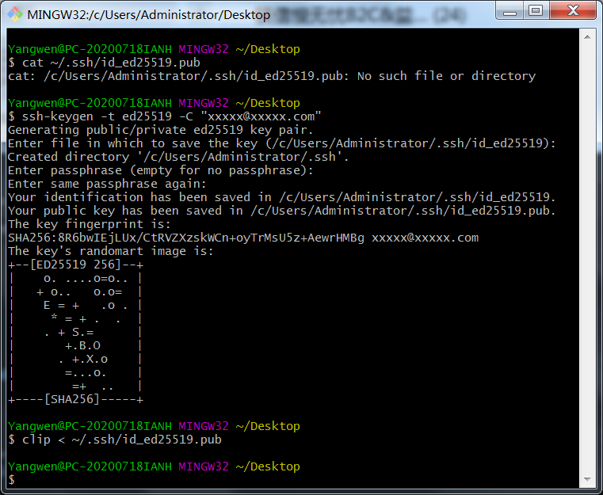
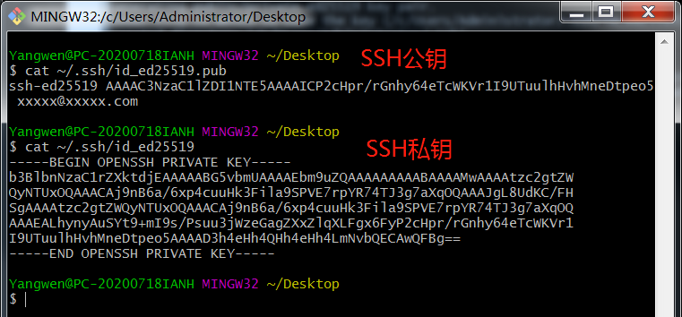

## 生成/添加SSH公钥
目前不管是在gitee，还是在阿里云，还是在github上，访问仓库时，都需要先配置好账户/仓库的SSH公钥。

1. 可以按如下命令来生成 sshkey:
  ```
  ssh-keygen -t ed25519 -C "xxxxx@xxxxx.com" 
  ```
  注意：这里的 xxxxx@xxxxx.com 只是生成的 sshkey 的名称，并不约束或要求具体命名为某个邮箱。
  现网的大部分教程均讲解的使用邮箱生成，其一开始的初衷仅仅是为了便于辨识所以使用了邮箱。

  按照提示完成三次回车，即可生成 ssh key。

2. 通过查看 ~/.ssh/id_ed25519.pub 文件内容，获取到你的 public key。
  ```
  cat ~/.ssh/id_ed25519.pub
  ```
  

3. 如果打算拷贝公钥到你的粘贴板下，请参考操作系统使用以下命令：
  ```
  clip < ~/.ssh/id_ed25519.pub
  ```
  

4. 复制生成的ssh key，添加到仓库中。

5. 添加后，在终端（Terminal）中输入，以阿里云为例：
```
 ssh -T git@codeup.aliyun.com
```
首次使用需要确认并添加主机到本机SSH可信列表。若返回 Welcome to Codeup, xxx!
 内容，则证明添加成功。
添加成功后，就可以使用SSH协议对仓库进行操作了。

### 参考链接
1. [gitee 生成/添加SSH公钥 以及解决 git@gitee.com: Permission denied (publickey). 错误问题](https://blog.csdn.net/weidu01/article/details/120910967)