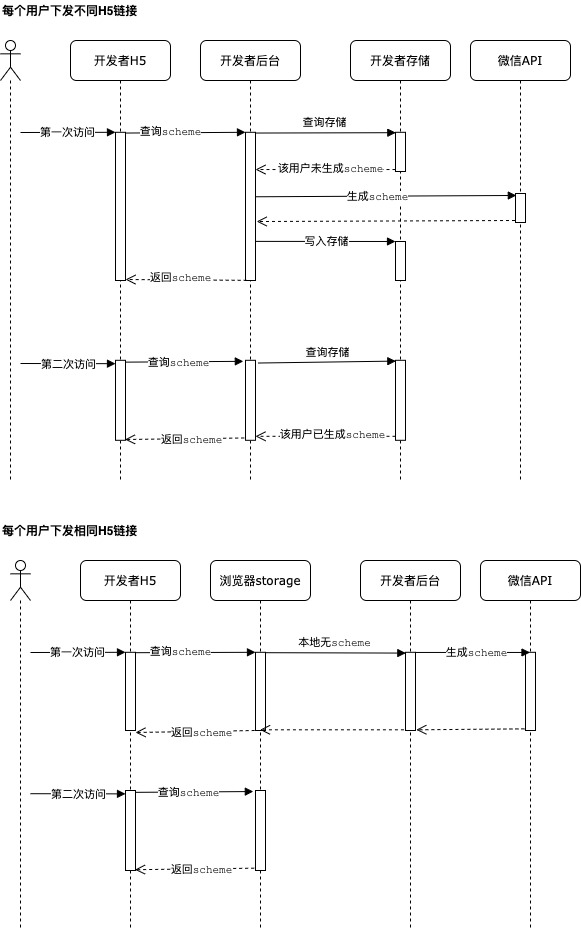

# 短信打开小程序

在微信小程序中，可以通过以下3种方式实现短信打开小程序。
1. 通过URL Scheme实现
2. 通过URL Link实现
3. 通过云开发静态网站实现

目前一般采用的是方案1。

3月9日，小程序官方发布了[小程序链接生成与使用规则调整公告](https://developers.weixin.qq.com/community/develop/doc/000aeab88a4ea0c5c89d81fde5b801)。公告中提到一点：链接生成后，若在微信外打开，用户可以在浏览器页面点击进入小程序。**每个独立的链接被用户访问后，仅此用户可以再次访问并打开对应小程序，其他用户无法再次通过相同链接打开该小程序**；

那如果这样的话，针对不同的用户，需要生成不同的短信链接，确保每个用户都可以访问小程序。因此需要在现有的基础上做一些改变。

## 通过URL Scheme实现
通过服务端接口或在小程序管理后台生成[URL Scheme](https://developers.weixin.qq.com/miniprogram/dev/framework/open-ability/url-scheme.html)后，**自行开发中转H5页面**。
将带有中转H5链接的短信内容通过开发者自有的短信发送能力或服务商的短信服务进行投放，实现短信打开小程序。

iOS系统支持识别 URL Scheme，可在短信等应用场景中直接通过 Scheme 跳转小程序。
Android系统不支持直接识别 URL Scheme，用户无法通过 Scheme 正常打开小程序，开发者需要使用 H5 页面中转，再跳转到 Scheme 实现打开小程序，跳转代码示例如下：
```js
location.href = 'weixin://dl/business/?t= *TICKET*'
```
**该跳转方法可以在用户打开 H5 时立即调用，也可以在用户触发事件后调用。**

示例网页地址（需要在网页中打开）：https://postpay-2g5hm2oxbbb721a4-1258211818.tcloudbaseapp.com/jump-mp.html

### 方案
1. 检测到微信客户端内，则免鉴权使用开放标签跳转；
2. 检测到在外部浏览器或 App，则使用 URL Scheme 跳转小程序。
3. 可将生成 scheme 的时机改为在用户打开 H5 时再生成：
   
4. **在打开H5时，需要对 URL Scheme 做缓存，缓存一定时间，这样可以避免生成次数超限。缓存时间和缓存数据容量可以按照实际情况去执行。**

### 开发
静态网站网页在微信客户端打开时，wx.config 可以传入小程序 AppID 并且不需计算签名，也就是免鉴权即可使用跳转小程序的能力。
具体代码可参见同目录下 demo.html

wx-open-launch-weapp 使用方法参见 `开放标签说明文档.md`


### 注意事项
1. 部分浏览器会限制打开网页直接跳转，可参考示例网页设置跳转按钮
2. 通过 URL Scheme 跳转到微信时，可能会触发系统弹框询问，若用户选择不跳转，则无法打开小程序。请开发者妥善处理用户选择不跳转的场景
3. 只能生成已发布的小程序的 URL Scheme
4. 该功能基本覆盖当前用户正在使用的微信版本，开发者无需进行低版本兼容
5. 微信内的网页如需打开小程序请使用**微信开放标签 - 小程序跳转按钮**，无公众号也可以直接使用小程序身份开发网页并免鉴权跳转小程序，见云开发静态网站跳转小程序。符合开放范围的小程序可以下发支持打开小程序的短信


## 通过URL Link实现
通过服务端接口生成[URL Link](https://developers.weixin.qq.com/miniprogram/dev/framework/open-ability/url-link.html)。直接将带有URL Link的短信内容通过开发者自有的短信发送能力或服务商的短信服务进行投放，实现短信打开小程序。

由于在微信内或者安卓手机打开 URL Link 时，默认会先跳转官方 H5 中间页，如果需要定制 H5 内容，可以使用云开发静态网站。若未使用云开发静态网站，则无法自定义。因此不选择该方式。

## 通过云开发静态网站实现
可以参考「云开发」-「静态网站」-[「短信跳小程序」](https://developers.weixin.qq.com/miniprogram/dev/wxcloud/guide/staticstorage/msg-miniprogram.html)。


## 静态网站
https://developers.weixin.qq.com/miniprogram/dev/wxcloud/guide/staticstorage/introduction.html

### 静态网站 H5 跳小程序
https://developers.weixin.qq.com/miniprogram/dev/wxcloud/guide/staticstorage/jump-miniprogram.html

### 短信规则
1. 短信发送能力的体验是每个有免费配额的环境首月100条，如有超过额度的需求可前往开发者工具 - 云开发控制台 - 对应按量付费环境 - 资源包 - 短信资源包，进行购买。如当前资源包无法满足需求也可通过云开发 工单 提交申请。
2. 营销类短信发送时间：8:00 - 22:00，通知类短信发送时间：全天；通知类短信不可包含营销内容。
3. 短信发送能力支持小程序和小游戏。
4. 发送国内短信的号码是1069开头，尾数是运营商随机号的号码。
5. 发送成功代表请求发送短信成功，短信异步下发，实际状态以运营商回执为准。没有发送成功的短信不计费,可用性参阅服务等级协议。
6. 营销类短信：相同内容短信对同一个手机号，30 秒内发送短信条数不超过1条；对同一个手机号，1自然日内发送短信条数不超过10条。通知类短信：相同内容且对同一个手机号，30 秒内发送短信条数不超过1条；对同一个手机号，30秒内发送短信条数不超过10条；对同一个手机号，1个自然日内发送短信条数不超过100条。
   
### 短信格式
短信格式：【小程序名称】{1},跳转小程序{2}退订回T； 示例：【云开发体验】能力上新，跳转小程序 https://dllzff.cn/VcdrUJK0 退订回T 短信由签名和正文内容组成：

短信签名是位于短信正文前【】中的署名，小程序发送短信时，签名为小程序名称。
正文内容是由短信模板和变量构成，{1}，跳转小程序 {2} 退订回T，模板参数中 {1}，{2} 是变量
1. {1} ：用户可自定义传入的内容，当前最长为30个字。
2. {2} ：用户传入的静态托管的地址，例如 /action/index.html?action=double12。
**注意：一条短信最多为70个字。小程序名字+短信内容，剩余可利用最多为30个字。否则将算作2条短信;**

### 短信内容长度计算规则
1. 短信长度（字数）=短信签名字数+短信内容字数；
2. 汉字、字母、数字、标点符号（不区分全角/半角）以及空格等，都按1个字计算；
3. 国内短信长度（签名+正文）不超过70字时，按照1条短信计费；超过70字即为长短信时，按67字/条分隔成多条计费。
**例如，短信长度为150字，则按照67字/67字/16字分隔成3条计费。**

### 短信内容规范
短信内容规范限制

1. 不支持【】，以免与签名混淆。
2. 不支持￥、★以及通过按键录入的组合型特殊符号，例如 ^_^&、☞、✓、※ 等，以免引起短信出现乱码。
3. 禁止发送违法违规相关内容。
4. 禁止发送未经许可的邀请，主要指邀请注册、邀请成为会员等。
5. 禁止发送股票、移民、面试招聘、彩票、返利、抽奖、贷款、催款、投资理财、赌博、中奖、毒品、党政、法律维权、众筹、慈善捐款、宗教、迷信、殡葬、刷单、空包网、一元夺宝、一元秒杀、A 货、医疗、整形、美容、会所、酒吧、足浴、暴力、恐吓、色情、皮草、助考、装修（含建材和家私）、商标注册、加群、加 QQ 或者加微信、贩卖个人信息、宣传短信通道、游戏推广、会展推广、网站推广、优惠券类推广、卡类推广、保险推广、信用卡提额、返现返利、代开发票、邀请好评、酒类、用户拉新以及用户召回等类型的短信。
