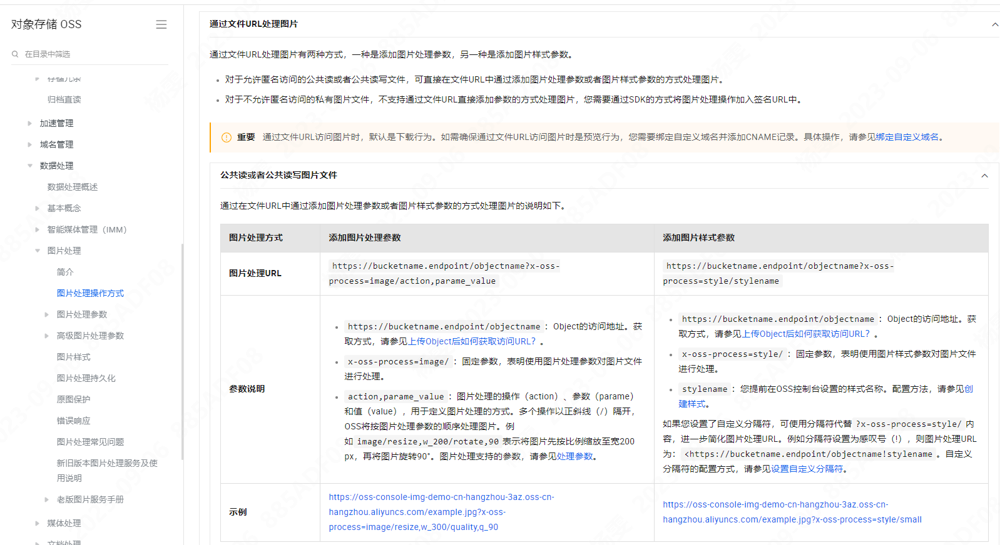

## 图片流量治理

一般我们在做项目时，涉及到图片的地方，我们都是直接通过设置图片的 src，然后就没有然后了。
如果图片很大的时候，会很占带宽，很耗流量。要是遇上网络卡的时候，加载速度就会更慢，体验感特别不好。
当然，有人会说，给图片加占位图呀，这样有个过渡效果就好了。但是，过渡以后，加载慢和占带宽的问题依然存在，治标不治本。

考虑一下，我们真的需要每个场景下面，图片都毫无保留无失真的展示给用户看吗？

实际上，只有一小部分场景，需要给用户看到原图。大部分情况下，特别是小图展示时，是没必要展示原图的。因此，我们可以对图片进行压缩、模糊等，减少图片资源加载时长，降低带宽消耗————图片治理。

通过图片治理，我们可以达到：

1. 大幅度降低流量消耗，降低带宽消耗
2. 提高运行性能和用户体验

### HOW

参考链接：

https://help.aliyun.com/zh/oss/user-guide/latest-version-of-img-guide/?spm=a2c4g.11186623.0.0.382d10a6MTwfNz

### 步骤

1. 图片加载
2. 判断是否在视图内，否则加载默认图，是则继续往下走
3. 判断是否支持 webp，是则加载 webp 格式且质量压缩的图片，否则加载质量压缩图片
4. 加载前提供一个占位图
