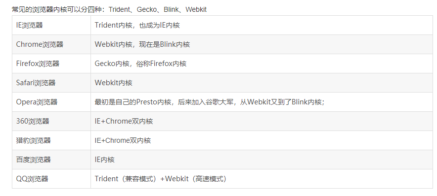

## 前端常见浏览器兼容性问题解决方案

不同浏览器，内核不一致，对网页的解析也会存在一定的差异。

浏览器内核主要分为两种：

1. 渲染引擎
2. js 引擎

内核更倾向于渲染引擎。



不同浏览器的默认样式存在差异，可以通过 `Normalize.css` 来抹平这些差异。

### 样式初始化

由于各大浏览器会有自身的默认样式，并且不尽相同，所以为了尽可能的保证样式的统一性，前端在开发项目之前都会先进行样式格式化，最常见的分为以下几个方面：

1. padding 值和 margin 值均设置为 0
   将 html、body、a、li、ol、input、textarea、select、button 等标签的 padding 值和 margin 值设置为 0。

2. html 标签
   设置统一的字体，如果使用 rem 单位，则 html 需要设置合适的字号。

3. a 标签
   设置统一的颜色，将 text-decoration 属性设置为 none。

4. ol 和 li 标签
   list-style 统一设置为 none。

5. input、textarea、select、button 等标签初始化
   border 设置为 none；

6. 根据需要设置颜色和背景色。

### 使用不同类型的浏览器内核前缀

1. Chrome（谷歌浏览器） 与 Safari（苹果浏览器） 内核：Webkit （中译无） 前缀：-webkit-
2. IE （IE 浏览器） 内核：Trident （中译三叉戟） 前缀：-ms-

3. Firefox （火狐浏览器） 内核：Gecko（中译壁虎） 前缀：-moz-

4. Opera （欧朋浏览器） 内核：Presto（中译迅速） 前缀：-o-

```css
-webkit-border-radius: 10px; /* 谷歌浏览器 */
-ms-border-radius: 10px; /* IE浏览器 */
-moz-border-radius: 10px; /* 火狐浏览器 */
-o-border-radius: 10px; /* 欧朋浏览器 */
border-radius: 10px;
```

### 针对 IE 浏览器不同版本的解决方案

#### 对于低版本的 IE 浏览器使用 CSS hack（即给特点前缀）

注：以下符号是写在属性名前面。

1. 兼容 IE6 的 hack 符号：- 或 \_
2. 兼容 IE6 、7 的 hack 符号：` ~ ! @ # $ % ^ & \* ( ) + = [ ] | < > , . 任意一个符号
3. 兼容 IE6、7、8 的 hack 符号：.

注：以下符号是写在属性值与分号之间，中间不留空格。

1. 兼容 IE8 的 hack 符号：\0/
2. 兼容 IE8、9、10 的 hack 符号：\0
3. 兼容 IE6、7、8、9、10 的 hack 符号：\9

```css
/* hack符号在前 */
_border-radius: 10px; /* IE6 */
+border-radius: 10px; /* IE6\7 */
.border-radius: 10px; /* IE6\7\8 */

/* hack符号在后 */
border-radius: 10px\0/; /* IE8 */
border-radius: 10px\0; /* IE8\9\10 */
border-radius: 10px\9; /* IE6\7\8\9\10 */
```

#### 为不同的版本编写独立的样式，其他浏览器识别不到。

例：大于 IE9 的浏览器使用单独的 style9.css 样式，只有 IE6 浏览器使用的 style6.css 样式。

### 其他特殊样式

1. cursor 属性的 hand 值和 pointer 值
   问题：firefox 浏览器不支持 hand 值，但其他浏览器均支持 pointer 值。
   解决: 统一使用 cursor 属性的 pointer 值。

2. 水平居中
   问题：IE8 及 IE8 以下版本浏览器不可通过设置 margin:0 auto 实现水平居中。
   解决: 可通过设置父级 text-align:center 实现。

3. 属性值 “inherit”
   问题：IE8 及 IE8 以下版本浏览器不支持属性值 “inherit”。
   解决：谨慎使用属性值 “inherit”。

### JS 兼容性

1. ES6 语法
   问题：IE11 不支持箭头函数、class 语法等（报 SCRIPT1002: 语法错误），不支持 Set 和 Map 数据结构（不报错）及 Promise 对象，支持 let 和 const，IE10 及以下不支持任何 ES6 语法。

   解决：如果要兼容 IE 浏览器的项目请使用 ES5 语法或者使用 Babel 进行转换。

2. 操作 tr 标签
   问题：IE9 及 IE9 以下版本浏览器，不能操作 tr 标签的 innerHTML 属性。

   解决：可以操作 td 标签的 innerHTML 属性。

3. Ajax
   问题：IE9 及 IE9 以下版本浏览器无法使用 Ajax 获取接口数据。

   解决：在使用 Ajax 请求之前设置 jQuery.support.cors=true。

4. event 对象的 srcElement 属性
   问题：IE8 及 IE8 以下版本浏览器 event 对象只有 srcElement 属性，没有 target 属性。

   解决：obj = event.target ? event.target : event.srcElement。

5. DOM 事件绑定
   问题：IE8 及 IE8 以下版本浏览器是用 attachEvent() 方法，而其他浏览器是 addEventListener() 方法。

   解决：判断 IE 浏览器版本，如果是 IE8 及以下 事件绑定则使用 attachEvent() 方法，注意 attachEvent() 方法的用法，第一个参数为 “onclick” 而不是 “click”。并且没有第三个参数。

### 常见的兼容性问题

1. 不同浏览器的标签默认的外补丁和内补丁不同

   问题症状：随便写几个标签，不加样式控制的情况下，各自的 margin 和 padding 差异较大。

   碰到频率:100%

   解决方案：CSS 里 \*{margin:0;padding:0;}

   备注：这个是最常见的也是最易解决的一个浏览器兼容性问题，几乎所有的 CSS 文件开头都会用通配符\*来设置各个标签的内外补丁是 0。

2. 块属性标签 float 后，又有横行的 margin 情况下，在 IE6 显示 margin 比设置的大

   问题症状:常见症状是 IE6 中后面的一块被顶到下一行

   碰到频率：90%（稍微复杂点的页面都会碰到，float 布局最常见的浏览器兼容问题）

   解决方案：在 float 的标签样式控制中加入 display:inline;将其转化为行内属性

   备注：我们最常用的就是 div+CSS 布局了，而 div 就是一个典型的块属性标签，横向布局的时候我们通常都是用 div float 实现的，横向的间距设置如果用 margin 实现，这就是一个必然会碰到的兼容性问题。

3. 设置较小高度标签（一般小于 10px），在 IE6，IE7，遨游中高度超出自己设置高度

   问题症状：IE6、7 和遨游里这个标签的高度不受控制，超出自己设置的高度

   碰到频率：60%

   解决方案：给超出高度的标签设置 overflow:hidden;或者设置行高 line-height 小于你设置的高度。

   备注：这种情况一般出现在我们设置小圆角背景的标签里。出现这个问题的原因是 IE8 之前的浏览器都会给标签一个最小默认的行高的高度。即使你的标签是空的，这个标签的高度还是会达到默认的行高。

4. 行内属性标签，设置 display:block 后采用 float 布局，又有横行的 margin 的情况，IE6 间距 bug

   问题症状：IE6 里的间距比超过设置的间距

   碰到几率：20%

   解决方案：在 display:block;后面加入 display:inline;display:table;

   备注：行内属性标签，为了设置宽高，我们需要设置 display:block;(除了 input 标签比较特殊)。在用 float 布局并有横向的 margin 后，在 IE6 下，他就具有了块属性 float 后的横向 margin 的 bug。不过因为它本身就是行内属性标签，所以我们再加上 display:inline 的话，它的高宽就不可设了。这时候我们还需要在 display:inline 后面加入 display:talbe。

5. 图片默认有间距

   问题症状：几个 img 标签放在一起的时候，有些浏览器会有默认的间距，加了问题一中提到的通配符也不起作用。

   碰到几率：20%

   解决方案：使用 float 属性为 img 布局

   备注：因为 img 标签是行内属性标签，所以只要不超出容器宽度，img 标签都会排在一行里，但是部分浏览器的 img 标签之间会有个间距。去掉这个间距使用 float 是正道。

6. 标签最低高度设置 min-height 不兼容

   问题症状：因为 min-height 本身就是一个不兼容的 CSS 属性，所以设置 min-height 时不能很好的被各个浏览器兼容

   碰到几率：5%

   解决方案：如果我们要设置一个标签的最小高度 200px，需要进行的设置为：{min-height:200px; height:auto !important; height:200px; overflow:visible;}

   备注：在 B/S 系统前端开时，有很多情况下我们又这种需求。当内容小于一个值（如 300px）时。容器的高度为 300px；当内容高度大于这个值时，容器高度被撑高，而不是出现滚动条。这时候我们就会面临这个兼容性问题。

7. IE9 以下浏览器不能使用 opacity
   解决方案：

   filter:alpha(opacity=50);  
   -moz-opacity:0.5;  
   -khtml-opacity: 0.5;  
   opacity: 0.5;
   filter: progid:DXImageTransform.Microsoft.Alpha(style = 0, opacity = 50);

8. 边距重叠问题；当相邻两个元素都设置了 margin 边距时，margin 将取最大值，舍弃最小值；
   解决方案：为了不让边重叠，可以给子元素增加一个父级元素，并设置父级元素为 overflow:hidden；

9. cursor:hand 显示手型在 safari 上不支持
   解决方案：统一使用 cursor:pointer

10. 两个块级元素，父元素设置了 overflow:auto；子元素设置了 position:relative ;且高度大于父元素，在 IE6、IE7 会被隐藏而不是溢出；
    解决方案：父级元素设置 position:relative

11. IE6 背景闪烁的问题

    问题：链接、按钮用 CSSsprites 作为背景，在 ie6 下会有背景图闪烁的现象。原因是 IE6 没有将背景图缓存，每次触发 hover 的时候都会重新加载

    解决：可以用 JavaScript 设置 ie6 缓存这些图片：

    ```ts
    document.execCommand('BackgroundImageCache', false, true);
    ```

12. 解决在 IE6 下，列表与日期错位的问题
    日期`<span>` 标签放在标题 `<a>` 标签之前即可

13. 解决 IE6 不支持 min-height 属性的问题

    ```css
    min-height: 350px;
    _height: 350px;
    ```

14. 让 IE7 IE8 支持 CSS3 background-size 属性
    由于 background-size 是 CSS3 新增的属性，所以 IE 低版本自然就不支持了，但是老外写了一个 htc 文件，名叫 background-size polyfill，使用该文件能够让 IE7、IE8 支持 background-size 属性。其原理是创建一个 img 元素插入到容器中，并重新计算宽度、高度、left、top 等值，模拟 background-size 的效果。

    ```css
    html {
      height: 100%;
    }
    body {
      height: 100%;
      margin: 0;
      padding: 0;
      background-image: url('img/37.png');
      background-repeat: no-repeat;
      background-size: cover;
      -ms-behavior: url('css/backgroundsize.min.htc');
      behavior: url('css/backgroundsize.min.htc');
    }
    ```

15. 键盘事件 keyCode 兼容性写法

    ```js
    var inp = document.getElementById('inp');
    var result = document.getElementById('result');

    function getKeyCode(e) {
      e = e ? e : window.event ? window.event : '';
      return e.keyCode ? e.keyCode : e.which;
    }

    inp.onkeypress = function (e) {
      result.innerHTML = getKeyCode(e);
    };
    ```

16. 求窗口大小的兼容写法

    ```js
    // 浏览器窗口可视区域大小（不包括工具栏和滚动条等边线）
    // 1600 * 525
    var client_w = document.documentElement.clientWidth || document.body.clientWidth;
    var client_h = document.documentElement.clientHeight || document.body.clientHeight;

    // 网页内容实际宽高（包括工具栏和滚动条等边线）
    // 1600 * 8
    var scroll_w = document.documentElement.scrollWidth || document.body.scrollWidth;
    var scroll_h = document.documentElement.scrollHeight || document.body.scrollHeight;

    // 网页内容实际宽高 (不包括工具栏和滚动条等边线）
    // 1600 * 8
    var offset_w = document.documentElement.offsetWidth || document.body.offsetWidth;
    var offset_h = document.documentElement.offsetHeight || document.body.offsetHeight;

    // 滚动的高度
    var scroll_Top = document.documentElement.scrollTop || document.body.scrollTop;
    ```

### 参考链接

1. [前端常见浏览器兼容性问题解决方案](https://www.cnblogs.com/angel648/p/11392262.html)
