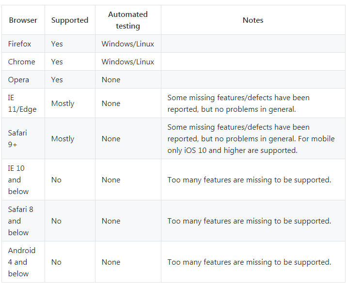

## 移动端实现预览pdf和下载pdf

项目中经常需要实现在线展示 PDF 文件以及下载 PDF 文件的功能。由于 PC 端和 H5 端不同浏览器有兼容问题，因此考虑以下几种方式进行实现。

### PDFObject
PDFObject 是一个用于在 HTML 中动态嵌入 PDF 文档的 javascript 库。PC 端兼容性比较好，可以兼容 ie9，但是移动端兼容性比较差。

### jquery.media.js

### pdf.js

pdf.js 支持在所有符合 HTML5 标准的浏览器上实现 PDF 在线预览、打印、下载等功能。

1. 兼容性： 

2. [pdf.js github 地址](https://github.com/mozilla/pdf.js)

3. [pdf.js online demo](https://mozilla.github.io/pdf.js/web/viewer.html)

4. 

### 参考链接
1. [pdf文件在线预览，兼容多浏览器和手机端](https://blog.csdn.net/qq_38584967/article/details/83784049)

2. [8 个 jQuery 的 PDF 浏览插件](https://www.oschina.net/news/35267/jquery-pdf-viewers)

https://mozilla.github.io/pdf.js/web/viewer.html

https://github.com/mozilla/pdf.js

https://github.com/mozilla/pdf.js/wiki/Frequently-Asked-Questions#file

https://www.google.com.hk/search?safe=strict&hl=zh-CN&ei=wKzOXM_rF8TfmAWJiq7IDQ&q=%E7%A7%BB%E5%8A%A8%E7%AB%AF%E9%A2%84%E8%A7%88pdf%E5%85%BC%E5%AE%B9%E6%80%A7&oq=%E7%A7%BB%E5%8A%A8%E7%AB%AF%E9%A2%84%E8%A7%88pdf%E5%85%BC%E5%AE%B9%E6%80%A7&gs_l=psy-ab.3...0.0..2670609...0.0..0.0.0.......0......gws-wiz.gbf4kbonZKk

https://blog.csdn.net/fade999/article/details/81327679

https://www.cnblogs.com/zdz8207/p/html5-pdf-js.html

https://1017401036.iteye.com/blog/2404819

https://blog.csdn.net/qq_38584967/article/details/83784049

https://blog.csdn.net/liuyaqi1993/article/details/77822946

https://www.oschina.net/news/35267/jquery-pdf-viewers

https://blog.csdn.net/qq_26173001/article/details/82783493#

https://blog.csdn.net/xiao_bin_shen/article/details/77778514

https://blog.csdn.net/a973685825/article/details/81169689

http://0313.name/archives/48

https://www.cnblogs.com/kagome2014/p/kagome2014001.html

https://www.cnblogs.com/zhanggf/p/8504317.html

https://blog.csdn.net/u013379933/article/details/84622166

