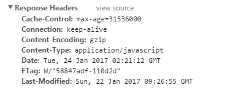

# HTTP 缓存机制及原理

之前做过一个需求，涉及到 HTTP 缓存处理，当时只是简单的借鉴了一下网上的方案，并没有系统性地了解其原理。因此呢，特地找了找网上各种博主写的文章，打算深入学习一下 HTTP 缓存机制。网上各种博主文章写得贼赞 \(^o^)/~ 看来不能大展身手啦，只能将其概括概括总结一下~

## 前言

WEB 性能优化中，HTTP 缓存机制扮演了一个比较重要的角色。同时呢，HTTP 缓存机制是一个比较基础性的内容，对于从事 WEB 开发的童鞋们来说应该是比较司空见惯啦~

一般来讲，HTTP 缓存就是浏览器对请求的静态资源文件进行缓存。可是它为什么要缓存呢？是怎么缓存的呢？会过期吗？接下来我将为你一一解答。(*^__^*)

## 为什么需要缓存

为什么需要缓存？缓存，顾名思义，就是暂存。那为什么要暂存，很简单啊，就是快呗~无论是从磁盘到内存还是网络到本地，都是为了下一次获取资源时能够更快地响应资源，避免时间消耗和I/O操作，避免无须的资源浪费。

通过网络去获取资源，需要客户端和服务端之间多次往返通信，这不但增加了客户端响应时长，还增加了网络流量，比较耗时。而 HTTP 缓存呢，直接通过浏览器和 APP 使用的开源网络库去缓存资源，岂不是更方便~

## 怎么缓存

我们已经知道了为什么需要缓存，那我们来说说怎么去缓存。在谈缓存之前，我们需要先考虑两个方面：（1）缓存失效；（2）减少读取。

缓存失效，比较好理解：缓存某个东西，总会有一个时长嘛，不可能缓存一次，终身有效。因此我们需要知道资源或者数据何时会失效，失效之后我们是不是需要重新获取数据并再次缓存。

减少读取：第一次获取数据，毫无疑问，肯定是要原原本本地把数据从服务器返回给客户端的。那第二次获取的时候，我如何判断此时是直接取缓存中的数据还是直接从服务器中获取数据呢？

因此，如何缓存，就要解决上述两个问题。接下来，我们看下 HTTP 是如何解决上述两个问题的。

## HTTP 报文

首先给大家简单介绍一下 HTTP 报文。HTTP 报文是什么呢？它就是浏览器和服务器之间通信时发送以及响应的数据块。浏览器向服务器请求数据，发送请求(request)报文；服务器向浏览器返回数据，返回响应(response)报文。

报文信息主要包含两部分： 
（1）包含属性的部分，即 header。里面包含着各种 cookie、缓存信息等。 
（2）包含数据主体部分，即 body。里面包含着 HTTP 传输的内容。

## HTTP 缓存机制解析

便于大家理解，我们假定浏览器中存在一个缓存数据库，专门用于缓存资源。

HTTP 缓存有多种规则，根据是否需要重新向服务器发送请求，我将其分为两大类：强制缓存(也称为强缓存)、对比缓存(也称为协商缓存)。

客户端第一次请求数据，此时缓存数据库中没有数据，因此会继续向服务器请求数据。服务器返回数据和缓存规则到客户端，由客户端将数据和缓存规则存入缓存系统，如下图所示： 

客户端已缓存数据，强制缓存下区分两种情况：未失效和已失效 

客户端已缓存数据，对比缓存区分两种情况：未失效和已失效 

基于上述几个图对比可知： 
（1）强制缓存下，如果未失效，直接从缓存数据库中获取数据，无须再次向服务器发送请求。 
（2）对比缓存下，不管是否失效，都需要向服务器发送请求判断是否生效。 
（3）强制缓存和对比缓存共同作用下，强制缓存优先级要高一些。

### 强制缓存

通过上述内容可知，强制缓存下缓存数据未失效时，再次获取数据可直接从缓存数据库中获取。那么浏览器如何取判断数据是否失效呢？

由客户端第一次请求数据的流程图可知，服务器将数据和缓存规则一并返回，而由 HTTP 报文简介可知，缓存信息包含在 header 中。

强制缓存下，响应 header 中有2个字段来标明失效规则（Expires/Cache-Control）。打开 chrome 开发中工具，可以明显看到网络请求情况。 

#### Expires

Expires 的值为服务端返回的到期时间，即下一次请求时，请求时间小于服务端返回的到期时间，直接使用缓存数据。

不过 Expires 是 HTTP 1.0 的东西，现在默认浏览器均默认使用 HTTP 1.1，所以它的作用基本忽略。

另一个问题是，到期时间是由服务端生成的，但是客户端时间可能跟服务端时间有误差，这就会导致缓存命中的误差。所以 HTTP 1.1 的版本，使用 Cache-Control 替代。

#### Cache-Control

Cache-Control 是最重要的规则。常见的取值有private、public、no-cache、max-age，no-store，默认为private，可以同时设置多个值。

private:             客户端可以缓存 
public:              客户端和代理服务器都可缓存（前端的同学，可以认为public和private是一样的） 
max-age=xxx:         缓存的内容将在 xxx 秒后失效，单位（秒） 
no-cache:            需要使用对比缓存来验证缓存数据（后面介绍） 
no-store:            所有内容都不会缓存，强制缓存，对比缓存都不会触发 

 
图中Cache-Control仅指定了max-age，所以默认为private，缓存时间为31536000秒（365天）
也就是说，在365天内再次请求这条数据，都会直接获取缓存数据库中的数据，直接使用。

### 对比缓存

对比缓存，顾名思义，需要进行比较判断是否可以使用缓存。

浏览器第一次请求数据时，服务器会将缓存标识与数据一起返回给客户端，客户端将二者备份至缓存数据库中。再次请求数据时，客户端将备份的缓存标识发送给服务器，服务器根据缓存标识进行判断，判断成功后，返回304状态码，通知客户端比较成功，可以使用缓存数据。

第一次访问： 

再次访问： 

通过两图的对比，我们可以很清楚的发现，在对比缓存生效时，状态码为304，并且报文大小和请求时间大大减少。

原因：服务端在进行标识比较后，只返回header部分，通过状态码通知客户端使用缓存，不再需要将报文主体部分返回给客户端。

对于对比缓存来说，缓存标识的传递是我们着重需要理解的，它在请求header和响应header间进行传递，
一共分为两种标识传递，接下来，我们分开介绍。

#### Last-Modified / If-Modified-Since
Last-Modified：
服务器在响应请求时，告诉浏览器资源的最后修改时间。 

If-Modified-Since：
再次请求服务器时，通过此字段通知服务器上次请求时，服务器返回的资源最后修改时间。
服务器收到请求后发现有头If-Modified-Since 则与被请求资源的最后修改时间进行比对。
若资源的最后修改时间大于If-Modified-Since，说明资源又被改动过，则响应整片资源内容，返回状态码200；
若资源的最后修改时间小于或等于If-Modified-Since，说明资源无新修改，则响应HTTP 304，告知浏览器继续使用所保存的cache。 

#### Etag / If-None-Match（优先级高于Last-Modified / If-Modified-Since）
Etag：
服务器响应请求时，告诉浏览器当前资源在服务器的唯一标识（生成规则由服务器决定）。 

If-None-Match：
再次请求服务器时，通过此字段通知服务器客户段缓存数据的唯一标识。
服务器收到请求后发现有头If-None-Match 则与被请求资源的唯一标识进行比对，
不同，说明资源又被改动过，则响应整片资源内容，返回状态码200；
相同，说明资源无新修改，则响应HTTP 304，告知浏览器继续使用所保存的cache。 

### 两种缓存对比以及定制最佳缓存策略
根据上述介绍，我们可以清楚知道两种缓存下的优缺点： 

强制缓存：再次请求服务器时，无需和服务器进行通信，减少和服务器之间的通信，适合于一些通用的不变化的资源。 

对比缓存：再次请求服务器时，需要将缓存标识发送给服务器。适合于一些数据不变化的接口请求等。 

无论哪种缓存，都有自己适用的场景，一般我们需要根据不同的业务场景来使用不同的缓存。以下是一个HTTP缓存的通用策略树： 

### 如何更新或废弃缓存
假如有一个样式文件，浏览器缓存了该css文件，你更改css样式之后，由于浏览器缓存，你无法获取到最新的样式。此时你可以给对应文件名加哈希或者加版本号，例如 style.x234ddfff.css 或者 style.css?v=1，从而强制更新。

## 刷新浏览器区分
假设对一个资源，浏览器第一次访问，获取资源内容和cache-control: max-age:600，Last_Modify: Wed, 10 Aug 2013 15:32:18 GMT于是浏览器把资源文件放到缓存中，并且决定下次使用的时候直接去缓存中取了。

1. 浏览器中输入链接并回车：浏览器发现缓存中有这个文件，就不发送任何请求，直接去缓存中获取。（最快）

2. F5 刷新：即检查If-Modify-since，对比确认是否返回304。

3. ctrl + F5 强制刷新：即删除原缓存文件，重新获取完整数据。

| 用户操作 | Expires/Cache-Control | Last-Modified/Etag
| ------ | ------ | ------ |
| 地址栏回车 | 有效 | 有效 |
| 页面链接跳转 | 有效 | 有效 |
| 新开窗口 | 有效 | 有效 |
| 前进、后退 | 有效 | 有效 |
| F5/按钮刷新 | 无效(BR重置max-age=0) | 有效 |
| Ctrl+F5刷新 | 无效（重置CC=no-cache） | 无效（请求头丢弃该选项） |

note：Etag 实际上很少人使用，因为它的计算是使用算法来得出的，而算法会占用服务端计算的资源，所有服务端的资源都是宝贵的，所以就很少使用 Etag 了。

## 总结
1. HTTP 缓存根据是否需要重新向服务器发送请求获取数据可分为强制缓存和对比缓存。

2. 已存在数据缓存，再次获取时，强制缓存下，直接返回缓存内容。

3. 已存在数据缓存，再次获取时，对比缓存下，客户端将标识发送给服务器，服务器根据标识判断是否需要使用缓存内容。

4. 对比缓存有2种标识传递： 
（1）Last-Modified / If-Modified-Since：即判断再次请求时间和最后修改时间的差值来决定是否返回304或者响应资源。 
（2）Etag / If-None-Match：即客户端发送标识（客户端第一次请求时返回给客户端的标识）给服务器，服务器判断是否与请求资源的唯一标识一致，一致则响应304，不一致则响应资源。

## 参考链接
1. [HTTP 缓存](https://developers.google.com/web/fundamentals/performance/optimizing-content-efficiency/http-caching?hl=zh-cn)

2. [HTTP缓存机制详解](https://juejin.im/entry/599afbe5f265da247c4ee6e3)

3. [彻底弄懂HTTP缓存机制及原理](https://www.cnblogs.com/chenqf/p/6386163.html)

4. [图解 HTTP 的缓存机制 | 实用 HTTP](https://juejin.im/post/5b30d05ee51d45587c51d276)

5. [详解web缓存](https://segmentfault.com/a/1190000006741200)

6. [浏览器 HTTP 协议缓存机制详解](https://my.oschina.net/leejun2005/blog/369148)

7. [翻译：web制作、开发人员需知的Web缓存知识](https://www.zhangxinxu.com/wordpress/2013/05/caching-tutorial-for-web-authors-and-webmasters/)

8. [浏览器缓存原理](https://www.cnblogs.com/wangpenghui522/p/5498427.html)