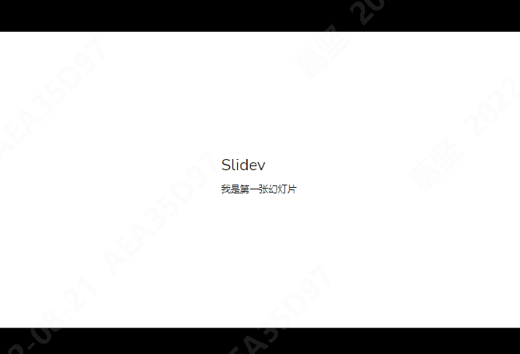
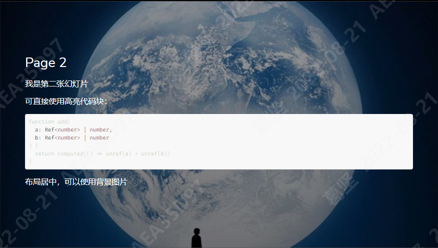
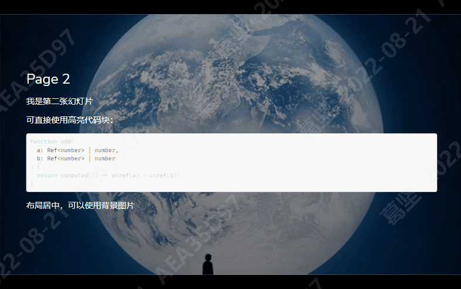
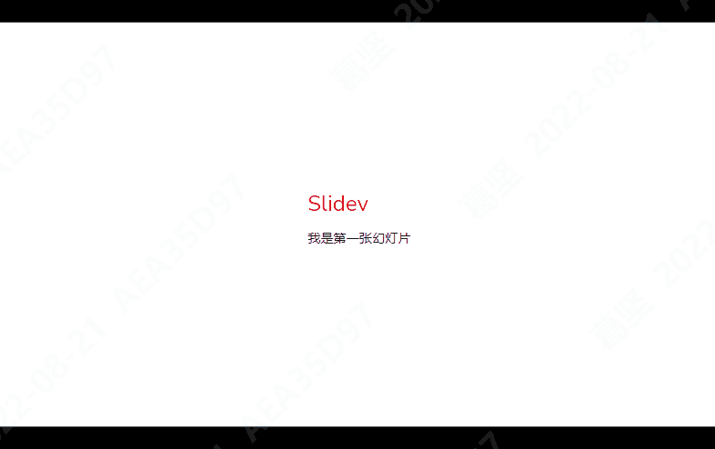
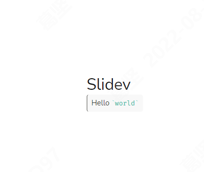

# 用 markdown 做 PPT，so easy
首先，请大家看一下之前震哥给大家分享的[前端技术]()
大家还记得不久前自己编写的述职报告PPT嘛？有没有觉得，有时候写PPT真难

## Slidev
>`Slidev(slide + dev, /slʌɪdɪv/)`，是基于 `Web` 的幻灯片制作和演示工具。它旨在让开发者专注在 `Markdown` 中编写内容，同时拥有支持 `HTML` 和 `Vue` 组件的能力，并且能够呈现像素级完美的布局，还在你的演讲稿中内置了互动的演示样例。<br/>
它使用了功能丰富的 `markdown` 文件来生成精美的幻灯片，具有即时重载的体验。它还拥有很多内置的集成功能，如实时编码、导出 `PDF`、演讲录制等。由于 `Slidev` 是由 `web` 驱动的，因此你可以使用它进行任何操作——具有无限的可能性。

汇总一下，`Slidev` 就是一个基于 `nodejs`、支持 `HTML` 和 `Vue`，内置代码高亮、实时编码等功能，使用 `Markdown` 语法来快速制作 PPT 的工具。

### 功能
* 📝 [Markdown 支持](https://cn.sli.dev/guide/syntax.html) —— 使用你最喜欢的编辑器和工作流编写 `Markdown` 文件
* 🧑‍💻 [开发者友好](https://cn.sli.dev/guide/syntax.html#code-blocks) —— 内置代码高亮、实时编码等功能
* 🎨 [可定制主题](https://cn.sli.dev/themes/gallery.html) —— 以 `npm` 包的形式共享、使用主题
* 🌈 [灵活样式](https://cn.sli.dev/guide/syntax.html#embedded-styles) —— 使用 `Windi CSS` 按需使用的实用类和易用的内嵌样式表
* 🤹 [可交互](https://cn.sli.dev/custom/directory-structure.html#components) —— 无缝嵌入 `Vue` 组件
* 🎙 [演讲者模式](https://cn.sli.dev/guide/presenter-mode.html) —— 可以使用另一个窗口，甚至是你的手机来控制幻灯片
* 🎨 [绘图](https://cn.sli.dev/guide/drawing.html) - 在你的幻灯片上进行绘图和批注
* 🧮 [LaTeX 支持](https://cn.sli.dev/guide/syntax.html#latex) —— 内置了对 `LaTeX` 数学公示的支持
* 📰 [图表支持](https://cn.sli.dev/guide/syntax.html#diagrams) —— 使用文本描述语言创建图表
* 🌟 [图标](https://cn.sli.dev/guide/syntax.html#icons) —— 能够直接从任意图标库中获取图标
* 💻 [编辑器](https://cn.sli.dev/guide/editors.html) —— 集成的编辑器，或者使用 `VS Code` 扩展
* 🎥 [演讲录制](https://cn.sli.dev/guide/recording.html) —— 内置录制功能和摄像头视图
* 📤 [跨平台](https://cn.sli.dev/guide/exporting.html) —— 能够导出 `PDF`、`PNG` 文件，甚至是一个可以托管的单页应用
* ⚡️ [快速](https://vitejs.dev/) —— 基于 `Vite` 的即时重载
* 🛠 [可配置](https://cn.sli.dev/custom/config-vite.html) —— 支持使用 `Vite` 插件、`Vue` 组件以及任何的 `npm` 包

### 技术栈
Slidev 使用了如下的工具和技术：
* [Vite](https://vitejs.dev/) —— 一款极速的前端工具
* 基于 [Vue 3](https://v3.vuejs.org/) 的 [Markdown](https://daringfireball.net/projects/markdown/syntax) —— 专注内容的同时，具备 `HTML` 和 `Vue` 组件的能力
* [Windi CSS](https://github.com/windicss/windicss) —— 按需、实用类优先的 `CSS` 框架，轻松定制你的幻灯片样式
* [Prism](https://github.com/PrismJS/prism), [Shiki](https://github.com/shikijs/shiki), [Monaco Editor](https://github.com/Microsoft/monaco-editor) —— 具有实时编码能力的一流代码片段支持
* [RecordRTC](https://recordrtc.org/) —— 内置录制功能和摄像头视图
* [VueUse](https://vueuse.org/) 家族 —— [@vueuse/core](https://github.com/vueuse/vueuse)、[@vueuse/head](https://github.com/vueuse/head)、[@vueuse/motion](https://github.com/vueuse/motion) 等
* [Iconify](https://iconify.design/) —— 图标库集合
* [Drauu](https://github.com/antfu/drauu) - 支持绘图和批注
* [KaTeX](https://katex.org/) —— `LaTeX` 数学渲染
* [Mermaid](https://mermaid-js.github.io/mermaid) —— 文本描述语言创建图表

### 安装
>Slidev 需要 Node.js 的版本 >=14.0.0

#### 预设模板
使用 NPM：
```powershell
npm init slidev@latest
```
使用 Yarn：
```powershell
yarn create slidev
```
执行命令后，根据提示输入项目名称，选择依赖安装方式后自动安装依赖，自动启动：http://127.0.0.1:3030/1。

在生成的项目框架 `package.json` 中，`scripts`有如下命令：
```json
"scripts": {
  "build": "slidev build",
  "dev": "slidev --open",
  "export": "slidev export"
}
```
可以通过 `yarn dev` 启动本地，`yarn build`进行打包，`yarn export`将幻灯片导出为PDF（或者其他格式）。

#### 手动安装
如果你倾向于手动安装 `Slidev`，或者想把它集成到你已有的项目中，你可以执行如下操作：
```powershell
npm install @slidev/cli @slidev/theme-default
```
```powershell
touch slides.md
```
```powershell
npx slidev
```

#### 全局安装
>自 v0.14 开始可用

```powershell
npm i -g @slidev/cli
```
然后即可在任何地方使用 `slidev`，而无需每次都创建一个项目。
```powershell
slidev
```
如果在本地的 `node_modules` 目录下找到了 `@slidev/cli`，此命令也同样有效。

**注意**：`Slidev` 会读取位于项目根目录的 `slides.md` 文件，并将其转换为幻灯片。每当你修改 `Markdown` 文件，幻灯片的内容都会立刻随之更新。

### 开始使用
幻灯片通过 一个 **markdown** 文件 编写而成（默认会使用 **./slides.md**）。

你可以像平时编写 `markdown` 一样使用 [`Markdown` 的相关特性](https://github.com/adam-p/markdown-here/wiki/Markdown-Cheatsheet)。

**注意**：使用以下例子时，遇到例子中带有代码块的，直接将代码块的注释去掉即可。

#### 分隔幻灯片
使用 `---` 添加分隔符来分隔你的幻灯片。
```
## Slidev
我是第一张幻灯片

---

## Page 2
我是第二张幻灯片

可直接使用高亮代码块：
// ```ts
console.log('Hello, World!')
// ```

---

## Page 3
我是第三张幻灯片
```


#### 扉页及布局
可以通过将分隔符转换为 [扉页块 (front matter)](https://jekyllrb.com/docs/front-matter/)，为每张幻灯片指定布局 (layout) 和其他元数据。每个扉页信息都**以分隔符 --- 开始，以另一个分隔符 --- 结束**。两个分隔符之间的文本是 `YAML` 格式的数据对象。

```
---
layout: center
---

## Slidev
我是第一张幻灯片

---
layout: cover
background: './images/background-1.jpg'
class: 'text-white'
---

## Page 2
我是第二张幻灯片

可直接使用高亮代码块：
// ```ts
console.log('Hello, World!')
// ```

布局居中，可以使用背景图片

---

## Page 3
我是第三张幻灯片
```


#### 代码块
我们可以使用 `Markdown` 风格的代码块，使得代码高亮。支持 [Prism](http://prismjs.com/) 和 [Shiki](https://github.com/shikijs/shiki) 作为语法高亮器。
```
// ```ts
console.log('Hello, World!')
// ```
```

如需**针对特定行进行高亮**展示，只需在 `{}` 内添加对应的行号。行号从 `1` 开始计算。
```
// ```ts{2,3}
function add(
  a: Ref<number> | number,
  b: Ref<number> | number
) {
  return computed(() => unref(a) + unref(b))
}
// ```
```



如果要在**多个步骤中改变高亮，你可以用 | 分隔它们**。比如：
```
//```ts {2-3|5|all}
function add(
  a: Ref<number> | number,
  b: Ref<number> | number
) {
  return computed(() => unref(a) + unref(b))
}
//```
```


#### 内联样式
可以在 `Markdown` 中直接使用 `<style>` 标签来覆盖当前幻灯片的样式。

```
...
<style>
h2 {
  color: red
}
</style>
...
```


`Markdown` 中的 `<style>` 标签均为 `scoped`。
在 [Windi CSS](https://windicss.org/) 的支持下，你可以直接使用嵌套的 `CSS` 和 [指令集](https://windicss.org/features/directives.html)。(例如，@apply)

```
...
<style>
blockquote {
  code {
    @apply text-teal-500 dark:text-teal-400;
  }
}
</style>
## Slidev
> Hello `world`
...
```



#### 静态资源
和编写 `Markdown` 的方式一样，你可以使用本地或远程的 `URL` 的图片。

如果是远程资源，内置的 [vite-plugin-remote-assets](https://github.com/antfu/vite-plugin-remote-assets) 将在第一次运行时把它们缓存到磁盘中，即便是大图也能实现立即加载。
```

```
如果是本地资源，请将资源放置到 `public` 文件夹中并使用 `/` 开头的 `URL` 来引用它们。
```

```
如果你想使用自定义的尺寸或样式，可以使用 `` 标签
```

```


## 参考链接
1. [Slidev 中文文档](https://cn.sli.dev/guide/)

2. [用Slidev写个简单的ppt](https://juejin.cn/post/7085133046856450084)