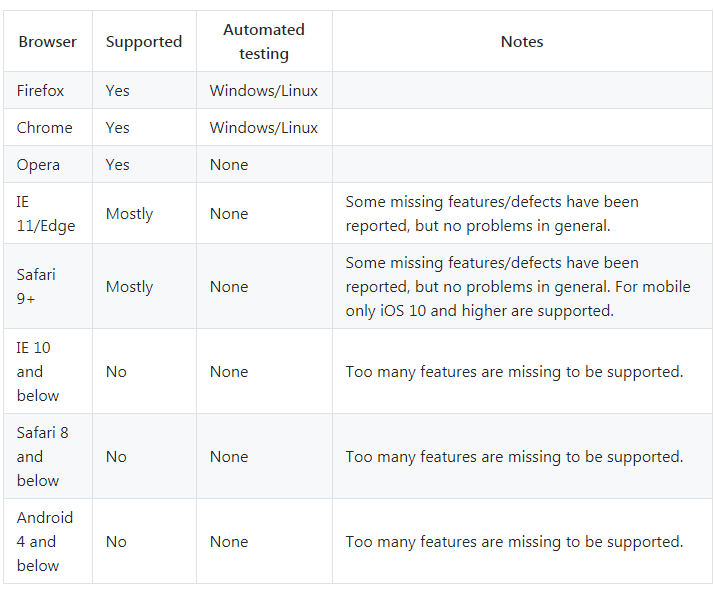

# 网页在线预览和下载pdf

之前做过公司的一个移动官网项目，遇到一个合同打开的问题。由于直接使用 window.location.href = 'xxx';(xxx 为后端提供的 pdf 地址，直接后端生成 pdf) 处理合同打开和下载，在部分机型上无法预览 pdf，甚至有些机型下载是乱码。/(ㄒoㄒ)/~~ 因此学习了一下网页在线预览和下载 pdf 的实现方式，以防后续再遇到类似的问题~

由于 PC 端和 H5 端不同浏览器预览和下载 pdf 有兼容问题，因此考虑以下几种方式进行实现。


## html 标签实现预览pdf
最简单的办法，直接使用 `<iframe>`、`<embed>`、`<object>` 这几个标签就可以实现 pdf 文件的预览（无需 JavaScript 支持）。

### iframe
iframe 元素会创建包含另外一个文档的内联框架（即行内框架）。所有浏览器都支持 iframe 标签。可以直接指定 iframe 标签的 src 为指定的 pdf 文件进行预览。当然，iframe 标签还有很多其他属性可供设置，详见[Web前端之iframe详解](https://www.cnblogs.com/lvhw/p/7107436.html)。如果部分浏览器不支持 iframe，可以在 iframe 标签中加入提示文案。[demo 地址]()
```html
<iframe src="./demo.pdf" width="100%" height="100%">
    This browser does not support PDFs. Please download the PDF to view it: <a href="./demo.pdf">Download PDF</a>
</iframe>
```
todo: 为啥会直接下载而不是预览？


### embed
embed 标签定义嵌入的内容，比如插件。embed 标签是 HTML5 中的新标签。可以设置 src 为指定的 pdf 文件达到预览的效果。与 iframe 不同的是，embed 标签是自闭合标签，无法在内部提供提示性文案。详见[HTML-embed标签](https://blog.csdn.net/u011537073/article/details/81141903)。
```html
<embed src="./demo.pdf" type="application/pdf" width="100%" height="100%" />
```
todo:h5打开会拦截


### object
object 标签定义一个嵌入的对象，用于包含对象，比如图像、音频、视频、Java applets、ActiveX、PDF 以及 Flash。几乎所有主流浏览器都拥有部分对 object 标签的支持。如果浏览器未展示 object 元素，就会执行 object 标签内部的代码，因此可以区分浏览器实现不同的代码。详见[html中object标签详解](https://www.cnblogs.com/qingsong/p/5055418.html)
```html
<object data="./demo.pdf" type="application/pdf" width="100%" height="100%">
    <iframe src="./demo.pdf" width="100%" height="100%" style="border: none;">
    This browser does not support PDFs. Please download the PDF to view it: <a href="./demo.pdf">Download PDF</a>
</object>
```
todo:h5打开会拦截


## PDFObject
根据 [PDFObject 官方文档](https://pdfobject.com/) 介绍，An open-source standards-friendly JavaScript utility for embedding PDF files into HTML documents，即 PDFObject 是一个基于 embed 标签实现 pdf 预览的开源、标准的 javascript 库。PDFObject 不渲染 pdf。主浏览器支持 PDFObject 2.x 版本，PC 兼容性比较好，可以兼容到 ie9(todo)，但是移动端兼容性比较差。

PDFObject 提供了一个 api(PDFObject.supportsPDFs) 用于判断该浏览器是否支持 PDFObject 预览：
```javascript
if (PDFObject.supportsPDFs) {
    console.log("Yay, this browser supports inline PDFs.");
} else {
    console.log("Boo, inline PDFs are not supported by this browser");
}
```

### 使用方式

1. 引入 js 脚本(下载地址：https://github.com/pipwerks/PDFObject/)
```html
<!-- 引入 pdfobject.js 和 pdfobject.min.js 效果一样 -->
<script type="text/javascript" src='pdfobject.min.js'></script>
```

2. 指定位置展示 pdf，可以充满整个浏览器或者某个 id，可以传入参数，详见[PDFObject 官方文档](https://pdfobject.com/)。
```html
<script type="text/javascript">
    if (PDFObject.supportsPDFs) { // PDF嵌入到网页指定id
        PDFObject.embed("./demo.pdf", "#demo_viewer" );
    } else {
        alert("当前浏览器不支持pdf预览哦~");
        location.href = "/";
    }
</script>
```
注意：PDFObject.embed 不支持中文字符串，需要做下处理todo：<br/>
```html
<script type="text/javascript">
    // 不支持中文，谷歌浏览器能运行,ie浏览器下embed方法则不能正确的找到pdf文件。
    var pdfurl = "/我.pdf";
    PDFObject.embed(pdfurl, "#demo_viewer" );

    // 解决
    var pdfurl = encodeURI("/我.pdf");
    PDFObject.embed(pdfurl, "#demo_viewer" );
</script>
```

### 完整示例
```html
<!DOCTYPE html>
<html lang="en">
<head>
    <meta charset="UTF-8">
    <meta name="viewport" content="width=device-width, initial-scale=1.0">
    <meta http-equiv="X-UA-Compatible" content="ie=edge">
    <title>使用 PDFObject 实现 pdf 预览</title>
    <script type="text/javascript" src='./pdfobject.min.js'></script>
    <style>
        html, body, #demo_viewer {
            width: 100%;
            height: 100%;
            margin: 0;
            padding: 0;
        }
    </style>
</head>
<body>
    <div id="demo_viewer"></div>
    <script type="text/javascript">
        if (PDFObject.supportsPDFs) { // PDF嵌入到网页指定id
            PDFObject.embed("./demo.pdf", "#demo_viewer" );
        } else {
            alert("当前浏览器不支持pdf预览哦~");
            location.href = "/";
        }
    </script>
</body>
</html>
```


## jquery.media.js


## pdf.js

pdf.js 支持在所有符合 HTML5 标准的浏览器上实现 PDF 在线预览、打印、下载等功能。

1. 兼容性：<br>


2. [pdf.js github 地址](https://github.com/mozilla/pdf.js)

3. [pdf.js online demo](https://mozilla.github.io/pdf.js/web/viewer.html)

4. 


## 参考链接

1. [pdf文件在线预览，兼容多浏览器和手机端](https://blog.csdn.net/qq_38584967/article/details/83784049)

2. [前端预览PDF：PDFObject、PDF.js](https://blog.csdn.net/liuyaqi1993/article/details/77822946)

3. [Web前端之iframe详解](https://www.cnblogs.com/lvhw/p/7107436.html)

4. [HTML-embed标签](https://blog.csdn.net/u011537073/article/details/81141903)

5. [html中object标签详解](https://www.cnblogs.com/qingsong/p/5055418.html)

6. [PDFObject 官方文档](https://pdfobject.com/)


2. [8 个 jQuery 的 PDF 浏览插件](https://www.oschina.net/news/35267/jquery-pdf-viewers)


https://mozilla.github.io/pdf.js/web/viewer.html

https://github.com/mozilla/pdf.js

https://github.com/mozilla/pdf.js/wiki/Frequently-Asked-Questions#file

https://www.google.com.hk/search?safe=strict&hl=zh-CN&ei=wKzOXM_rF8TfmAWJiq7IDQ&q=%E7%A7%BB%E5%8A%A8%E7%AB%AF%E9%A2%84%E8%A7%88pdf%E5%85%BC%E5%AE%B9%E6%80%A7&oq=%E7%A7%BB%E5%8A%A8%E7%AB%AF%E9%A2%84%E8%A7%88pdf%E5%85%BC%E5%AE%B9%E6%80%A7&gs_l=psy-ab.3...0.0..2670609...0.0..0.0.0.......0......gws-wiz.gbf4kbonZKk

https://blog.csdn.net/fade999/article/details/81327679

https://www.cnblogs.com/zdz8207/p/html5-pdf-js.html

https://1017401036.iteye.com/blog/2404819

https://blog.csdn.net/qq_38584967/article/details/83784049

https://blog.csdn.net/liuyaqi1993/article/details/77822946

https://www.oschina.net/news/35267/jquery-pdf-viewers

https://blog.csdn.net/qq_26173001/article/details/82783493#

https://blog.csdn.net/xiao_bin_shen/article/details/77778514

https://blog.csdn.net/a973685825/article/details/81169689

http://0313.name/archives/48

https://www.cnblogs.com/kagome2014/p/kagome2014001.html

https://www.cnblogs.com/zhanggf/p/8504317.html

https://blog.csdn.net/u013379933/article/details/84622166

